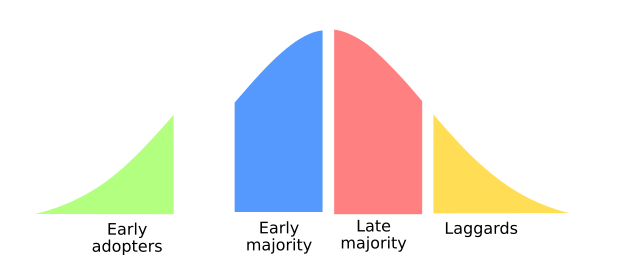
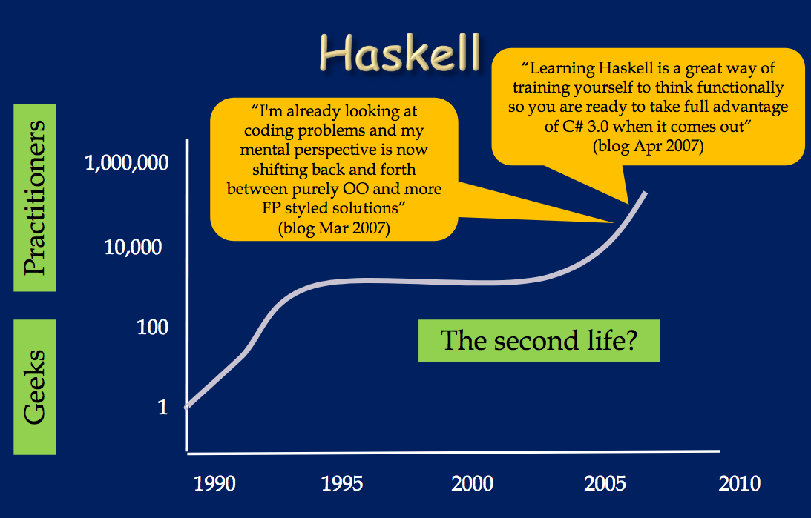

% How to market Haskell
% Gabriel Gonzalez
% July 31, 2020

# Source material

<link rel="stylesheet" href="https://cdn.jsdelivr.net/gh/tonsky/FiraCode@4/distr/fira_code.css">
<style>
code {
  font-family: "Fira Code";
}
</style>

This talk draws inspiration from the following book:

* [Crossing the Chasm: Marketing and Selling High-Tech Products to Mainstream Customers](https://www.amazon.com/Crossing-Chasm-Marketing-High-Tech-Mainstream/dp/0060517123)

The book addressed startups, but the advice is highly relevant to Haskell

# Who needs to hear this?

You are my target audience if you:

* … wish there were more Haskell jobs
* … wonder why Haskell fails to gain mainstream traction

You are not my target audience if you:

* … were hoping for a presentation with code
* … have given up hope on Haskell becoming mainstream

# Overview

* What is "marketing"?
* The chasm
* Crossing the chasm
* Market selection

# Everything you know about marketing is wrong

This is my one 🔥inflammatory🔥 slide for the talk

I'm confident that most of my audience (yes, you!) doesn't know how to market
Haskell to mainstream programmers

In fact, I'll wager that you misunderstand marketing _in general_

I'll go through a few marketing misconceptions, using MongoDB as the "foil"

(Sorry, MongoDB)

# Misconception #1: Marketing = Misleading claims

Do you believe that popular tools thrive because of __misleading claims__?

🤔: Which database I should select for my business?

😎: I recommend MongoDB, the only database that is ✨web scale✨

People who believe this will conclude:

🧐💭 "I will steer conversations away from Haskell's poor IDE support"

# Misconception #2: Marketing = Hype

Do you believe that popular tools thrive because of __hype__?

🤔: How will I know which database is the best?

😎: All the ❄️cool❄️ kids are using MongoDB.  #JoinTheConvo

People who believe this will conclude:

🧐💭 "I should spend more time cheerleading about Haskell on social media"

# Misconception #3: Marketing = Corporate backing

Do you believe that popular tools thrive because of __corporate backing__?

🤔: Maybe I should just use Postgres instead?

😎: MongoDB just raised $150 million 💰.  If you can't beat 'em, join 'em

People who believe this will conclude:

🧐💭 "Facebook adopting Haskell will save the language"

# So what is marketing?

There is a kernel of truth to each misconception, but they each miss the point

The book "Crossing the Chasm" provides an excellent definition of "marketing":

> "Marketing" is prioritizing the needs of a "market".  A "market" is a
> group of users that reference each other when making decisions.

The key concepts are:

* Prioritization: Marketing is about what you choose __not to build__

* Segmentation: Marketing is about who you choose __not to persuade__

In other words, marketing is the art of saying __NO__, either to potential
features or potential users

# Marketing is virtuous

Marketing is actually a noble task, which the book captures well in this quote:

> "Marketing's purpose, therefore, is to develop and shape something that is
> real, and not, as people sometimes want to believe, to create illusions.  In
> other words, we are dealing with a discipline more akin to gardening or
> sculpting than, say, to spray painting or hypnotism."

In other words, if you market a tool well, no misleading claims, hype, nor
corporate backing is necessary.

# Questions?

* What is "marketing"?
* The chasm
* Crossing the chasm
* Market selection

# The Technology Adoption Life Cycle

The technology adoption life cycle models adoption of _discontinuous_ changes

* Continuous change: Upgrading `aeson` to improve runtime performance
* Discontinuous change: Switching from Python to Haskell

Early adopters are __visionaries__: they prefer new technologies

Early majority are __pragmatists__: they prefer proven technologies

We won't cover late majority or laggards in this talk


# The chasm

The "chasm" refers to a large gap between visionaries and pragmatists



Symptoms of being stuck in the chasm:

> * Burst of enthusiasm and adoption followed by "hitting a wall"
> * Visionaries adore you, but pragmatists are suspicious
> * Nothing important ever officially supports you

# Visionaries

Credit: Simon Peyton Jones - "A taste of Haskell"


# Pragmatists

Credit: Simon Peyton Jones - "A taste of Haskell"


# Stuck in the chasm

Credit: Simon Peyton Jones - "A taste of Haskell"



# Why does the chasm exist?

Visionaries are __negative__ references for pragmatists

In other words: evangelism from visionaries turns off pragmatists

This happens for the following reasons:

> * Lack of respect for the value of colleague's experiences
> 
> * Taking a greater interest in technology than in their industry
> 
> * Failing to recognize the importance of existing product infrastructure
> 
> * Overall disruptiveness

# Lack of respect

> Visionaries are the first people in their industry to see the potential of the
> new technology.  Fundamentally, __they see themselves as smarter than their
> opposite numbers in companies__ -- and, quite often, they are.  Indeed, it is
> their ability to see things first that they want to leverage into a
> competitive advantage.  That advantage can only come about if no one else has
> discovered it.  They do not expect, therefore, to be buying a well-tested
> product with an extensive list of industry references.  Indeed, __if such a
> reference base exists, it may actually turn them off__, indicating that for
> this technology, at any rate, they are already too late.

🧐: Haskell is a secret weapon.  Other languages are toys in comparison

> Pragmatists, on the other hand, __deeply value the experience of their
> colleagues__ in other companies.  When they buy, they expect extensive
> references, and they want a good number to come from companies in their own
> industry segment.  This, as we have already noted, creates a catch-22
> situation;  since there are usually only one or two visionaries per industry
> segment, how can you accumulate the number of references a pragmatist
> requires, when virtually everyone left to call on is also a pragmatist?

🤔: Then why are so few companies using Haskell?

# Interest in technology

> Visionaries are defining the future.  You meet them at technology conferences 
> and other futurist forums where people gather to forecast trends and seek out
> new market opportunities.  They are easy to strike up a conversation with, and
> they understand and appreciate what high-tech companies and high-tech products
> are trying to do.  They want to talk ideas with bright people.  __They are
> bored with the mundane details__ of their own industries.  __They like to talk
> and think high tech__.

🧐: Profunctor optics are the future of lenses

> Pragmatists, on the other hand, __don't put a lot of stake in futuristic
> things__.  They see themselves more in present-day terms, as the people
> devoted to making the wheels of their industry turn.  Therefore, they tend to
> invest their convention time in industry-specific issues.  Where pragmatists
> are concerned, sweeping changes and global advantages may make for fine
> speeches, but not much else.

🤔: I can already write a web server in Python, so why learn a new language?

# Failing to recognize existing infrastructure

> Visionaries are building systems from the ground up.  They are incarnating
> their vision.  __They do not expect to find components for these systems
> lying around.__  They do not expect standards to have been established --
> indeed, they are planning to set new standards.  They do not expect support
> groups to be in place, procedures to have been established, or third parties
> to be available to share in the workload and the responsibility.

🧐: No OAuth package?  No problem; I can probably whip up my own

> Pragmatists expect all these things.  __When they see visionaries going their
> own route__ with little or no thought of connecting with the mainstream
> practices in their industry, __they shudder.__  Pragmatists have based their
> careers on such connections: Once again, it is painfully obvious that
> visionaries, as a group, make a very poor reference base for pragmatists.

🤔: No OAuth package?  I'll revisit Haskell when the ecosystem is more mature

# Overall disruptiveness

> From a pragmatist's point of view, visionaries are the people who come in and
> soak up all the budget for their projects.  If the project is a success, they
> take all the credit, while the __pragmatists get stuck trying to maintain a
> system that is so "state-of-the-art" no one is quite sure how to keep it
> working__.  If the project fails, visionaries always seem to be a step ahead
> of the disaster, getting out of town while they can, and leaving the
> pragmatists to clean up the mess.

🧐: Rewriting this project in Haskell would solve our problems

> Visionaries, successful or not, don't plan to stick around long.  They see
> themselves on a fast track that has them leapfrogging up the corporate ladder
> and across corporations.  __Pragmatists, on the other hand, tend to be
> committed long term to their profession and the company at which they work.__
> They are very cautious about grandiose schemes because they know they will
> have to live with the results.

🤔: Will I have to learn Haskell if you abandon this project?

# Is all hope lost?

So how on earth can visionaries convince pragmatists to adopt?

We don't want to evangelize more (that makes things worse!)

We also don't want to sell out 💰 or burn out 😰 to build an enormous ecosystem

# Visionaries vs. Pragmatists

The solution is to understand the following fundamental difference:

* Visionaries are __project-oriented__

  🧐: Is Haskell the best tool for my project?

* Pragmatists are __market-oriented__

  🤔: Is Haskell is the best tool for my industry?

We need to think/speak/act in a __market-oriented__ way to convince pragmatists

This is why the discipline is called __market__-ing

# Questions?

* What is "marketing"?
* The chasm
* Crossing the chasm
* Market selection

# Crossing the chasm

"Crossing the chasm" means jumping the gap between visionaries and pragmatists


As noted previously, this appears to be a chicken-and-egg problem:

> Pragmatists, on the other hand, deeply value the experience of their
> colleagues in other companies.  When they buy, they expect extensive
> references, and they want a good number to come from companies in their own
> industry segment.  This, as we have already noted, creates a catch-22
> situation;  since there are usually only one or two visionaries per industry
> segment, __how can you accumulate the number of references a pragmatist
> requires, when virtually everyone left to call on is also a pragmatist?__

# Pragmatists are loyal

Pragmatists are picky as hell, but they can become your greatest ally

> …, __once a start-up has earned its spurs with the pragmatist buyers within a
> given market, they tend to be very loyal to it, and even go out of their way
> to help it suceed__.  When this happens, the cost of sales goes way down, and
> the leverage on incremental R&D to support any given customer goes way up.
> That's one of the reasons pragmatists make such a great market.

🧐: Haskell is the best language for building interpreters.  Ask your
    colleagues if you don't believe me

🤔: You're right.  My colleagues and I will ensure that Haskell remains the
    language of choice

This is because pragmatists are __market-oriented__

They want their tools to be "official" or "standard" for their industry

# A recipe for success

* First, solve an enormous problem

  The problem has to be so bad that a few pragmatists _have_ to use your tool

  🤔: I'd rather not try something new, but I have to use Haskell in anger

* Provide a best-in-class experience

  It's not enough to be good, you need to be the best (for that market)

  🤔: Wow, Haskell is way better than I thought.  It blows away the competition

* Focus your effort on one market at a time

  ... because you can't build a top notch experience otherwise

  🤔: Haskell may not be a good fit for other industries, but I'm okay with that

# A recipe for failure

* Solve a problem that has already been solved

  🧐: Did you know that you can build a web server in Haskell?

* Litter the ecosystem with half-baked projects

  🧐: I can write the documentation later.  Better yet, someone else can

* Spread yourself thin

  🧐: Haskell is a general-purpose programming language

# The importance of focus

I like to think of tool adoption as analogous to a nuclear chain reaction:

* If adoption reaches a critical mass within a market then adoption grows
  uncontrollably

  "the complete absence of death"

* Otherwise adoption fizzles out

  "the slow death"

Many understand this but try to manufacture hype to stimulate the reaction

Artificial hype doesn't work in practice because pragmatists are hard to fool

🧐: Haskell has top notch tooling, like a strong type system, and Hoogle, and…

🤔: What about IDE support?

Let's talk about how to create legitimate hype

# Amplification

When positive references from pragmatists "collide", magic happens:

🤔: Should we give Haskell a try?

🙂: I've heard great things about Haskell

🙂: Me, too!  I used Haskell myself and I'd recommend it without hesitation

🤔: Great!  Let's give it a trial run

# Amplification

* 🌱 Organization adopts tool
* 🎓 New developers trained
* 🔨 Contributions made back to ecosystem
* 📐 Standards drafted
* 💖 More positive references created

```
     Before           Middle          After 
┌───────────────┬───────────────┬───────────────┐
│               │               │       ○       │
│               │               │       ↑       │
│    →○  ○←     │    {react}    │    ○←   →○    │
│               │               │       ↓       │
│               │               │       ○       │
└───────────────┴───────────────┴───────────────┘

Legend:

○: Positive reference
●: Negative reference
```

# Cancellation

Negative references neutralize positive references:

🤔: Should we give Haskell a try?

🙂: I've heard great things about Haskell

🙃: Nah, I tried Haskell and was thoroughly disappointed with the ecosystem

🤔: Hmmm.  Maybe we're not yet ready to invest in Haskell

```
     Before           Middle          After
┌───────────────┬───────────────┬───────────────┐
│               │               │               │
│               │               │               │
│    →○  ●←     │   {fizzle}    │               │
│               │               │               │
│               │               │               │
└───────────────┴───────────────┴───────────────┘

Legend:

○: Positive reference
●: Negative reference
```

# Segmentation

> A "market" is a group of users that reference each other when making
> decisions.

Positive and negative references mostly stay within their respective markets

```
     Market A        Market B        Market C
┌───────────────┬───────────────┬───────────────┐
│               │            →○ │ ○←            │
│            →● │ ○←            │               │
└───────────────┴───────────────┴───────────────┘

┌───────────────┬───────────────┬───────────────┐
│               │              ○│○              │
│              ●│○              │               │
└───────────────┴───────────────┴───────────────┘
┌───────────────┬───────────────┬───────────────┐
│               │             ○←│→○             │
│             ●←│→○             │               │
└───────────────┴───────────────┴───────────────┘

Legend:

○: Positive reference
●: Negative reference
```

# Examples

A market corresponds to an "application domain" or "vertical", such as:

* Interpreters
* Distributed systems
* Ops

The following are __not__ markets because they are "horizontal" concerns:

* Concurrency
* Type safety
* Immutability

# Subcritical markets

If a language community spreads themselves thin, no chain reaction ever occurs

```
                   Distributed
       Ops           Systems       Interpreters
┌───────────────┬───────────────┬───────────────┐
│ ●        ○    │ ●       ○     │     ○         │
│               │    ○          │○        ● ○   │
│   ○   ●       │               │      ●       ○│ Before
│               │ ○        ●    │   ●           │
│         ○     │               │      ○        │
│    ○          │        ○      │           ●   │
└───────────────┴───────────────┴───────────────┘

┌───────────────┬───────────────┬───────────────┐
│    ●        ○ │  ○     ○      │   ●           │
│      ○        │      ●        │       ○       │
│          ○    │               │   ○           │ After
│ ○    ●        │       ○       │     ●    ●    │
│       ○       │            ●  │○     ○      ○ │
│               │ ○             │     ●         │
└───────────────┴───────────────┴───────────────┘

Legend:

○: Positive reference
●: Negative reference
```

# Supercritical market

Focus your efforts on one market to trigger a self-sustaining chain reaction

```
                   Distributed
       Ops           Systems       Interpreters
┌───────────────┬───────────────┬───────────────┐
│ ●        ○    │ ●       ○     │     ○         │
│               │    ●          │○        ● ○   │
│   ●   ●       │               │      ○       ○│ Before
│               │ ●        ●    │   ○           │
│         ○     │               │      ○        │
│    ○          │        ○      │           ○   │
└───────────────┴───────────────┴───────────────┘

┌───────────────┬───────────────┬───────────────┐
│        ○      │               │  ○      ○     │
│               │     ●      ●  │ ○  ○       ○  │
│   ○          ●│       ○       │        ○      │ After
│  ●            │               │ ● ○     ○     │
│               │               │  ○    ○ ○   ○ │
│               │        ●      │ ○ ○        ○  │
└───────────────┴───────────────┴───────────────┘

Legend:

○: Positive reference
●: Negative reference
```

# Market overlap

Markets are not completely isolated, they slightly overlap

This means that a chain reaction in one market can stimulate an adjacent one

```
                             Interpreters
              Distributed ┌───────────────┐
                 Systems  │  ○○    ○    ○ │
             ┌────────────┼──┐    ○   ○○  │
     Ops     │  ○         │ ○│  ○  ○  ○   │
┌────────────┼──┐         │○○│   ●   ○   ○│
│       ●    │○ │      ○  │  │ ○   ○ ○  ○ │
│     ○      │  │  ●      │○ │ ○  ○    ○  │
│            │  │         └──┼────────────┘
│            │  │ ●          │
│  ●         └──┼────────────┘
│        ○      │
└───────────────┘


Legend:

○: Positive reference
●: Negative reference
```

# Market overlap

Markets are not completely isolated, they slightly overlap

This means that a chain reaction in one market can stimulate an adjacent one

```
                             Interpreters
              Distributed ┌───────────────┐
                 Systems  │   ○      ○    │
             ┌────────────┼──┐   ○   ○   ○│
     Ops     │  ○    ○ ○  │○○│ ○  ○   ○   │
┌────────────┼──┐  ○      │  │○  ○○       │
│            │○ │ ○○   ○  │ ○│   ○   ●  ○ │
│     ●      │ ○│  ○    ○ │ ○│ ○    ○    ○│
│   ○        │○○│       ○ └──┼────────────┘
│            │○ │ ● ○     ○  │
│     ●      └──┼────────────┘
│           ○   │
└───────────────┘


Legend:

○: Positive reference
●: Negative reference
```

# Market overlap

Markets are not completely isolated, they slightly overlap

This means that a chain reaction in one market can stimulate an adjacent one

```
                             Interpreters
              Distributed ┌───────────────┐
                 Systems  │○  ○       ○●  │
             ┌────────────┼──┐  ○ ○     ○○│
     Ops     │   ○  ○     │ ○│○     ○     │
┌────────────┼──┐○ ○○   ○ │  │   ○      ○ │
│ ●    ○   ○○│ ○│   ○ ○   │○ │ ○  ○   ○   │
│     ○○     │○ │         │○○│    ○     ○ │
│ ○      ○   │○ │○○●    ○ └──┼────────────┘
│      ○     │○ │     ○    ○ │
│ ○  ○     ○ └──┼────────────┘
│○       ○   ○  │
└───────────────┘


Legend:

○: Positive reference
●: Negative reference
```

# Questions?

* What is "marketing"?
* The chasm
* Crossing the chasm
* Market selection

# Which market should we focus on?

Picking a market to focus on is hard

… typically because there are too many good choices!

Should Haskell focus on:

> * __Interpreters?__
> 
>   Haskell's original _raison d'être_ is being the standard language for PLT
> 
> * __Web development?__
> 
>   Michael Snoyman pioneered Haskell in this area, which remains highly active
> 
> * __Data science?__
> 
>   The [Data Haskell](https://www.datahaskell.org/) group was created for this
>   purpose
>
> * __Finance / Cryptocurrency?__
>
>   One of the largest source of Haskell jobs

# Basics of market selection

The most important factors are:

> * __Target "customer"__
>
>   Is there a single, identifiable person/lead/manager within a software
>   engineering organization with the technical authority to adopt our tool?
>
> * __Compelling reason to adopt__
>
>   Can they live with the problem for another year or not?
>
> * __Whole product__
>
>   Do we have enough volunteers to build a best-in-class solution to the
>   problem?
>
> * __Competition__
>
>   Has this problem already been addressed by another tool?

For this talk I will only focus on the "Whole Product"

# The whole product


# Ideas

* Why did Rust succeed much more quickly than Haskell?
* Crib ideas from podcast discussion
* Critique "Simple Haskell" movement
* Use something other than `pandoc` to render the slides
