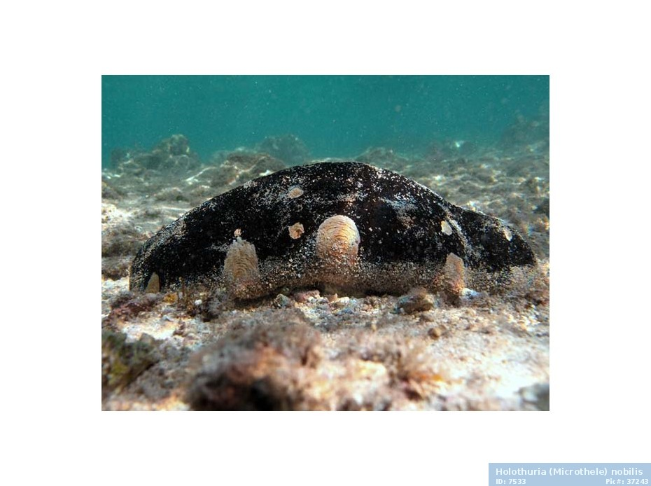
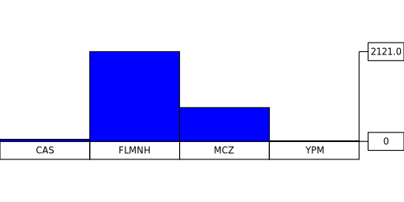

% Data science APIs in Haskell
% Gabriel Gonzalez
% January 10, 2017

# Following along

You can use `nix` to follow along with all of the examples

If you don't have `nix` installed, you can run:

```bash
curl https://nixos.org/nix/install | sh
```

... and once `nix` is installed, you can build these slides and examples using:

```haskell
$ git clone https://github.com/Gabriel439/slides.git
$ cd slides/lambdaconf/data
$ nix-build release.nix
```

... or you can open up a Nix shell for running code in the REPL like this:

```haskell
$ nix-shell
```

These slides are also available from the same repository:

[https://github.com/Gabriel439/slides/blob/master/lambdaconf/data/data.md](https://github.com/Gabriel439/slides/blob/master/lambdaconf/data/data.md)

# My background

**DISCLAIMER:** I am **NOT** a data scientist

... but I do know a lot about the Haskell ecosystem

... and I have some experience with API design

So I will divide this talk into two halves - one half per area of my expertise:

* The first half will briefly tour the Haskell data science ecosystem

* The second half will demo a new API I'm designing for data science

I hope that everybody will learn something interesting from each half

# Topics

This talk will mainly cover *relational operations over in-memory data sets*

This talk will **NOT** cover:

* database programming (i.e. `mysql`/`postgres` bindings)
* big data (i.e. `hadoop`/`spark` bindings)
* numerical programming (i.e. `BLAS`/`LAPACK` bindings)

If you want to learn more about these other topics, check out this post:

* [State of the Haskell ecosystem](https://github.com/Gabriel439/post-rfc/blob/master/sotu.md)

That is a broad survey of the Haskell ecosystem's suitability for various areas

# Overview

* Practical data science example
    * Basic input/output and encoding/decoding
    * Basic data transformations
    * Advanced tricks
* A relational algebra library
    * The `Table` type
    * Primitive `Table`s
    * Derived `Table`s
* Conclusion

# A practical data science example

The first half of this talk is based off of the following "R challenge":

[http://r-bio.github.io/challenges/](http://r-bio.github.io/challenges/)

These exercises explore CSVs containing taxonomic information on sea cucumbers


# Download the data

```bash
$ wget http://r-bio.github.io/data/holothuriidae-specimens.csv
$ wget http://r-bio.github.io/data/holothuriidae-nomina-valid.csv
```

If you want to download the files in Haskell, you can use:

* `http-client`/`http-client-tls` - Low level libraries for HTTP/HTTPS requests
* `wreq` - High level library for HTTP/HTTPS reqeusts

# Preview files

These are the basic operations for reading and writing bytes:

```haskell
-- exercises/00/Main.hs

import Data.ByteString.Lazy (ByteString)

import qualified Data.ByteString.Lazy.Char8

preview :: ByteString -> ByteString
preview =
      Data.ByteString.Lazy.Char8.unlines
    . take 3
    . Data.ByteString.Lazy.Char8.lines

process :: FilePath -> IO ()
process file = do
    bytes <- Data.ByteString.Lazy.Char8.readFile file
    Data.ByteString.Lazy.Char8.putStr (preview bytes)

main :: IO ()
main = do
    process "holothuriidae-specimens.csv"
    putStrLn ""
    process "holothuriidae-nomina-valid.csv"
```

# Output

```haskell
dwc:county,dwc:country,dwc:family,dwc:day,dwc:recordedBy,dwc:order,dwc:institutionCode,dwc:class,dwc:phylum,idigbio:uuid,dwc:scientificNameAuthorship,dwc:occurrenceID,dwc:subgenus,dwc:decimalLatitude,dwc:higherClassification,dwc:catalogNumber,dwc:decimalLongitude,dwc:datasetName,dwc:month,dwc:specificEpithet,dwc:stateProvince,dwc:collectionCode,dwc:genus,dwc:continent,idigbio:dateModified,dwc:scientificName,dwc:year
,Belize,Holothuriidae,24,J. Pahalas,Aspidochirotida,FLMNH,Holothuroidea,,80ac37c0-b98a-4106-8008-d9a8649eef2b,Ludwig,1E37E1F2-28DA-4A8D-96B0-0E3ABD26E8F1,,,,4877-Echinodermata,,,5,mexicana,,Invertebrate Zoology,Holothuria,,2014-10-16T19:17:03.991Z,Holothuria mexicana,2006
French Frigate Shoals,USA,Holothuriidae,12,"Gustav Paulay, Sea McKeon, Brian Zgliczynski, Rusty Brainard, Jim Maragos & John Starmer",Aspidochirotida,FLMNH,Holothuroidea,,19701098-7e86-40e2-8e0d-79d847653630,Augustin,7F2BE3C7-5555-4DDB-A133-BB8E70739508,,23.8632,,6075-Echinodermata,-166.1842,,10,dofleini,Hawaiian Islands,Invertebrate Zoology,Holothuria,,2014-10-16T21:39:06.569Z,Holothuria dofleini,2006

Order.current,Family.current,Genus.orig,Subgenus.orig,Species.orig,Author,Year,Genus.current,Subgenus.current,species.current,Available,Valid,Status
Aspidochirotida,Holothuriidae,Mülleria,,Agassizii,Selenka,1867,Actinopyga,,agassizii,yes,yes,accepted
Aspidochirotida,Holothuriidae,Actinopyga,,albonigra,Cherbonnier & Féral,1984,Actinopyga,,albonigra,yes,yes,accepted
```



# Decode CSV

I highly recommend `cassava` for CSV parsing

```haskell
-- exercises/01/Main.hs

import Data.Map (Map)
import Data.Text (Text)
import Data.Vector (Vector)

import qualified Data.ByteString.Lazy
import qualified Data.Csv
import qualified Data.Vector

process :: FilePath -> IO ()
process file = do
    bytes <- Data.ByteString.Lazy.readFile file
    case Data.Csv.decodeByName bytes of
        Left err -> do
            fail err
        Right (header, vector) -> do
            print header
            let _ = vector :: Vector (Map Text Text)
            mapM_ print (Data.Vector.take 2 vector)

main :: IO ()
main = do
    process "holothuriidae-specimens.csv"
    putStrLn ""
    process "holothuriidae-nomina-valid.csv"
```

# Output

```haskell
["dwc:county","dwc:country","dwc:family","dwc:day","dwc:recordedBy","dwc:order","dwc:institutionCode","dwc:class","dwc:phylum","idigbio:uuid","dwc:scientificNameAuthorship","dwc:occurrenceID","dwc:subgenus","dwc:decimalLatitude","dwc:higherClassification","dwc:catalogNumber","dwc:decimalLongitude","dwc:datasetName","dwc:month","dwc:specificEpithet","dwc:stateProvince","dwc:collectionCode","dwc:genus","dwc:continent","idigbio:dateModified","dwc:scientificName","dwc:year"]
fromList [("dwc:family","Holothuriidae"),("dwc:stateProvince",""),("dwc:datasetName",""),("dwc:phylum",""),("dwc:month","5"),("dwc:decimalLongitude",""),("dwc:catalogNumber","4877-Echinodermata"),("dwc:year","2006"),("idigbio:dateModified","2014-10-16T19:17:03.991Z"),("dwc:occurrenceID","1E37E1F2-28DA-4A8D-96B0-0E3ABD26E8F1"),("dwc:institutionCode","FLMNH"),("dwc:specificEpithet","mexicana"),("dwc:scientificName","Holothuria mexicana"),("dwc:decimalLatitude",""),("dwc:subgenus",""),("dwc:continent",""),("dwc:order","Aspidochirotida"),("dwc:class","Holothuroidea"),("dwc:country","Belize"),("dwc:recordedBy","J. Pahalas"),("dwc:higherClassification",""),("dwc:county",""),("idigbio:uuid","80ac37c0-b98a-4106-8008-d9a8649eef2b"),("dwc:genus","Holothuria"),("dwc:day","24"),("dwc:collectionCode","Invertebrate Zoology"),("dwc:scientificNameAuthorship","Ludwig")]
fromList [("dwc:family","Holothuriidae"),("dwc:stateProvince","Hawaiian Islands"),("dwc:datasetName",""),("dwc:phylum",""),("dwc:month","10"),("dwc:decimalLongitude","-166.1842"),("dwc:catalogNumber","6075-Echinodermata"),("dwc:year","2006"),("idigbio:dateModified","2014-10-16T21:39:06.569Z"),("dwc:occurrenceID","7F2BE3C7-5555-4DDB-A133-BB8E70739508"),("dwc:institutionCode","FLMNH"),("dwc:specificEpithet","dofleini"),("dwc:scientificName","Holothuria dofleini"),("dwc:decimalLatitude","23.8632"),("dwc:subgenus",""),("dwc:continent",""),("dwc:order","Aspidochirotida"),("dwc:class","Holothuroidea"),("dwc:country","USA"),("dwc:recordedBy","Gustav Paulay, Sea McKeon, Brian Zgliczynski, Rusty Brainard, Jim Maragos & John Starmer"),("dwc:higherClassification",""),("dwc:county","French Frigate Shoals"),("idigbio:uuid","19701098-7e86-40e2-8e0d-79d847653630"),("dwc:genus","Holothuria"),("dwc:day","12"),("dwc:collectionCode","Invertebrate Zoology"),("dwc:scientificNameAuthorship","Augustin")]

["Order.current","Family.current","Genus.orig","Subgenus.orig","Species.orig","Author","Year","Genus.current","Subgenus.current","species.current","Available","Valid","Status"]
fromList [("Status","accepted"),("Genus.orig","M\252lleria"),("Species.orig","Agassizii"),("Subgenus.orig",""),("Family.current","Holothuriidae"),("Year","1867"),("Author","Selenka"),("species.current","agassizii"),("Genus.current","Actinopyga"),("Valid","yes"),("Order.current","Aspidochirotida"),("Available","yes"),("Subgenus.current","")]
fromList [("Status","accepted"),("Genus.orig","Actinopyga"),("Species.orig","albonigra"),("Subgenus.orig",""),("Family.current","Holothuriidae"),("Year","1984"),("Author","Cherbonnier & F\233ral"),("species.current","albonigra"),("Genus.current","Actinopyga"),("Valid","yes"),("Order.current","Aspidochirotida"),("Available","yes"),("Subgenus.current","")]
```


# Exercise

How many specimens are there?

```haskell
-- exercises/02/Main.hs

import Data.Map (Map)
import Data.Text (Text)
import Data.Vector (Vector)

import qualified Data.ByteString.Lazy
import qualified Data.Csv

process :: FilePath -> IO (Vector (Map Text Text))
process file = do
    bytes <- Data.ByteString.Lazy.readFile file
    case Data.Csv.decodeByName bytes of
        Left   err        -> fail err
        Right (_, vector) -> return vector

main :: IO ()
main = do
    specimens <- process "holothuriidae-specimens.csv"
    print (length specimens)
    -- 2984
```

# Exercise

The `dwc:institutionCode` column lists the museum where the specimens are
housed:

* How many unique institutions house specimens?

```haskell
-- exercises/03/Main.hs

{-# LANGUAGE OverloadedStrings #-}
{-# LANGUAGE RecordWildCards   #-}

import Data.Csv (FromNamedRecord(..), (.:))
import Data.Foldable (toList)
import Data.Text (Text)
import Data.Vector (Vector)

import qualified Data.ByteString.Lazy
import qualified Data.Csv
import qualified Data.List

data Specimen = Specimen
    { institutionCode :: Text
    } deriving (Show)

instance FromNamedRecord Specimen where
    parseNamedRecord m = do
        institutionCode <- m .: "dwc:institutionCode"
        return (Specimen {..})

process :: FilePath -> IO (Vector Specimen)
process file = do
    bytes <- Data.ByteString.Lazy.readFile file
    case Data.Csv.decodeByName bytes of
        Left   err        -> fail err
        Right (_, vector) -> return vector

main :: IO ()
main = do
    specimens <- process "holothuriidae-specimens.csv"
    let institutions :: Vector Text
        institutions = fmap institutionCode specimens
    print (Data.List.nub (toList institutions))
    -- ["FLMNH","CAS","MCZ","YPM"]
```

# Exercise

Draw a bar plot that shows how many specimens are housed in each institution

So about that ...

# Haskell plotting libraries

I'm not pleased with any Haskell plotting libraries

Probably the most mature is the `Chart` library

However, I sometimes prefer to use the `diagrams` library directly

You can also output the data as CSV and plot using another tool

I think there is a lot of room for improvement in this area

My wish list:

* A subset of the Diagrams API with simpler types ...
* ... with a large toolbox of useful primitives for assembling charts ...
* ... and a backend that plots to a window reliably on OS X

I've heard HaskellForMac serves this niche well but I haven't tried it yet

# Exercise

```haskell
-- exercises/04/Main.hs

{-# LANGUAGE FlexibleContexts  #-}
{-# LANGUAGE OverloadedStrings #-}
{-# LANGUAGE RecordWildCards   #-}
{-# LANGUAGE TypeFamilies      #-}

import Data.Csv (FromNamedRecord(..), (.:))
import Data.Foldable (toList)
import Data.Monoid ((<>))
import Diagrams
import Diagrams.Prelude (blue)
import Data.Text (Text)
import Data.Vector (Vector)

import qualified Data.ByteString.Lazy
import qualified Data.Csv
import qualified Data.List
import qualified Data.List.NonEmpty
import qualified Data.Text
import qualified Diagrams.Backend.SVG (renderSVG)

data Specimen = Specimen
    { institutionCode :: Text
    } deriving (Show)

instance FromNamedRecord Specimen where
    parseNamedRecord m = do
        institutionCode <- m .: "dwc:institutionCode"
        return (Specimen {..})

process :: FilePath -> IO (Vector Specimen)
process file = do
    bytes <- Data.ByteString.Lazy.readFile file
    case Data.Csv.decodeByName bytes of
        Left   err        -> fail err
        Right (_, vector) -> return vector

chart :: [(Text, Double)] -> IO ()
chart xys = do
    let maxY = maximum [ y | (_, y) <- xys ]

    let bar (_, y) = alignB (fc blue (rect 10 (10 * y / maxY)))
    let bars = hcat (map bar xys)

    let label (x, _) = alignT (text (Data.Text.unpack x) <> rect 10 2)
    let labels = hcat (map label xys)

    let yMax = alignR (hrule 1) <> alignL (text (show maxY) <> rect 4 2)
    let yMin = alignR (hrule 1) <> alignL (text  "0"        <> rect 4 2)
    let yAxis0 = alignT (vrule 10) <> alignL yMax
    let yAxis  = alignBL yAxis0 <> alignL yMin

    let diagram = yAxis <> alignBR bars <> alignTR labels

    Diagrams.Backend.SVG.renderSVG "chart.svg" (dims (V2 512 256)) diagram

main :: IO ()
main = do
    specimens <- process "holothuriidae-specimens.csv"
    let institutions = toList (fmap institutionCode specimens)
    let toBar xs = (Data.List.NonEmpty.head xs, fromIntegral (length xs))
    chart (map toBar (Data.List.NonEmpty.group (Data.List.sort institutions)))
```

# Output




# Exercise

The column `dwc:year` indicates when the specimen was collected:

* When was the oldest specimen included in this data frame collected?
  (hint: It was not in year 1)
* What proportion of the specimens in this data frame were collected between
  the years 2006 and 2014 (included)?

```haskell
-- exercises/05/Main.hs

{-# LANGUAGE OverloadedStrings #-}
{-# LANGUAGE RecordWildCards   #-}

import Data.Csv (FromNamedRecord(..), (.:))
import Data.Foldable (toList)
import Data.Text (Text)
import Data.Vector (Vector)

import qualified Data.ByteString.Lazy
import qualified Data.Csv
import qualified Data.List

data Specimen = Specimen
    { institutionCode :: Text
    , year            :: Maybe Integer
    } deriving (Show)

instance FromNamedRecord Specimen where
    parseNamedRecord m = do
        institutionCode <- m .: "dwc:institutionCode"
        year            <- m .: "dwc:year"
        return (Specimen {..})

process :: FilePath -> IO (Vector Specimen)
process file = do
    bytes <- Data.ByteString.Lazy.readFile file
    case Data.Csv.decodeByName bytes of
        Left   err        -> fail err
        Right (_, vector) -> return vector

main :: IO ()
main = do
    specimens <- process "holothuriidae-specimens.csv"

    let years :: [Integer]
        years = do
            specimen <- toList specimens
            Just y   <- return (year specimen)
            return y

    print (take 10 (Data.List.sort years))
    -- [1,91,91,91,91,91,91,1902,1902,1957]

    print (minimum (filter (1700 <) years))
    -- 1902

    let inRange :: Integer -> Bool
        inRange year = 2006 <= year && year <= 2014

    let matches :: [Integer]
        matches = filter inRange years

    print (fromIntegral (length matches) / fromIntegral (length specimens) :: Double)
    -- 0.4932975871313673
```

# Exercise

The `dwc:class` column contains the specimen's class (here they should all be
“Holothuroidea”). However, some specimens are missing this column

* How many specimens do not have a listed class?
* Fix all rows with a missing class by setting the class to "Holothuroidea"

```haskell
-- exercises/06/Main.hs

{-# LANGUAGE OverloadedStrings #-}

import Control.Lens
import Data.Map (Map)
import Data.Text (Text)
import Data.Vector (Vector)

import qualified Data.ByteString.Lazy
import qualified Data.Csv

process :: FilePath -> IO (Vector (Map Text Text))
process file = do
    bytes <- Data.ByteString.Lazy.readFile file
    case Data.Csv.decodeByName bytes of
        Left   err        -> fail err
        Right (_, vector) -> return vector

main :: IO ()
main = do
    specimens <- process "holothuriidae-specimens.csv"

    print (lengthOf (traverse . ix "dwc:class" . only "") specimens)
    -- 50

    print (lengthOf (traverse . ix "dwc:class" . only "Holothuroidea") specimens)
    -- 2934

    let modify :: Text -> Text
        modify c = if c == "" then "Holothuroidea" else c

    let specimens2 :: Vector (Map Text Text)
        specimens2 = over (traverse . ix "dwc:class") modify specimens

    print (lengthOf (traverse . ix "dwc:class" . only "") specimens2)
    -- 0

    print (lengthOf (traverse . ix "dwc:class" . only "Holothuroidea") specimens2)
    -- 2984
```

# Exercise

The `nomina` table has `Genus.current` and `Subgenus.current` columns

Which values of `Genus.current` also come with a `Subgenus.current`?

```haskell
-- exercises/07/Main.hs

{-# LANGUAGE OverloadedStrings #-}
{-# LANGUAGE RecordWildCards   #-}

import Data.Csv (FromNamedRecord(..), (.:))
import Data.Foldable (toList)
import Data.Text (Text)
import Data.Vector (Vector)

import qualified Data.ByteString.Lazy
import qualified Data.Csv
import qualified Data.List
import qualified Data.Vector

data Nomen = Nomen
    { genus    :: Text
    , subgenus :: Text
    } deriving (Show)

instance FromNamedRecord Nomen where
    parseNamedRecord m = do
        genus    <- m .: "Genus.current"
        subgenus <- m .: "Subgenus.current"
        return (Nomen {..})

process :: FilePath -> IO (Vector Nomen)
process file = do
    bytes <- Data.ByteString.Lazy.readFile file
    case Data.Csv.decodeByName bytes of
        Left   err        -> fail err
        Right (_, vector) -> return vector

main :: IO ()
main = do
    nomina <- process "holothuriidae-nomina-valid.csv"

    let hasSubgenus :: Nomen -> Bool
        hasSubgenus (Nomen {..}) = subgenus /= ""

    let genera :: Vector Text
        genera = fmap genus (Data.Vector.filter hasSubgenus nomina)

    print (Data.List.nub (toList genera))
    -- ["Holothuria"]
```

# Exercise

Left join the `specimens` table with the `nomina` table on the species name:

The species name is a composite key computed in a different way for each table:

* Concatenate the `dwc:genus` and `dwc:specificEpithet` columns in `specimens`
* Concatenate the `Genus.current` and `species.current` columns in `nomina`

Filter out rows where `Status = "accepted"`

Save the following columns to "holothuriidae-pending.csv":

* `idigbio:uuid`
* `dwc:genus`
* `dwc:specificEpithet`
* `dwc:institutionCode`
* `dwc:catalogNumber`

```haskell
-- exercises/08/Main.hs

{-# LANGUAGE DuplicateRecordFields #-}
{-# LANGUAGE OverloadedStrings     #-}
{-# LANGUAGE RecordWildCards       #-}

import Data.ByteString.Lazy (ByteString)
import Data.Csv
    (DefaultOrdered(..), FromNamedRecord(..), ToNamedRecord(..), (.:), (.=))
import Data.Foldable (toList)
import Data.Text (Text)
import Data.Vector (Vector)

import qualified Data.ByteString.Lazy
import qualified Data.Csv
import qualified Data.Discrimination
import qualified Data.Discrimination.Grouping
import qualified Data.Text
import qualified Data.Vector

data Specimen = Specimen
    { institutionCode :: Text
    , uuid            :: Text
    , catalogNumber   :: Text
    , specificEpithet :: Text
    , genus           :: Text
    } deriving (Show)

instance FromNamedRecord Specimen where
    parseNamedRecord m = do
        institutionCode <- m .: "dwc:institutionCode"
        uuid            <- m .: "idigbio:uuid"
        catalogNumber   <- m .: "dwc:catalogNumber"
        specificEpithet <- m .: "dwc:specificEpithet"
        genus           <- m .: "dwc:genus"
        return (Specimen {..})

instance ToNamedRecord Specimen where
    toNamedRecord (Specimen {..}) =
        Data.Csv.namedRecord
            [ "dwc:institutionCode" .= institutionCode
            , "idigbio:uuid"        .= uuid
            , "dwc:catalogNumber"   .= catalogNumber
            , "dwc:specificEpithet" .= specificEpithet
            , "dwc:genus"           .= genus
            ]

instance DefaultOrdered Specimen where
    headerOrder _ =
         Data.Vector.fromList
             [ "dwc:institutionCode"
             , "idigbio:uuid"
             , "dwc:catalogNumber"
             , "dwc:specificEpithet"
             , "dwc:genus"
             ]

data Nomina = Nomina
    { status  :: Text
    , genus   :: Text
    , species :: Text
    } deriving (Show)

instance FromNamedRecord Nomina where
    parseNamedRecord m = do
        status  <- m .: "Status"
        genus   <- m .: "Genus.current"
        species <- m .: "species.current"
        return (Nomina {..})

process :: FromNamedRecord a => FilePath -> IO (Vector a)
process file = do
    bytes <- Data.ByteString.Lazy.readFile file
    case Data.Csv.decodeByName bytes of
        Left   err        -> fail err
        Right (_, vector) -> return vector

main :: IO ()
main = do
    specimens <- process "holothuriidae-specimens.csv"
    nomina    <- process "holothuriidae-nomina-valid.csv"

    let leftKey :: Specimen -> Text
        leftKey  (Specimen {..}) = Data.Text.unwords [genus, specificEpithet]

    let rightKey :: Nomina -> Text
        rightKey (Nomina {..}) = Data.Text.unwords [genus, species]

    let joinedGroups :: [[(Specimen, Maybe Text)]]
        joinedGroups =
            Data.Discrimination.leftOuter
                Data.Discrimination.Grouping.hashing
                (\specimen (Nomina {..}) -> (specimen, Just status))
                (\specimen -> (specimen, Nothing))
                leftKey
                rightKey
                (toList specimens)
                (toList nomina   )

    let joined :: [(Specimen, Maybe Text)]
        joined = concat joinedGroups

    let pending :: (Specimen, Maybe Text) -> Bool
        pending (_, status)  = status /= Just "accepted"

    let select :: (Specimen, Maybe Text) -> Specimen
        select (specimen, _) = specimen

    let output :: [Specimen]
        output = map select (filter pending joined)

    let bytes :: ByteString
        bytes = Data.Csv.encodeDefaultOrderedByName output
    Data.ByteString.Lazy.writeFile "holothuriidae-pending.csv" bytes
```

# Output

```bash
$ cat holothuriidae-pending.csv
idigbio:uuid,dwc:genus,dwc:specificEpithet,dwc:institutionCode,dwc:catalogNumber
19701098-7e86-40e2-8e0d-79d847653630,Holothuria,dofleini,FLMNH,6075-Echinodermata
194fa8a6-a91c-4a7c-ab6d-87195e26a268,Holothuria,dofleini,FLMNH,1326-Echinodermata
c9049c41-60a8-498e-adf3-0f56b354fbf3,Holothuria,dofleini,FLMNH,4801-Echinodermata
37f80585-6311-470b-b5ac-372213690382,Holothuria,dofleini,FLMNH,6269-Echinodermata
589d3c61-6f75-4d07-bff8-fff2238d4e04,Holothuria,dofleini,FLMNH,6132-Echinodermata
c0b94d53-0a12-4823-bf2e-67f4e4b55d6e,Holothuria,dofleini,FLMNH,6069-Echinodermata
f6d6112e-ba3e-4b63-b54b-c6a001023083,Holothuria,dofleini,FLMNH,6120-Echinodermata
61379bbf-7f44-4a2c-a9ce-edf884a2e863,Holothuria,,FLMNH,16110-Echinodermata
5a3e5f1f-327c-475d-99f4-7d745f8e1579,Holothuria,,FLMNH,1586-Echinodermata
61347dca-ecb3-465a-a61e-cc5216c726e5,Holothuria,,FLMNH,15471-Echinodermata
3528116c-c33d-41b1-a6e3-54b300890f1d,Holothuria,,FLMNH,3629-Echinodermata
3792e27b-d355-4fa6-825d-fc3330829631,Holothuria,,FLMNH,7912-Echinodermata
929553c1-2544-4920-9ae2-9ae16ac60ac3,Holothuria,,FLMNH,979-Echinodermata
ba6d4469-c430-4815-b02e-05d4027cf22a,Holothuria,,FLMNH,455-Echinodermata
21402bea-2755-4398-a3ec-11cf0e00487b,Holothuria,,MCZ,HOL-918
c4211c26-a275-4ac5-9d8d-028ef173852d,Holothuria,,FLMNH,3626-Echinodermata
5a15e1fb-e020-4d39-8606-2d0ee4513c83,Holothuria,,FLMNH,985-Echinodermata
a442e178-6aea-40ed-9d87-f3089911016d,Holothuria,,FLMNH,10340-Echinodermata
51be8ad3-66e8-40dc-ad5d-0062d64509dc,Holothuria,,FLMNH,15468-Echinodermata
b851ab72-7b7a-44b3-bba9-3a35f526ec1d,Holothuria,,FLMNH,12286-Echinodermata
c111e3c9-9008-4d18-9c10-3c944c40f4d1,Holothuria,,FLMNH,7862-Echinodermata
f87a3d2a-d400-4bfe-a23f-c225df1039ca,Holothuria,,CAS,140662
946842bc-7034-45bc-8b91-e4afc5e7b2ec,Holothuria,,FLMNH,15749-Echinodermata
811a27a4-abbf-4e05-bff0-55eb267f6a45,Holothuria,,CAS,199668
9c2c4072-1ab6-4ec8-afd4-1caefd7f87a4,Holothuria,,MCZ,HOL-871
338d3634-ef73-4e86-a563-85de5e6e7035,Holothuria,,FLMNH,11846-Echinodermata
c42241ca-13f8-4fc3-ba31-9155231a402e,Holothuria,,FLMNH,2745-Echinodermata
0b6da940-9411-4d4a-bf4f-5de2870677d0,Holothuria,,FLMNH,14613-Echinodermata
86f2925c-16c0-4b88-ada2-4bcad6e61798,Holothuria,,FLMNH,13339-Echinodermata
c70d924c-2f3b-4400-9971-e7d4457e8b85,Holothuria,,FLMNH,15187-Echinodermata
3a0a3ce9-6864-40db-8a08-48410705e201,Holothuria,,FLMNH,13646-Echinodermata
77f9cfb1-ecb2-4777-afab-3323fd328849,Holothuria,,FLMNH,11232-Echinodermata
09be5616-38c9-4e3a-b3d2-9639ba0e201b,Holothuria,,FLMNH,6667-Echinodermata
eb10a305-c5df-4727-8c29-9636cfd02967,Holothuria,,FLMNH,7156-Echinodermata
567aff71-c3bf-4928-9e1f-32aef16c499d,Holothuria,,FLMNH,11083-Echinodermata
5a264aad-f6b3-4aa9-877e-f61ea969a44e,Holothuria,,FLMNH,1878-Echinodermata
9e0d4d6a-1a8b-4680-8a51-866b8b92b6c0,Holothuria,,FLMNH,4141-Echinodermata
ced7c4d7-fe06-48c1-a818-aabf93607fd1,Holothuria,,FLMNH,6248-Echinodermata
f0e68cc5-e6c2-416c-8a63-5596cc051e84,Holothuria,,FLMNH,1707-Echinodermata
0b3ab0f6-a4b7-4b6b-9731-b6fb73169fdb,Holothuria,,FLMNH,16114-Echinodermata
d38ec5ec-0d84-4c39-9a91-76f370864acb,Holothuria,,FLMNH,2355-Echinodermata
05aef29b-3e93-4789-8186-56db6d88ac99,Holothuria,,FLMNH,15172-Echinodermata
0f2edbbc-99a7-43b2-abe8-c0f21d376517,Holothuria,,FLMNH,1746-Echinodermata
8754fe39-6ff6-465e-a91f-d54faf45fab8,Holothuria,,FLMNH,11203-Echinodermata
00e22a58-4c00-4c22-a165-9ed436c65270,Holothuria,,CAS,184130
3122aa62-fbcc-4448-8a66-d6afa84e2e81,Holothuria,,CAS,184107
d3db26ce-7717-45d8-a4b1-2c2afeeef553,Holothuria,,CAS,141529
41f76321-ebf6-4b33-b4ff-c88d39445a98,Holothuria,,MCZ,HOL-1208
d2a2b298-3bc0-4d81-8b49-d3195e30f0bc,Holothuria,,FLMNH,15458-Echinodermata
2c4af1a0-6572-4269-b95d-283531ce592b,Holothuria,,FLMNH,11178-Echinodermata
dbcb585b-a288-4fd7-9df3-231982f248c2,Holothuria,,FLMNH,7285-Echinodermata
65e2af45-fcd3-497f-9f2a-1d46d2a84ed2,Holothuria,,FLMNH,13315-Echinodermata
17cc0507-8a2b-4a5d-91b7-7f8111818f7c,Holothuria,,FLMNH,4078-Echinodermata
ef78a4c3-ef71-4ca2-bc09-7dfb2aa2272c,Holothuria,,FLMNH,11757-Echinodermata
b002db43-3ec3-450a-ae4c-5b099aaa7adc,Holothuria,,FLMNH,1757-Echinodermata
064437a5-58ec-4f7f-9945-13ce1e065133,Holothuria,,FLMNH,4527-Echinodermata
49f9ed67-8fad-49a1-94d4-3fd626f4fa95,Holothuria,,CAS,125699
fcc527b3-4e3e-45fe-9ef4-edc6faa48339,Holothuria,,CAS,111375
17cbdf93-e79d-4909-ace1-1cc1cbd6ff94,Holothuria,,FLMNH,1647-Echinodermata
27476d0c-0fb5-41b1-afd1-3560f68a31bc,Holothuria,,FLMNH,10320-Echinodermata
fd748151-35f1-4df8-a2a1-e43c26559c2e,Holothuria,,FLMNH,12076-Echinodermata
acadf538-7189-4517-b6f7-33f616b6f267,Holothuria,,FLMNH,5129-Echinodermata
5120a2e7-3c33-4468-879e-11b814ac5f2b,Holothuria,,FLMNH,13188-Echinodermata
69890e47-9bc5-4a89-afe1-5efe19f9ca3e,Holothuria,,FLMNH,14590-Echinodermata
3b3721b6-2d9c-408f-b4b3-81bcbb1f5b2c,Holothuria,,FLMNH,13659-Echinodermata
d4fda3a1-7333-4419-a0aa-dee88f04a46b,Holothuria,,FLMNH,14571-Echinodermata
2d437fb0-2eea-43dc-ab85-95370d6e1f6e,Holothuria,,FLMNH,972-Echinodermata
488d8600-4a66-431e-bb58-71d8c8a18f40,Holothuria,,FLMNH,9412-Echinodermata
ce364e3e-65b8-43a8-b453-7630371c9b05,Holothuria,,FLMNH,11249-Echinodermata
f3e37341-9b5b-4418-af55-c76ce9bc8e15,Holothuria,,FLMNH,984-Echinodermata
9e7d3493-a0ae-4cf9-bd8f-254f0eb026d8,Holothuria,,FLMNH,11114-Echinodermata
cbab31d6-25b3-42bc-a28b-2aa0a7007b7c,Holothuria,,FLMNH,12906-Echinodermata
11c28966-c30e-412e-bd08-d0b1a8698595,Holothuria,,FLMNH,14516-Echinodermata
41466142-11c0-43f7-b2b4-2f2b84dd8b60,Holothuria,,FLMNH,10317-Echinodermata
01825bf3-3a7c-4906-9be8-beb190473444,Holothuria,,FLMNH,7586-Echinodermata
cac1fe49-678b-4813-9722-d2ae1bee930a,Holothuria,,FLMNH,4256-Echinodermata
fe5806e1-3f43-4048-90e5-82d79c2955ea,Holothuria,,CAS,111383
c138db27-1d2a-4ba6-8aad-06438cc3333a,Holothuria,,CAS,111361
408fd78f-1343-4a0d-982c-2de7030ac62a,Holothuria,,MCZ,125925
e2899052-a9bc-4604-af6a-eaa54c1f2ccc,Holothuria,,FLMNH,1797-Echinodermata
e2743139-a870-44c6-858c-00d286916f52,Holothuria,,FLMNH,2262-Echinodermata
75093908-94c0-4fa2-be12-d060d0d02390,Holothuria,,FLMNH,13673-Echinodermata
3416e5e0-934c-47e7-ab09-fe2b6591f94f,Holothuria,,FLMNH,8729-Echinodermata
1cd25453-14b5-40cf-8160-c8b18a848ea6,Holothuria,,FLMNH,11231-Echinodermata
21461938-fa45-48fb-9996-22305b72f8d4,Holothuria,,FLMNH,14830-Echinodermata
1347e263-d0dd-428f-8c2e-89fee368fbe6,Holothuria,,CAS,141530
c9addc7a-4db6-4f76-b2fe-2847ec6b6e7e,Holothuria,,CAS,117999
fc7d041e-e14a-4e69-ab6b-1d71efd7c7cc,Holothuria,,FLMNH,1877-Echinodermata
e8e4837f-85dd-4e4f-a417-3557e8229f04,Holothuria,,FLMNH,12505-Echinodermata
5c5196c4-cd93-41d5-a65a-8151548bf8cb,Holothuria,,FLMNH,6366-Echinodermata
2a58f800-6c28-469e-bded-2925cc1c627b,Holothuria,,FLMNH,13674-Echinodermata
411d7422-d7fe-471c-9c4e-0a9fbae3e286,Holothuria,,FLMNH,14591-Echinodermata
1b128029-81a3-4d8c-a018-28f80b0dadc8,Holothuria,,FLMNH,2002-Echinodermata
c9c1d09e-2f75-4398-a292-17aaca89e322,Holothuria,,FLMNH,7998-Echinodermata
7b9e7009-b9ca-4a2e-8e0e-c529cfca2bcb,Holothuria,,FLMNH,5574-Echinodermata
e1f701c1-39d0-48cc-b1eb-ebddf7dbf241,Holothuria,,FLMNH,7286-Echinodermata
64671dee-2793-4482-8f03-e89fa1fe2b4d,Holothuria,,FLMNH,7154-Echinodermata
eb737cff-9ca3-4812-9f78-ac08c036d00e,Holothuria,,CAS,199547
8f254475-c8c7-410a-bf7e-d48f7b55e44c,Holothuria,,YPM,"YPM IZ 000929.EC"
2cf532f2-5f6c-47c1-b02c-3e78111783da,Holothuria,,FLMNH,1770-Echinodermata
12b553ad-7824-48b8-8d88-b2b978b3dae7,Holothuria,,FLMNH,7228-Echinodermata
25820287-b3a2-46a9-bd4e-e6c993908a73,Holothuria,,FLMNH,11758-Echinodermata
2aea6945-56dc-40ef-ba80-27298682fc6b,Holothuria,,FLMNH,14053-Echinodermata
8a24f2bd-cde8-440c-bc61-0f7a075319fc,Holothuria,,FLMNH,10997-Echinodermata
dad3254a-2ee4-4108-b28a-fff5d734607b,Holothuria,,FLMNH,15415-Echinodermata
d6032040-bcb1-4288-8252-9127a5da9a60,Holothuria,,FLMNH,16051-Echinodermata
3c72ac63-3366-4746-a0b8-ed1e23cc87be,Holothuria,,FLMNH,13356-Echinodermata
5c2e89b9-b4df-4cba-86b7-b03f3259aa9c,Holothuria,,FLMNH,14984-Echinodermata
c8b8fb50-23e9-460f-8686-8402bff01bff,Holothuria,,FLMNH,11815-Echinodermata
1cfe5a6f-bc12-46a2-8828-c9195edaf292,Holothuria,,CAS,111360
0713089b-aa9c-4055-989c-d73d368f689e,Holothuria,,CAS,199757
a61dd900-74b1-49a3-8fb9-042290d1d2ef,Holothuria,,CAS,111364
569ef0ec-256e-4271-a41d-e280f4d34345,Holothuria,"sp. 21",FLMNH,3453-Echinodermata
77b53492-6ea9-4fd6-b716-516d639b4c0b,Holothuria,philippinensis,FLMNH,8301-Echinodermata
fb3d9b88-11ec-4d22-a6e9-0a59c7f6f276,Holothuria,philippinensis,FLMNH,16179-Echinodermata
a1f33104-8b04-4c25-8203-49e555c4fae5,Holothuria,philippinensis,FLMNH,8870-Echinodermata
8c7f88cc-0d5f-4548-b76e-2dc6bde8205f,Holothuria,"sp. 26",FLMNH,6883-Echinodermata
b914c81a-4f16-41c2-9a63-686500786bc4,Holothuria,"sp. 26",FLMNH,7314-Echinodermata
2b77543b-0ec3-47af-971d-d5bcebdec0a7,Holothuria,"sp. 26",FLMNH,6882-Echinodermata
5162594b-8af0-4746-b936-3cbca94c88ce,Holothuria,"sp. 29",FLMNH,5411-Echinodermata
15c3e105-3d1e-407f-8f1c-e75da3e8684c,Holothuria,"sp. 18",FLMNH,5621-Echinodermata
b8f9ae1d-f1b3-4f01-9fef-638ed39d0158,Holothuria,"sp. 18",FLMNH,5893-Echinodermata
4e46f0e7-98a2-4511-96d5-dcd6daef8144,Holothuria,"sp. 18",FLMNH,5892-Echinodermata
e66d12df-74e3-47e0-a7e3-42857253da79,Holothuria,"sp. 18",FLMNH,5896-Echinodermata
f9fc1026-adf4-456f-afa6-ea92135b5ce8,Holothuria,"sp. 25",FLMNH,7593-Echinodermata
34db7fae-e0ac-4dec-bc9c-4948c1dd65c5,Holothuria,"sp. 25",FLMNH,7579-Echinodermata
a0538b84-d7c6-4dd8-9ea7-b070151d450d,Holothuria,"sp. 25",FLMNH,6309-Echinodermata
0b1336c3-a226-4ad7-9bbe-ee36c8c36d05,Holothuria,"sp. 25",FLMNH,7573-Echinodermata
e44546eb-18d3-45dd-af6c-f686e01f9b35,Holothuria,"sp. 25",FLMNH,7578-Echinodermata
1e643533-f99d-4a1b-9048-277e172e6e73,Holothuria,"sp. ""pentard""",FLMNH,11326-Echinodermata
6887dc74-9daa-45c7-a9b6-027b907cf39f,Holothuria,"sp. ""pentard""",FLMNH,11340-Echinodermata
8f8d9040-8dcd-44a6-907f-4b9aef4fd9a0,Holothuria,"sp. ""pentard""",FLMNH,11321-Echinodermata
aad36848-a722-43ec-aa57-8954b5ee08e6,Holothuria,"sp. ""pentard""",FLMNH,11324-Echinodermata
49a2002a-c63f-4e5a-ad0c-3584dfd35eff,Holothuria,"sp. ""pentard""",FLMNH,11327-Echinodermata
c5805e18-b4d7-4539-bfc5-38b794af814b,Holothuria,"sp. ""pentard""",FLMNH,11323-Echinodermata
790e8dff-ba2d-426b-848f-07a9f2fa1da7,Holothuria,"sp. ""pentard""",FLMNH,11325-Echinodermata
099ee07d-98e6-4425-b803-d9bf3d0d9a0d,Holothuria,"sp. ""pentard""",FLMNH,11322-Echinodermata
ff7fe427-13a2-44de-af17-863934cb251b,Holothuria,"sp. (Pittman sp. 2)",FLMNH,1587-Echinodermata
0bfca8ac-cb6f-4b6d-9db4-e039a62d19aa,Holothuria,"sp. (Pittman sp. 2)",FLMNH,929-Echinodermata
7abef873-fc8a-477c-80bd-4a65226eaf4a,Holothuria,"sp. (Pittman sp. 2)",FLMNH,932-Echinodermata
960c7451-9218-472c-96b4-62c31338390a,Holothuria,"n sp",MCZ,HOL-1919
1b76fbe8-f6ec-4164-ac42-65c5ffabb1f4,Holothuria,"n sp",MCZ,HOL-2126
1ffaf0ff-05a7-4800-bd47-698e4d10696e,Holothuria,"n sp",MCZ,32007
1f1353c2-5c3a-42d4-99c4-f2fd96a35581,Holothuria,"n sp",MCZ,HOL-874
695095c8-5e16-4f74-9336-9e5f1d421081,Holothuria,"n sp",MCZ,HOL-2081
b0fecedc-2f59-4e6a-8f43-8f7e430ae7cd,Holothuria,annulifera,CAS,184142
d33c40ef-ea0e-479d-9bd8-4eb7e2e1cc36,Holothuria,similis,MCZ,126454
f256f8cd-bbd1-4b37-aa51-61c15ee4518d,Holothuria,similis,MCZ,HOL-1016
2547641d-9d07-4ee5-ad5b-4ed1af6d1c0b,Holothuria,"sp. 45",FLMNH,14912-Echinodermata
a4f1259d-d47b-4029-b6bb-317a03da49d0,Holothuria,"sp. 45",FLMNH,14911-Echinodermata
1175ca3e-a33e-4ff1-85c5-a3b67119f874,Holothuria,"sp. 23",FLMNH,1734-Echinodermata
41130c82-3f09-4c21-85bd-195e10b766d3,Holothuria,"sp. 23",FLMNH,11034-Echinodermata
1c91ef71-72af-4ee6-918e-7b6dc31bf824,Holothuria,"sp. 23",FLMNH,11035-Echinodermata
b38187da-684b-4a79-9e57-940d38611dbc,Holothuria,"sp. 23",FLMNH,11033-Echinodermata
eee1c2c8-c83c-471a-bbdb-5e012321bca4,Holothuria,"sp. 23",FLMNH,2324-Echinodermata
7dd31ced-f4cc-4494-a09b-7a9045c92228,Holothuria,"sp. 24",FLMNH,6881-Echinodermata
4617b91b-97bd-4659-bf0a-3b75d6f3f86e,Holothuria,erinaceus,MCZ,HOL-664
b7941533-630b-4e70-98f6-54e1aefce563,Holothuria,erinaceus,MCZ,HOL-579
12ee6374-f86e-4d6a-b57c-2cddf137045d,Holothuria,erinaceus,MCZ,HOL-870
65d5191e-893f-49b3-9dd1-4da7c96fca10,Holothuria,erinaceus,MCZ,HOL-666
8f238e84-d6a2-4e4e-a5d0-8b9316c32d5f,Holothuria,"sp. 17",FLMNH,1846-Echinodermata
fc6c3d31-f1af-4e5b-88b5-136a5453f393,Holothuria,frequentiamensis,CAS,21165
896f3418-f5e9-4a5b-8e1f-d1da7bca3b98,Holothuria,gyrifer,MCZ,HOL-1535
dcb3f97d-f664-4dd9-92d8-6a2a3d337a00,Holothuria,gyrifer,MCZ,HOL-1534
065432e4-076b-480b-bfdb-01db3b9445d2,Holothuria,"sp. 32",FLMNH,12087-Echinodermata
0fb117c8-02ab-49fa-8e11-d4013abe1cb7,Holothuria,"sp. 32",FLMNH,11955-Echinodermata
656d9154-879f-42d7-9b49-526f2c02db0e,Holothuria,trapedza,MCZ,HOL-1065
e284525e-a5b9-483f-95b4-bb971cba2e06,Holothuria,canaliculata,FLMNH,7643-Echinodermata
1c108e10-b6dd-45e4-8809-492f3bce9f3f,Holothuria,"sp. 6",FLMNH,1897-Echinodermata
ea5888fb-40a2-4145-a2ed-4cf395885923,Holothuria,tuberculosa,MCZ,HOL-1587
```

# Wishlist

These were the things I struggled with when solving these exercises:

* No anonymous records!!!
    * The `records` library might help here
* Losing data in `ghci` after `:reload`
    * The `ghcid --test=:main` or the `rapid` package might help here
* No off-the-shelf pure function to sort vectors anywhere on Hackage
    * Seriously!?!?!

# Questions?

# A higher-level API

My wish: relational operations on in-memory data structures

The second half of this talk covers a prototype implementation I'm working on

The codename of this project is `bears`

You can find this implementation at:

[https://github.com/Gabriel439/Haskell-Bears-Library](https://github.com/Gabriel439/Haskell-Bears-Library)

# `Table`

The `Table` type is the central data structure in this library

```haskell
data Table key row = Table
    { rows     :: Map key row
    , fallback :: Maybe row
    } deriving (Eq, Foldable, Functor, Ord, Show, Traversable)

instance Ord key => Applicative (Table key) where ...
instance Ord key => Alternative (Table key) where ...
```

Two key differences from conventional tables:

* We separate the primary key from the rest of the row
* We also provide an optional `fallback` row if a given `key` is missing

```haskell
lookup :: Ord k => k -> Table k v -> Maybe v
lookup k t = Data.Map.Strict.lookup k (rows t) <|> fallback t
```

# Example tables

We'll be using the following tables for our upcoming examples

```haskell
>>> let firstNames = fromList [(0, "Gabriel"    ), (1, "Oscar"), (2, "Edgar"    )                  ]
>>> let lastNames  = fromList [(0, "Gonzalez"   ),               (2, "Codd"     ), (3, "Bryant"   )]
>>> let handles    = fromList [(0, "GabrielG439"), (1, "posco"),                   (3, "avibryant")]
```

All three tables have the same type:

```haskell
firstNames, lastNames, handles :: Table Integer String
```

Here is their internal representation:

```haskell
>>> firstNames
Table {rows = fromList [(0,"Gabriel"),(1,"Oscar"),(2,"Edgar")], fallback = Nothing}
>>> lastNames
Table {rows = fromList [(0,"Gonzalez"),(2,"Codd"),(3,"Bryant")], fallback = Nothing}
>>> handles
Table {rows = fromList [(0,"GabrielG439"),(1,"posco"),(3,"avibryant")], fallback = Nothing}
```

# Lookups

```haskell
lookup :: Ord key => key -> Table key row -> Maybe row
```

```haskell
>>> lookup 1 firstNames  -- Key present
Just "Oscar"
>>> lookup 1 lastNames   -- Key absent
Nothing
>>> lookup 1 handles     -- Key present
Just "posco"
```

The `lookup` function connects `Table` with `Maybe` in interesting ways

These slides will highlight several parallels between `Table` and `Maybe`

# `empty` - `Table`

Every type that implements the `Alternative` interface must implement `empty`:

```haskell
class Applicative f => Alternative f where
    empty :: f a

    ...
```

... and `Table` implements `Alternative`

```haskell
{-# LANGUAGE InstanceSigs #-}

instance Ord key => Alternative (Table key) where
    empty :: Table key a
    empty = Table { rows = Data.Map.Strict.empty, fallback = Nothing }

    ...
```

An `empty` `Table` is not defined for any key:

```haskell
>>> empty :: Table Integer String
Table {rows = fromList [], fallback = Nothing}
```

# `empty` - `Maybe`

`Maybe` also implements the `Alternative` class:

```haskell
instance Alternative Maybe where
    empty :: Maybe a
    empty = Nothing

    ...
```

... and `lookup` on an `empty` `Table` returns an `empty` `Maybe`:

```haskell
lookup k empty = empty
```

```haskell
>>> lookup 0 empty
Nothing
```

# `pure` - `Table`

Every type that implements the `Applicative` interface must implement `pure`:

```haskell
class Functor f => Applicative f where
    pure :: a -> f a

    ...
```

... and `Table` implements `Applicative`:

```haskell
instance Ord key => Applicative (Table key) where
    pure :: a -> Table key a
    pure row = Table { rows = Data.Map.Strict.empty, fallback = Just row }
```

A `pure` `Table` is defined for every key:

```haskell
>>> pure "Gabriel" :: Table Integer String
Table {rows = fromList [], fallback = Just "Gabriel"}
```

# `pure` - `Maybe`

`Maybe` also implements `Applicative`:

```haskell
instance Applicative Maybe where
    pure :: a -> Maybe a
    pure x = Just x
```

... and a `lookup` on a `pure` `Table` returns a `pure` `Maybe`:

```haskell
lookup k (pure row) = pure row
```

```haskell
>>> lookup 0 (pure "Gabriel")
Just "Gabriel"
>>> lookup 999 (pure "Gabriel")
Just "Gabriel"
```

# `(<|>)` - `Table`

Every type that implements `Alternative` must also implement `(<|>)`:

```haskell
class Alternative f where
    ...

    (<|>) :: f a -> f a -> f a
```

... and `Table` implements `Alternative`:

```haskell
instance Ord key => Alternative (Table key) where
    ...

    (<|>) :: Table key a -> Table key a -> Table key a
    Table lm lv <|> Table rm rv = Table (Data.Map.Strict.union lm rm) (lv <|> rv)
```

`(<|>)` combines two `Table`s, preferring the left table if keys collide:

```haskell
>>> firstNames
Table {rows = fromList [(0,"Gabriel"),(1,"Oscar"),(2,"Edgar")], fallback = Nothing}
>>> lastNames
Table {rows = fromList [(0,"Gonzalez"),(2,"Codd"),(3,"Bryant")], fallback = Nothing}
>>> firstNames <|> lastNames
Table {rows = fromList [(0,"Gabriel"),(1,"Oscar"),(2,"Edgar"),(3,"Bryant")], fallback = Nothing}
```

# `(<|>)` - `pure`

`Maybe` also implements `Alternative`:

```haskell
instance Alternative Maybe where
    Nothing <|> x = x
    x       <|> _ = x
```

... and `lookup` "distributes over" `(<|>)`:

```haskell
lookup k (l <|> r) = lookup k l <|> lookup k r
```

```haskell
>>> lookup 3 (firstNames <|> lastNames)
Just "Bryant"
>>> lookup 3 firstNames <|> lookup 3 lastNames
Just "Bryant"
```

# `do` - `Table`

Every type that implements `Applicative` must support a subset of `do` notation

I won't explain how this works due to time constraints

For `Table`s, `do` notation behaves like an inner join on a shared key:

```haskell
>>> :set -XApplicativeDo  -- This lets use `do` notation for joins
>>> :set +m               -- Enable Python-style multi-line input
>>> let example0 = do
|           firstName <- firstNames
|           lastName  <- lastNames
|           return (firstName, lastName)
| 
>>> example0
Table {rows = fromList [(0,("Gabriel","Gonzalez")),(2,("Edgar","Codd"))], fallback = Nothing}
```

You can join as many tables as you like this way:

```haskell
>>> let example1 = do
|           firstName <- firstNames
|           lastName  <- lastNames
|           handles   <- lastNames
|           return (firstName, lastName, handle)
| 
>>> example1
Table {rows = fromList [(0,("Gabriel","Gonzalez","GabrielG439"))], fallback = Nothing}
```

# `do` - `Maybe`

`Maybe` also implements `do` notation:

```haskell
do x <- Just 1
   y <- Just 2
   return (x, y)

= Just (1, 2)
```

```haskell
do x <- Nothing
   y <- Just 2
   return (x, y)

= Nothing
```

... and `lookup` distributes over `do` notation:

```haskell
  lookup k (do x <- xs; y <- ys; return (x, y))
= do x <- lookup k xs; y <- lookup k ys; return (x, y)
```

```haskell
>>> lookup 2 (do x <- firstNames; y <- lastNames; return (x, y))
Just ("Edgar","Codd")
>>> do x <- lookup 2 firstNames; y <- lookup 2 lastNames; return (x, y)
Just ("Edgar","Codd")
```

# `fmap` - `Table`

Every type that implements the `Functor` interface must implement `fmap`

```haskell
class Functor f where
    fmap :: (a -> b) -> f a -> f b
```

... and `Table` derives `Functor`:

```haskell
{-# LANGUAGE DeriveFunctor #-}

data Table key row = ... deriving (..., Functor, ...)
```

... but we can also manually implement `Functor`, too:

```haskell
instance Functor (Table key) where
    fmap :: (a -> b) -> Table key a -> Table key b
    fmap f t = Table { rows = fmap f (rows t), fallback = fmap f (fallback t) }
```

`fmap` is a superset of `SELECT`, transforming each row of the `Table`:

```haskell
>>> example0
Table {rows = fromList [(0,("Gabriel","Gonzalez")),(2,("Edgar","Codd"))], fallback = Nothing}
>>> fmap snd example0
Table {rows = fromList [(0,"Gonzalez"),(2,"Codd")], fallback = Nothing}
```

# `fmap` - `ApplicativeDo`

We can also express `fmap` with `do` notation thanks to `ApplicativeDo`:

```haskell
>>> do (firstName, lastName) <- example0
|      return lastName
|
Table {rows = fromList [(0,"Gonzalez"),(2,"Codd")], fallback = Nothing}
```

`ApplicativeDo` is really also "`FunctorDo`"

# `RecordWildCards`

`RecordWildCards` greatly simplifies picking out specific fields from a record:

```haskell
data Person = Person
    { firstName :: String
    , lastName  :: String
    , age       :: Integer
    , handle    :: String
    }

people :: Table Integer Person
people = ...

example :: Table Integer (String, Integer)
example = do
    Person {..} <- people
    return (firstName, age)
```

# `DuplicateRecordFields`

We can also use `DuplicateRecordFields` to store the fields in another record

```haskell
data Person = Person
    { firstName :: String
    , lastName  :: String
    , age       :: Integer
    , handle    :: String
    }

people :: Table Integer Person
people = ...

data Result = Result
    { firstName :: String
    , age       :: Integer
    }

example :: Table Integer Result
example = do
    Person {..} <- people
    return (Select {..})
```

This is a nifty trick to project out a subset of record fields in Haskell

# `lookup` laws

In category theory terminology, `lookup` is an "`Alternative` morphism",

`lookup` preserves the structure of `Functor`/`Applicative`/`Alternative`

```haskell
lookup k (fmap f x) = fmap f (lookup k x)

lookup k empty = empty

lookup k (pure x) = pure x

lookup k (l <|> r) = lookup k l <|> lookup k r

  lookup k (do x <- xs; y <- ys; return (x, y))
= do x <- lookup k xs; y <- lookup k ys; return (x, y)
```

We can use these laws to prove that `lookup` distributes over other operations

# `optional` - `Table`

For left, right, and outer joins we will make use of the `optional` function:

```haskell
optional :: Alternative f => f a -> f (Maybe a)
optional m = fmap Just m <|> pure Nothing
```

This function is provided by Haskell's standard library

`optional` works for any type that implements `Alternative`, including `Table`:

```haskell
optional :: Table key a -> Table key (Maybe a)
```

`optional` adds a trivial fallback to any `Table`:

```haskell
> firstNames
Table {rows = fromList [(0,"Gabriel"),(1,"Oscar"),(2,"Edgar")], fallback = Nothing}
> optional firstNames
Table {rows = fromList [(0,Just "Gabriel"),(1,Just "Oscar"),(2,Just "Edgar")], fallback = Just Nothing}
```

# `optional` - `Maybe`

`optional` also works on `Maybe`:

```haskell
optional :: Maybe a -> Maybe (Maybe a)
```

... and the behavior of `optional` on values of type `Maybe` is equivalent to:

```haskell
optional = Just
```

`lookup` distributes over `Alternative` operations

Therefore, we can derive "for free" that `lookup` distributes over `optional`:

```haskell
lookup k (optional t) = optional (lookup k t)
```

```haskell
>>> lookup 1 (optional firstNames)
Just (Just "Oscar")
>>> optional (lookup 1 firstNames)
Just (Just "Oscar")
>>> lookup 3 (optional firstNames)
Just Nothing
>>> optional (lookup 3 firstNames)
Just Nothing
```

# `optional` joins

Left join:

```haskell
>>> do firstName <-          firstNames
|      lastName  <- optional lastNames
|      return (firstName, lastName)
|
Table {rows = fromList [(0,("Gabriel",Just "Gonzalez")),(1,("Oscar",Nothing)),(2,("Edgar",Just "Codd"))], fallback = Nothing}
```

Right join:

```haskell
>>> do firstName <- optional firstNames
|      lastName  <-          lastNames
|      return (firstName, lastName)
|
Table {rows = fromList [(0,(Just "Gabriel","Gonzalez")),(2,(Just "Edgar","Codd")),(3,(Nothing,"Bryant"))], fallback = Nothing}
```

Outer join:

```haskell
>>> do firstName <- optional firstNames
|      lastName  <- optional lastNames
|      return (firstName, lastName)
|
Table {rows = fromList [(0,(Just "Gabriel",Just "Gonzalez")),(1,(Just "Oscar",Nothing)),(2,(Just "Edgar",Just "Codd")),(3,(Nothing,Just "Bryant"))], fallback = Just (Nothing,Nothing)}
```

# Multiple `optional` joins

```haskell
>>> do firstName <-          firstNames
|      lastName  <- optional lastNames
|      handle    <- optional handles
|      return (firstName, lastName)
|
Table {rows = fromList [(0,("Gabriel",Just "Gonzalez",Just "GabrielG439")),(1,("Oscar",Nothing,Just "posco")),(2,("Edgar",Just "Codd",Nothing))], fallback = Nothing}
>>> :type it
Table Integer (String, Maybe String, Maybe String)
```

```haskell
>>> do firstName <- optional firstNames
|      lastName  <-          lastNames
|      handle    <- optional handles
|      return (firstName, lastName)
|
Table {rows = fromList [(0,(Just "Gabriel","Gonzalez",Just "GabrielG439")),(2,(Just "Edgar","Codd",Nothing)),(3,(Nothing,"Bryant",Just "avibryant"))], fallback = Nothing}
>>> :type it
Table Integer (Maybe String, String, Maybe String)
```

# Other SQL operations

* `WHERE` corresponds to `filter`

```haskell
filter :: (row -> Bool) -> Table key row -> Table key row
```

* `LIMIT` corresponds to `take`

```haskell
take :: Int -> Table key row -> Table key row
```

* `GROUP BY` + aggregate function corresponds to `groupBy` + `fold`

```haskell
groupBy :: (row -> key) -> Table key' row -> GroupBy key row

fold :: Fold row reslut -> Groups key row -> Table key result
```

# Conclusions

You can do both weakly typed and strongly typed data exploration in Haskell

* All the tools are there, but not yet organized into a cohesive whole

* A relational algebra library could become a focal point for organizing things

There is an elegant connection between relational algebra and category theory

* `Functor`/`Applicative`/`Alternative` + `ApplicativeDo` provide a slick API

* These let us explore typed data without the types getting in the way

* I will release these ideas as a library after more polish and documentation


# Questions?

You can find these slides at:

[https://github.com/Gabriel439/slides/tree/master/lambdaconf/data.md](https://github.com/Gabriel439/slides/tree/master/lambdaconf/data.md)

You can also reach me at:

* Email - [Gabriel439@gmail.com](mailto:Gabriel439@gmail.com)
* Twitter - [GabrielG439](https://twitter.com/GabrielG439)

# TODO

More type signatures for `let` bindings
Move Haskell plotting libraries slide
"column dwc:year"
Wish list: join for `Map`s
Nomina, not Nomen
Fill out Questions slides
