% Min-maxing Slay the Spire with Haskell
% Gabriella Gonzalez
% October 7, 2016

# Background

<style>
.reveal h1, .reveal h2, .reveal h3, .reveal h4, .reveal h5 {
  text-transform: none;
}

section {
  overflow-y: auto !important;
  overflow-x: hidden !important;
  height: 100%;
}

code {
  max-height: none !important;
}
</style>

[My last MuniHac presentation](https://youtu.be/6a5Ti0r8Q2s) was more
theoretical

This time I'm giving a more Hackathon-oriented talk 

Specifically, I'm presenting the project I'm hacking on

## The project

This is a toy attempt to solve the game "Slay the Spire"

I'm only attempting to solve simple early-game fights

No heuristics; we're computing exact solutions

## I like to overthink this game

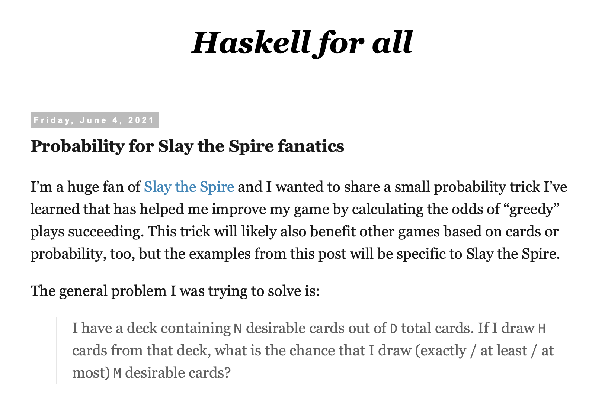

# Outline

* <span style="color:#ff2c2d">Slay the Spire 101</span>
* Distribution monad
* Implementing game mechanics
* Memoization

## Slay the Spire 101

We're solving a tiny subset of the game:

- Only one character: The Ironclad
- Only one fight: a Cultist

## Turn 1 - Begin

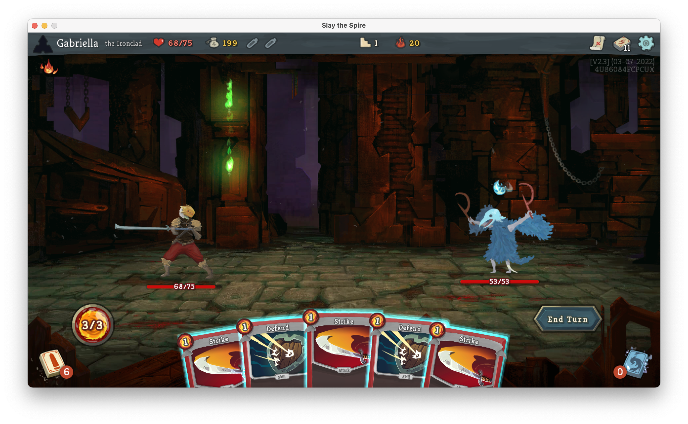

## Turn 1 - Deck

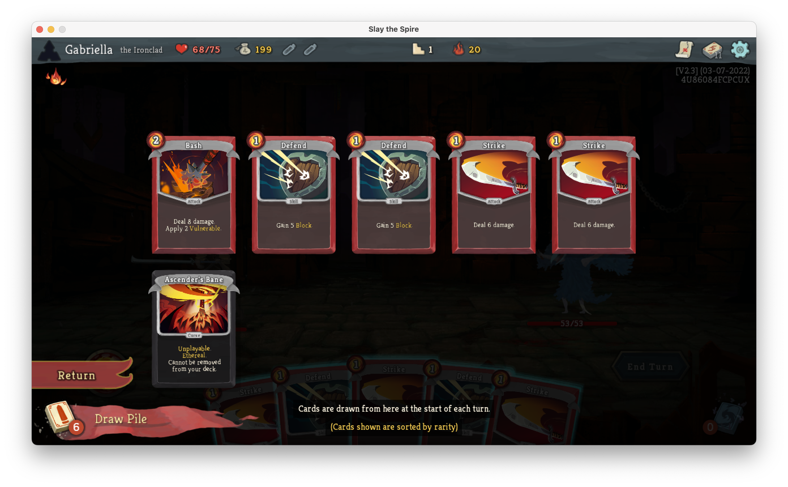

## Turn 1 - Strike

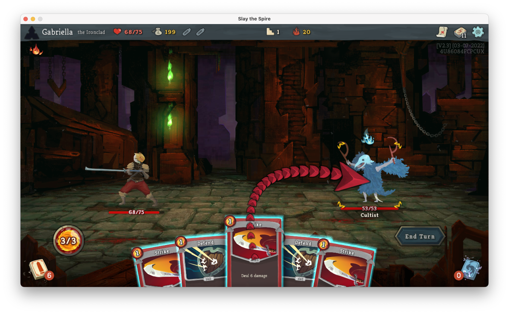

## Turn 1 - Defend

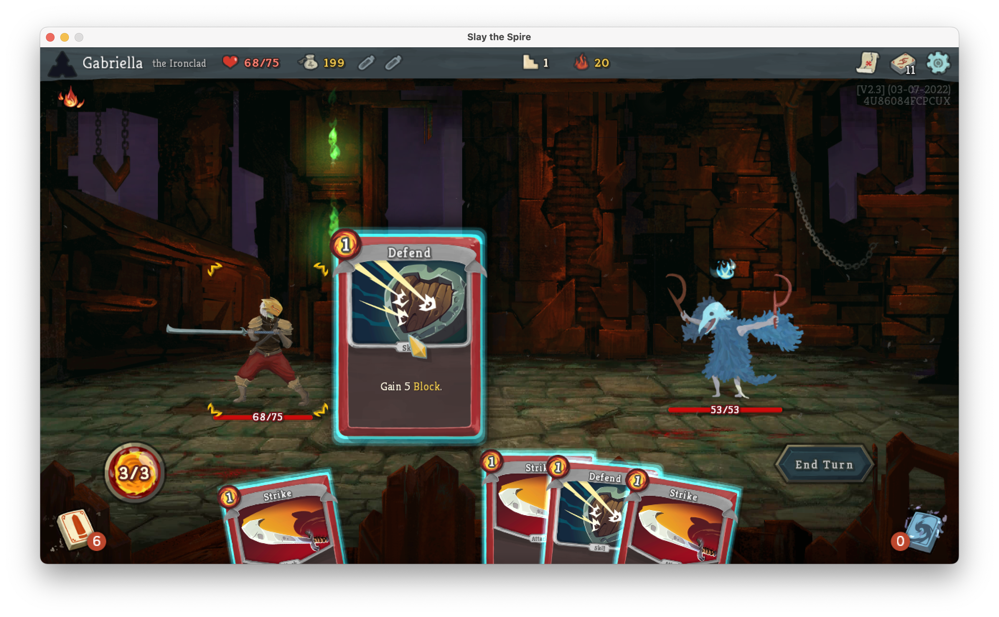

## Turn 1 - End

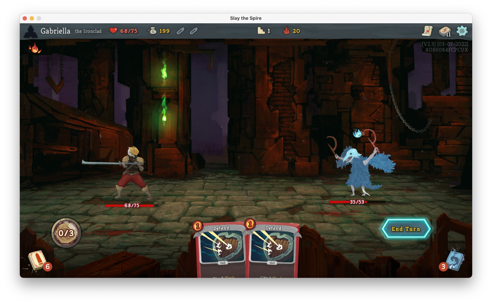

## Turn 2 - Begin

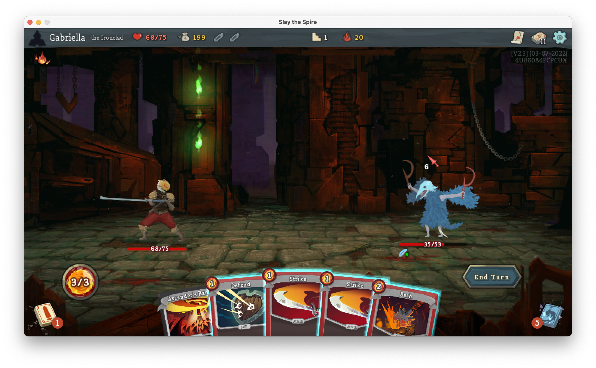

## Turn 2 - Deck

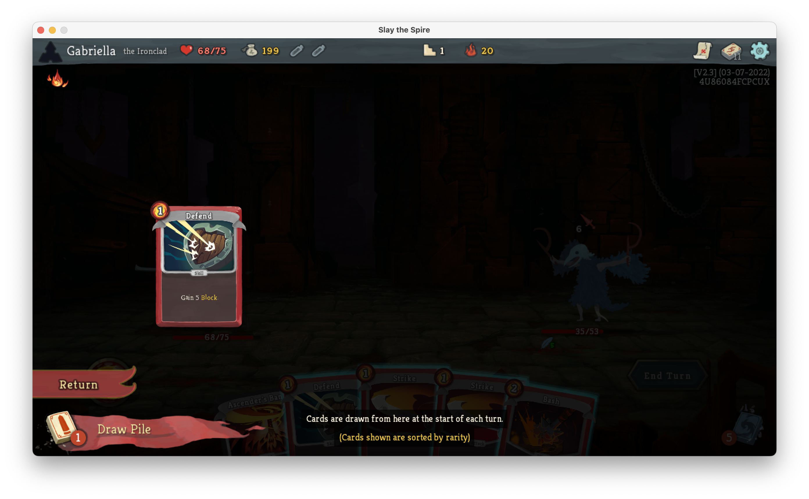

## Turn 2 - Bash

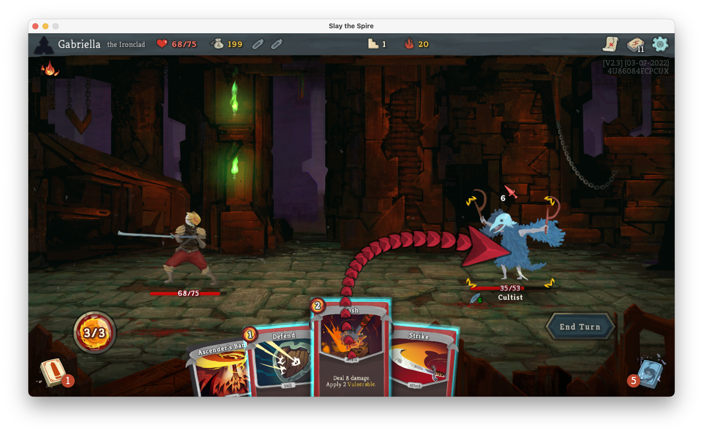

## Turn 2 - Bash consequences

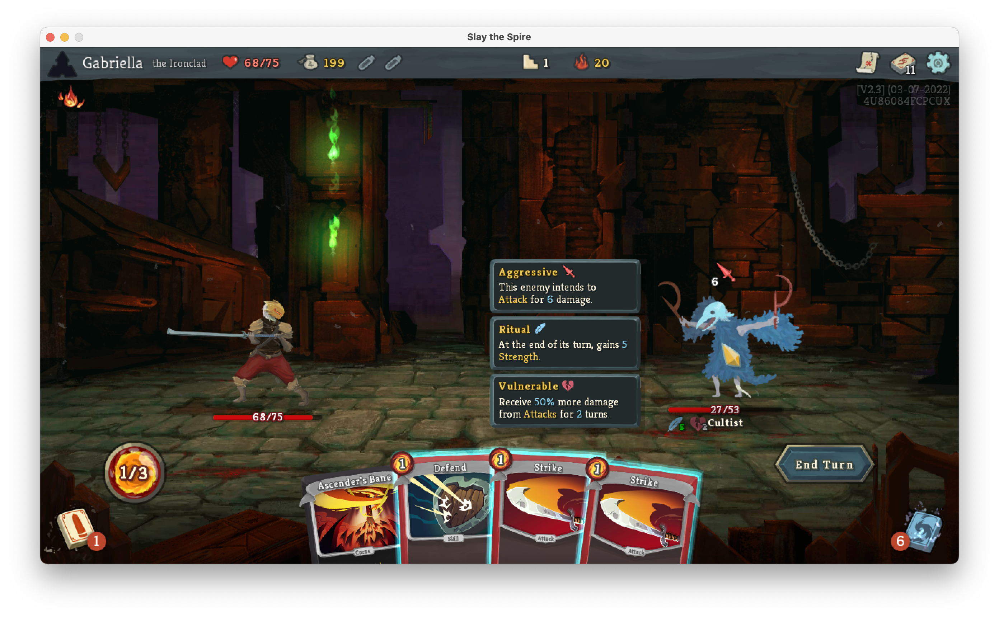

## Turn 2 - Defend


## Turn 2 - End

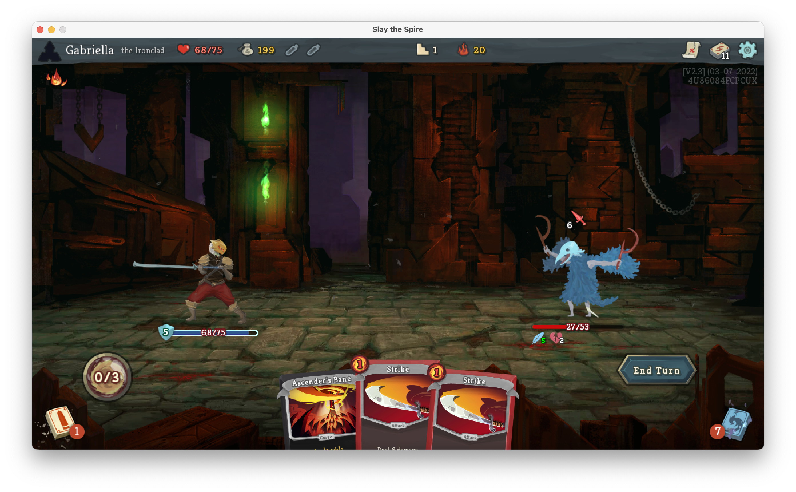

## Turn 3 - Begin

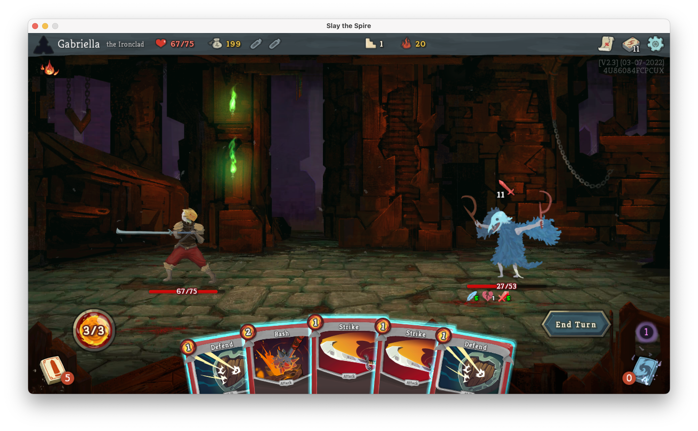

## Turn 3 - Deck

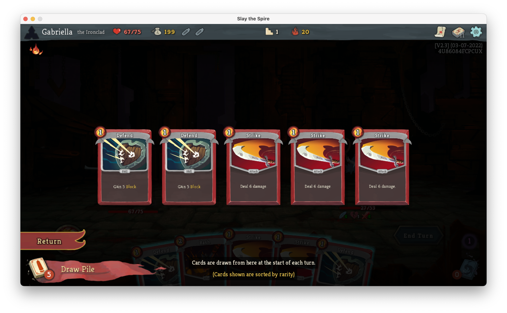

## Turn 3 - Strike

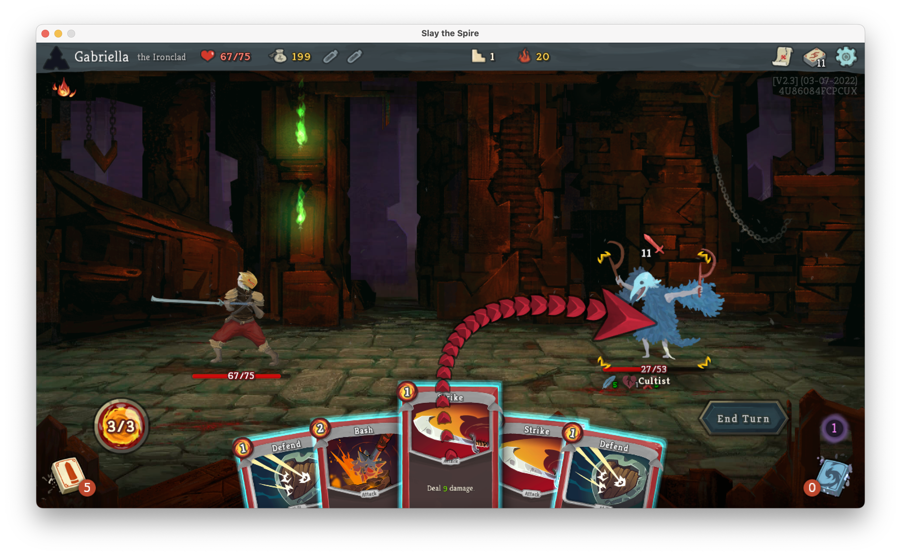

## Turn 3 - End

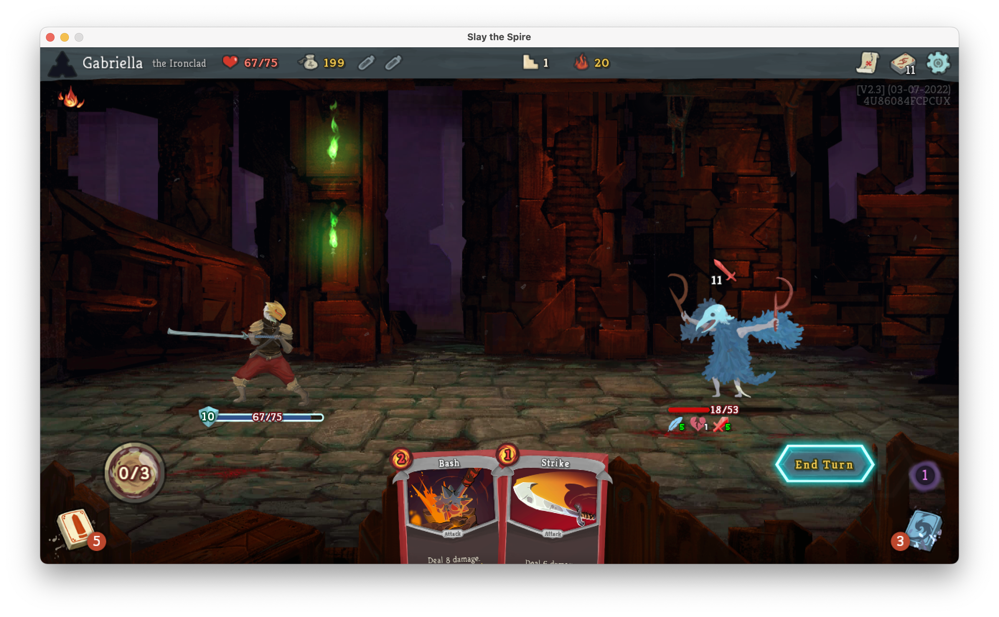

## Turn 4 - Begin

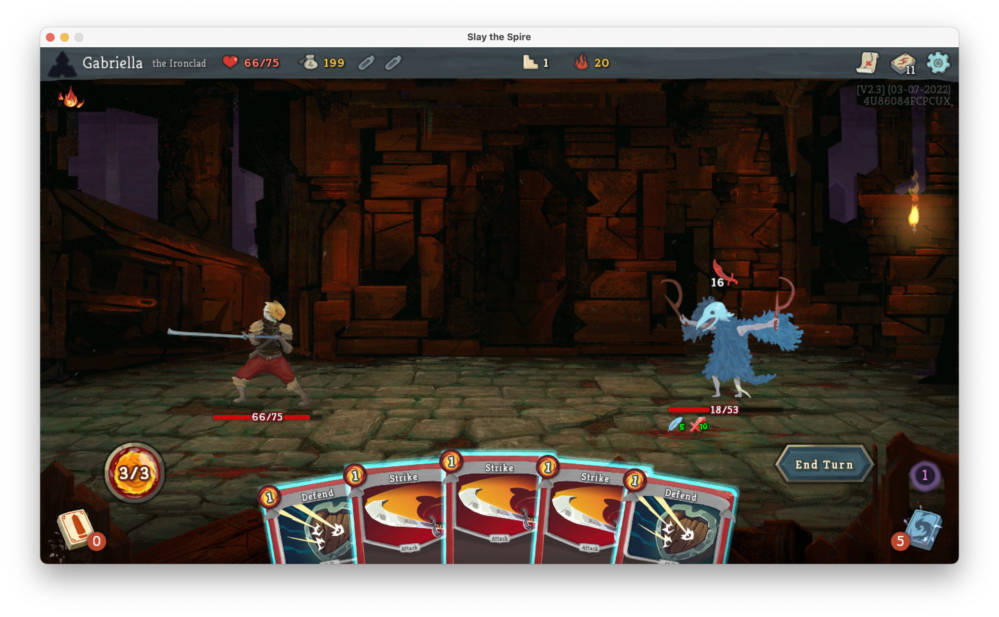

## Outcome

We only took 2 damage 🎉

* Was that the optimal play? (<span style="color:#17ff2e">yes</span>)

* Was that good or bad luck? (<span style="color:#17ff2e">good</span>, saved <span style="color:#17ff2e">2.5</span> HP)

* What if cultist had +1 HP? (We lose <span style="color:#ff2c2d">1.2 more</span> HP)

* What if we upgrade Bash? (We lose <span style="color:#17ff2e">2.0 less</span> HP)

# Outline

* Slay the Spire 101
* <span style="color:#ff2c2d">Distribution monad</span>
* Implementing game mechanics
* Memoization

## Distribution monad

We need a way to model uncertain outcomes

We'll do so using the following types:

```haskell
import Data.List.NonEmpty (NonEmpty)

-- | A single possibility, consisting of an outcome paired
--   with the associated weight of that outcome
data Possibility a = Possibility{ outcome :: a, weight :: Rational }
    deriving (Show)

-- | A probability distribution, which is a non-empty list of
--   weighted outcomes
newtype Distribution a =
    Distribution{ possibilities :: NonEmpty (Possibility a) }
    deriving (Show)
```

## Syntactic sugar

```haskell
{-# LANGUAGE DerivingStrategies         #-}
{-# LANGUAGE GeneralizedNewtypeDeriving #-}

import GHC.Exts (IsList)

import qualified Data.List.NonEmpty as NonEmpty

newtype Distribution a =
    Distribution{ possibilities :: NonEmpty (Possibility a) }
    deriving newtype (IsList)

instance Show a => Show (Distribution a) where
    show distribution =
        show (NonEmpty.toList (possibilities distribution))
```

## Syntactic sugar - Example

```haskell
>>> :set -XOverloadedLists

>>> data Coin = Heads | Tails deriving (Show)

>>> toss = [ Possibility Heads (1 / 2), Possibility Tails (1 / 2) ]
        :: Distribution Coin

>>> import Text.Show.Pretty

>>> pPrint toss
[ Possibility { outcome = Heads , weight = 1 % 2 }
, Possibility { outcome = Tails , weight = 1 % 2 }
]
```

## Monad instance - Example

```haskell
>>> toss = [ Possibility Heads (1 / 2), Possibility Tails (1 / 2) ]
        :: Distribution Coin

>>> twice = do x <- toss; y <- toss; return (x, y)

>>> pPrint twice
[ Possibility { outcome = ( Heads , Heads ) , weight = 1 % 4 }
, Possibility { outcome = ( Heads , Tails ) , weight = 1 % 4 }
, Possibility { outcome = ( Tails , Heads ) , weight = 1 % 4 }
, Possibility { outcome = ( Tails , Tails ) , weight = 1 % 4 }
]
```

## Monad instance - Example

```haskell
>>> toss = [ Possibility Heads (3 / 10), Possibility Tails (7 / 10) ]
        :: Distribution Coin

>>> twice = do x <- toss; y <- toss; return (x, y)

>>> pPrint twice
[ Possibility { outcome = ( Heads , Heads ) , weight = 9 % 100 }
, Possibility { outcome = ( Heads , Tails ) , weight = 21 % 100 }
, Possibility { outcome = ( Tails , Heads ) , weight = 21 % 100 }
, Possibility { outcome = ( Tails , Tails ) , weight = 49 % 100 }
]
```

## Monad instance

```haskell
{-# LANGUAGE BlockArguments #-}
{-# LANGUAGE DeriveFunctor  #-}

import qualified Control.Monad as Monad

data Possibility a = Possibility{ outcome :: a, weight :: Rational }
    deriving stock (Functor)

newtype Distribution a =
    Distribution{ possibilities :: NonEmpty (Possibility a) }
    deriving stock (Functor)

instance Monad Distribution where
    m >>= f = Distribution do
        Possibility{ outcome = x, weight = w₀ } <- possibilities m
        Possibility{ outcome = y, weight = w₁ } <- possibilities (f x)
        return Possibility{ outcome = y, weight = w₀ * w₁ }

instance Applicative Distribution where
    pure x =
        Distribution (pure Possibility{ outcome = x, weight = 1 })

    (<*>) = Monad.ap
```

## WriterT 💡

Instead of this:

```haskell
data Possibility a = Possibility{ outcome :: a, weight :: Rational }

newtype Distribution a =
    Distribution{ possibilities :: NonEmpty (Possibility a) }
```

… we could have done this:

```haskell
import Control.Monad.Trans.Writer (WriterT)
import Data.Monoid (Product)

newtype Distribution a =
    Distribution (WriterT (Product Rational) NonEmpty a)
    deriving newtype (Functor, Applicative, Monad)
```

## Expected value

<span class="math">$$ \sum_{i} n_{i} p_{i}

```haskell
{-# LANGUAGE NamedFieldPuns #-}

-- | Compute the expected value for a probability distribution
expectedValue :: Fractional number => Distribution number -> number
expectedValue Distribution{ possibilities } = sum (fmap weigh possibilities)
  where
    weigh Possibility{ outcome, weight } = fromRational weight * outcome
```

# Outline

* Slay the Spire 101
* Distribution monad
* <span style="color:#ff2c2d">Implementing game mechanics</span>
* Memoization

## Implementing game mechanics

Now that we have the `Distribution` monad we can implement the game

## API - Type

```haskell
-- | Play the game optimally to its conclusion
play
    :: (Fractional number, Ord number)

    => (state -> number)
    -- ^ Objective function

    -> (state -> [Distribution state])
    -- ^ A function which generates the available moves

    -> state
    -- ^ The starting state

    -> Distribution state
    -- ^ The final probability distribution after optimal play
```

## API - Term

```haskell
import Data.List (maximumBy)
import Data.Ord (comparing)

play objectiveFunction toChoices = loop
  where
    loop status
        | null choices = do
            pure status
        | otherwise = do
            nextStatus <- maximumBy (comparing predict) choices
            loop nextStatus
      where
        choices = toChoices status

    predict choice = expectedValue do
        nextStatus <- choice
        finalStatus <- loop nextStatus
        return (objectiveFunction finalStatus)
```


## State - Card

We only support the starting cards:

```haskell
-- | Ironclad cards
data Card
    = Bash
    | Strike
    | Defend
    | Ascender'sBane
    deriving (Eq, Generic, Ord, Show)
```

This also does not support upgraded cards

## State - Global

```haskell
import GHC.Generics (Generic)
import Data.Map (Map)

-- | Game state
data Status = Status
    { turn                 :: Int
    , energy               :: Int
    , deck                 :: Map Card Int
    , hand                 :: Map Card Int
    , graveyard            :: Map Card Int
    , ironcladHealth       :: Int
    , ironcladBlock        :: Int
    , cultistHealth        :: Int
    , cultistVulnerability :: Int
    } deriving (Eq, Generic, Ord, Show)
```

`Int` is faster and simpler than `Natural`

## Objective function

```haskell
objective :: Status -> Double
objective Status{ ironcladHealth } = fromIntegral ironcladHealth
```

Well, that was simple

This only works because we're not using heuristics

## Game over

The game ends when the cultist or Ironclad dies

```haskell
done :: Status -> Bool
done Status{ ironcladHealth, cultistHealth } =
    ironcladHealth <= 0 || cultistHealth <= 0
```

Hopefully the cultist dies first 😬

## Combinatorics

```haskell
-- | Draw N cards from the deck
drawMany :: Int -> StateT Status Distribution ()

-- | All possible plays that consume up to N energy
subsetsByEnergy :: Int -> Map Card Int -> [(Map Card Int, Int)]
```

## Playing a card

```haskell
act :: Card -> StateT Status Distribution ()
act card = do
    status <- State.get

    let vulnerability = case card of
            Bash -> 2
            _    -> 0

    let damageMultiplier =
            if 1 <= cultistVulnerability status then 1.5 else 1

    let baseDamage = case card of
            Strike -> 6
            Bash   -> 8
            _      -> 0

    let damage = truncate (baseDamage * damageMultiplier :: Double)

    let block = case card of
            Defend -> 5
            _      -> 0

    let newCultistHealth = max 0 (cultistHealth status - damage)

    State.put status
        { hand                 = decrease 1 card (hand status)
        , graveyard            = increase 1 card (graveyard status)
        , cultistHealth        = newCultistHealth
        , cultistVulnerability = cultistVulnerability status + vulnerability
        , ironcladBlock        = ironcladBlock status + block
        }
```

## Ending a turn

```haskell
endTurn :: StateT Status Distribution ()
endTurn = do
    status <- State.get

    let newCultistVulnerability =
            max 0 (cultistVulnerability status - 1)

    let cultistDamage =
            if turn status == 0 then 0 else 1 + 5 * turn status

    let cultistUnblockedDamage =
            if 0 < cultistHealth status
            then max 0 (cultistDamage - ironcladBlock status)
            else 0

    let newIroncladHealth =
            max 0 (ironcladHealth status - cultistUnblockedDamage)

    let exhausted = Map.delete Ascender'sBane (hand status)

    State.put status
        { hand = Map.empty
        , graveyard = Map.unionWith (+) exhausted (graveyard status)
        , ironcladHealth = newIroncladHealth
        , cultistVulnerability = newCultistVulnerability
        }

    drawMany 5

    State.modify (\s -> s
        { ironcladBlock = 0
        , energy = 3
        , turn = turn status + 1
        })
```

## Choices

```haskell
exampleChoices :: Status -> [Distribution Status]
exampleChoices status = do
    Monad.guard (not (done status))

    ~(subset, remainingEnergy) <- subsetsByEnergy 3 (hand status)

    let process :: Card -> Int -> StateT Status Distribution ()
        process card count = Monad.replicateM_ count (act card)

    let turn :: StateT Status Distribution ()
        turn = do
            State.modify (\s -> s{ energy = remainingEnergy })

            _ <- Map.traverseWithKey process subset

            endTurn

    return (State.execStateT turn status)
```

## Heuristic

```haskell
exampleChoices :: Status -> [Distribution Status]
exampleChoices status = do
    Monad.guard (not (done status))

    let heuristic subsets
            | null filtered = subsets
            | otherwise     = filtered
          where
            filtered = filter predicate subsets
              where
                predicate (_, remainingEnergy) = remainingEnergy <= 0

    ~(subset, remainingEnergy) <- heuristic (subsetsByEnergy 3 (hand status))

    let process :: Card -> Int -> StateT Status Distribution ()
        process card count = Monad.replicateM_ count (act card)

    let turn :: StateT Status Distribution ()
        turn = do
            State.modify (\s -> s{ energy = remainingEnergy })

            _ <- Map.traverseWithKey process subset

            endTurn

    return (State.execStateT turn status)
```

## Optimizations

I made some simplifying assumptions:

- Card order doesn't matter
- Energy is updated after playing all cards

These assumptions don't hold in general

## Starting states

We will produce a `Distribution` of starting states

```haskell
-- | All possible starting states
possibleInitialStatuses :: Distribution Status
possibleInitialStatuses = do
    status <- Distribution do
        cultistHealth <- 50 :| [ 51 .. 56 ]

        return
          Possibility
            { weight = 1 / 7
            , outcome =
                Status
                  { cultistHealth
                  , ironcladHealth = 68
                  , deck =
                      Map.fromList
                        [ (Strike, 5)
                        , (Defend, 4)
                        , (Bash, 1)
                        , (Ascender'sBane, 1)
                        ]
                  , hand = Map.empty
                  , graveyard = Map.empty
                  , cultistVulnerability = 0
                  , ironcladBlock = 0
                  , energy = 3
                  , turn = 0
                  }
            }

    State.execStateT (drawMany 5) status
```

## Putting it all together

We can simulate all possible fights like this:

```haskell
game :: Distribution Status
game = do
    initialStatus <- possibleInitialStatuses

    play objective exampleChoices initialStatus

main :: IO ()
main = print (expectedValue (fmap objective game))
```

… but that is too slow!  It takes ages to run

# Outline

* Slay the Spire 101
* Distribution monad
* Implementing game mechanics
* <span style="color:#ff2c2d">Memoization</span>

## Time complexity

Our program is slow because it recomputes too much

Specifically, if:

- $d$ is the depth (average # of turns)
- $b$ is average number of branches per turn

… then the time complexity is $O(b^{d})$

## Time complexity

What are the typical values for $b$ and $d$?

$b$ is around $10$ (# of hands we can draw)

Under *optimal play* $d ≈ 3.6$ turns

However, we do not search only $10^{3.6}$ states …

## Sub-optimal play

The algorithm has to simulate suboptimal play!

Under sub-optimal play $d$ can go as high as $9$!

This means we simulate approximately $10^{9}$ states

## Number of states

There aren't $10^{9}$ states, though!

If:

* $i$ is the max health of the ironclad (68)
* $c$ is the max health of the cultist (56)
* $h$ is the number of possible hands (19)

… then the maximum number of states is:

$$i * c * h = 72352$$

… which is a *much* lower number.

## Memoization

Memoization exploits the small state space

We only compute the `play` function once per state

We'll use the `MemoTrie` package for this purpose

## Before - Type

```haskell
play
    :: (Fractional number, Ord number)
    => (state -> number)
    -> (state -> Bool)
    -> (state -> NonEmpty (Distribution state))
    -> state
    -> Distribution state
```

## After - Type

```haskell
play
    :: (Fractional number, Ord number, HasTrie state)
    => (state -> number)
    -> (state -> Bool)
    -> (state -> NonEmpty (Distribution state))
    -> state
    -> Distribution state
```

## Before - Term

```haskell
play objectiveFunction toChoices = loop
  where
    loop status
        | null choices = do
            pure status
        | otherwise = do
            nextStatus <- maximumBy (comparing predict) choices
            loop nextStatus
      where
        choices = toChoices status

    predict choice = expectedValue do
        nextStatus <- choice
        finalStatus <- loop nextStatus
        return (objectiveFunction finalStatus)
```

## After

```haskell
play objectiveFunction toChoices = MemoTrie.memoFix memoize
  where
    memoize loop status
        | null choices = do
            pure status
        | otherwise = do
            nextStatus <- maximumBy (comparing predict) choices
            loop nextStatus
      where
        choices = toChoices status

    predict choice = expectedValue do
        nextStatus <- choice
        finalStatus <- loop nextStatus
        return (objectiveFunction finalStatus)
```

## Supporting instances

```haskell
instance HasTrie Card where
    newtype (Card :->: b) = CardTrie { unCardTrie :: Reg Card :->: b }

    trie = MemoTrie.trieGeneric CardTrie

    untrie = MemoTrie.untrieGeneric unCardTrie

    enumerate = MemoTrie.enumerateGeneric unCardTrie

instance HasTrie Status where
    newtype (Status :->: b) = StatusTrie { unStatusTrie :: Reg Status :->: b }

    trie = MemoTrie.trieGeneric StatusTrie

    untrie = MemoTrie.untrieGeneric unStatusTrie

    enumerate = MemoTrie.enumerateGeneric unStatusTrie

instance (HasTrie k, HasTrie v, Ord k) => HasTrie (Map k v) where
    newtype (Map k v :->: b) = MapTrie { unMapTrie :: Reg [(k, v)] :->: b }

    trie f = MapTrie (trie (f . Map.fromAscList . Generics.to))

    untrie t a = untrie (unMapTrie t) (Generics.from (Map.toList a))

    enumerate t = map adapt (enumerate (unMapTrie t))
      where
        adapt (a, b) = (Map.fromAscList (Generics.to a), b)
```

## Min-maxing slay the spire

Now we can finally compute the result:

```haskell
game :: Distribution Status
game = do
    initialStatus <- possibleInitialStatuses

    play objective exampleChoices initialStatus

main :: IO ()
main = print (expectedValue (fmap objective game))
```

```
63.547677967061674 (32627274131 % 513429840)
```

In other words, we lose 5.8 health on average

# Conclusion

- The correct name for this is a "Markov decision process"
- Haskell makes this sort of solver really slick (especially memoization)
- Slay the Spire is an amazing game

You can find these slides here:

- [GitHub - Gabriella439/slides - munihac2022](https://github.com/Gabriella439/slides)

You can find the code here:

- [GitHub - Gabriella439/spire](https://github.com/Gabriella439/spire)

If you use Nix, you can run the latest code using:

```bash
$ nix run github:Gabriella439/spire
```

# Appendix: Fun numbers

| Information | Expected Ironclad HP | Change |
-----------------------------------------------
| Baseline | 63.548 | N/A |
| Cultist has 53 HP | 64.292 | <span style="color:#17ff2e">+0.744</span> |
| Turn 1 draw | 65.696 | <span style="color:#17ff2e">+1.404</span> |
| Turn 2 draw | 66.317 | <span style="color:#ff2c2d">+0.622</span> |
| Turn 3 draw | 66.000 | <span style="color:#17ff2e">-0.317</span> |
| Turn 4 draw | 66.000 | <span style="color:#17ff2e">0.000</span> |

## Appendix: Fun numbers

| Cultist Starting HP | Expected Ironclad HP |
----------------------------------------------
| 50 | 64.90251709951256 |
| 51 | 64.47234240417347 |
| 52 | 64.47234240417347 |
| 53 | 64.29158962206014 |
| 54 | 62.511362804701804 |
| 55 | 62.15813612040936 |
| 56 | 62.025455314400894|

The result doesn't change for 51 vs. 52 Cultist HP!

# Appendix: Tool-assisted play

We can (sort of) use this to choose plays

```haskell
-- | Play the game optimally for one step
step
    :: (Fractional number, Ord number, HasTrie state)
    => (state -> number)
    -- ^ Objective function
    -> (state -> [Distribution state])
    -- ^ A function which generates the available moves
    -> state
    -- ^ The starting state
    -> Maybe (Distribution state)
    -- ^ The final probability distribution
step objectiveFunction toChoices status =
    case choices of
        []         -> Nothing
        [ choice ] -> Just choice
        _          -> Just (List.maximumBy (Ord.comparing predict) choices)
  where
    choices = toChoices status

    predict choice = expectedValue do
        nextStatus <- choice

        finalStatus <- play objectiveFunction toChoices nextStatus

        return (objectiveFunction finalStatus)
```

## Sample play - Turn 1

```haskell
Status
  { cultistHealth = 53
  , ironcladHealth = 68
  , deck =
      fromList
        [ ( Bash , 1 )
        , ( Strike , 2 )
        , ( Defend , 2 )
        , ( Ascender'sBane , 1 )
        ]
  , hand = fromList [ ( Strike , 3 ) , ( Defend , 2 ) ]
  , graveyard = fromList []
  , cultistVulnerability = 0
  , ironcladBlock = 0
  , energy = 3
  , turn = 0
  }
```

## Sample play - Turn 1


## Sample play - Turn 2

```haskell
Status
  { cultistHealth = 35
  , ironcladHealth = 68
  , deck = fromList [ ( Defend , 1 ) ]
  , hand =
      fromList
        [ ( Bash , 1 )
        , ( Strike , 2 )
        , ( Defend , 1 )
        , ( Ascender'sBane , 1 )
        ]
  , graveyard = fromList [ ( Strike , 3 ) , ( Defend , 2 ) ]
  , cultistVulnerability = 0
  , ironcladBlock = 0
  , energy = 3
  , turn = 1
  }
```

## Sample play - Turn 2


## Sample play - Turn 3

```haskell
Status
  { cultistHealth = 27
  , ironcladHealth = 67
  , deck = fromList [ ( Strike , 3 ) , ( Defend , 2 ) ]
  , hand =
      fromList [ ( Bash , 1 ) , ( Strike , 2 ) , ( Defend , 2 ) ]
  , graveyard = fromList []
  , cultistVulnerability = 1
  , ironcladBlock = 0
  , energy = 3
  , turn = 2
  }
```

## Sample play - Turn 3


## Sample play - Turn 4

```haskell
Status
  { cultistHealth = 18
  , ironcladHealth = 66
  , deck = fromList []
  , hand = fromList [ ( Strike , 3 ) , ( Defend , 2 ) ]
  , graveyard =
      fromList [ ( Bash , 1 ) , ( Strike , 2 ) , ( Defend , 2 ) ]
  , cultistVulnerability = 0
  , ironcladBlock = 0
  , energy = 3
  , turn = 3
  }
```

## Sample play - Turn 4


