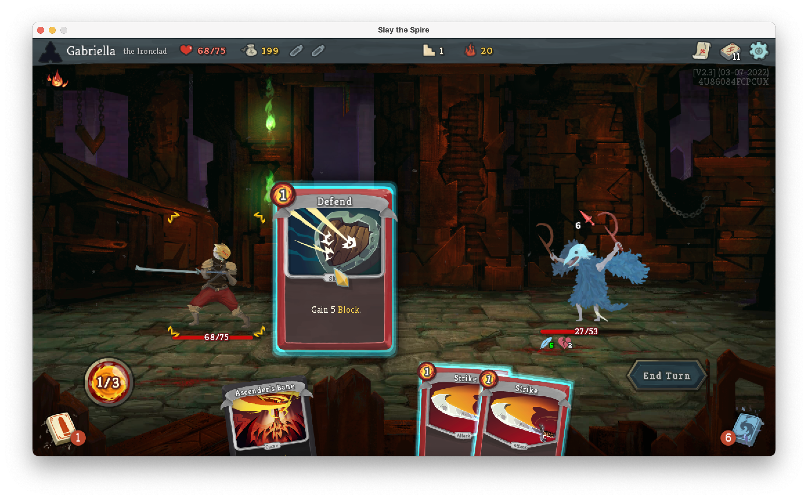

% Minmaxing Slay the Spire with Haskell
% Gabriella Gonzalez
% October 7, 2016

# Background

<style>
    .reveal h1, .reveal h2, .reveal h3, .reveal h4, .reveal h5 {
                  text-transform: none;
          }
</style>

[My last MuniHac presentation](https://youtu.be/6a5Ti0r8Q2s) was more
theoretical

This time I'm giving a more Hackathon-oriented talk 

Specifically, I'm presenting the project I'm hacking on

## The project

This is a toy attempt to solve the game "Slay the Spire"

I'm only attempting to solve simple early-game fights

No heuristics; we're computing the optimal outcome

## I like to overthink this game


# Outline

* <span style="color:#ff2c2d">Slay the Spire 101</span>
* Distribution monad
* Implementing game mechanics
* Memoization

# Slay the Spire 101

We're solving a tiny subset of the game:

- Only one character: The Ironclad
- Only one fight: a Cultist

## Turn 1 - Begin


## Turn 1 - Deck


## Turn 1 - Strike


## Turn 1 - Defend


## Turn 1 - End


## Turn 2 - Begin


## Turn 2 - Deck


## Turn 2 - Bash


## Turn 2 - Bash consequences


## Turn 2 - Defend



## Turn 2 - End


## Turn 3 - Begin


## Turn 3 - Deck


## Turn 3 - Strike


## Turn 3 - End


## Turn 4 - Begin


# Outcome

We only took 2 damage 🎉

* Was that the optimal play? (<span style="color:#17ff2e">yes</span>)

* Was that good or bad luck? (<span style="color:#17ff2e">good</span>, saved <span style="color:#17ff2e">1.8</span> HP)

* What if cultist had +1 HP? (We lose <span style="color:#ff2c2d">1.4 more</span> HP)

* What if we upgrade Bash? (We lose <span style="color:#17ff2e">1.3 less</span> HP)

# Outline

* Slay the Spire 101
* <span style="color:#ff2c2d">Distribution monad</span>
* Implementing game mechanics
* Memoization

# Distribution monad

We need a way to model uncertain outcomes

We'll do so using the following types:

```haskell
import Data.List.NonEmpty (NonEmpty)

-- | A single possibility, consisting of an outcome paired
--   with the associated weight of that outcome
data Possibility a = Possibility{ outcome :: a, weight :: Int }
    deriving (Show)

-- | A probability distribution, which is a non-empty list of
--   weighted outcomes
newtype Distribution a =
    Distribution{ possibilities :: NonEmpty (Possibility a) }
    deriving (Show)
```

## Expected value

<span class="math">$$ \sum_{i} n_{i} p_{i} = {\sum_{i} n_{i} w_{i} \over \sum_{i} w_{i}}$$</span>

## Expected value

```haskell
{-# LANGUAGE NamedFieldPuns #-}

data Possibility a = Possibility{ outcome :: a, weight :: Int }

newtype Distribution a =
    Distribution{ possibilities :: NonEmpty (Possibility a) }

-- | Compute the expected value for a probability distribution
expectedValue :: Fractional number => Distribution number -> number
expectedValue Distribution{ possibilities } =
    totalTally / fromIntegral totalWeight
  where
    totalTally = sum (fmap tally possibilities)

    totalWeight = sum (fmap weight possibilities)

    tally Possibility{ outcome, weight } = fromIntegral weight * outcome
```

## Syntactic sugar

```haskell
{-# LANGUAGE DerivingStrategies         #-}
{-# LANGUAGE GeneralizedNewtypeDeriving #-}

import GHC.Exts (IsList)

import qualified Data.List.NonEmpty as NonEmpty

newtype Distribution a =
    Distribution{ possibilities :: NonEmpty (Possibility a) }
    deriving newtype (IsList)

instance Show a => Show (Distribution a) where
    show distribution =
        show (NonEmpty.toList (possibilities distribution))
```

## Syntactic sugar - Example

```haskell
>>> :set -XOverloadedLists

>>> data Coin = Heads | Tails deriving (Show)

>>> toss = [ Possibility Heads 1, Possibility Tails 1 ]
        :: Distribution Coin

>>> import Text.Show.Pretty

>>> pPrint toss
[ Possibility { outcome = Heads , weight = 1 }
, Possibility { outcome = Tails , weight = 1 }
]
```

## Monad instance

```haskell
{-# LANGUAGE BlockArguments #-}
{-# LANGUAGE DeriveFunctor  #-}

import qualified Control.Monad as Monad

data Possibility a = Possibility{ outcome :: a, weight :: Int }
    deriving stock (Functor)

newtype Distribution a =
    Distribution{ possibilities :: NonEmpty (Possibility a) }
    deriving stock (Functor)

instance Monad Distribution where
    m >>= f = Distribution do
        Possibility{ outcome = x, weight = w₀ } <- possibilities m
        Possibility{ outcome = y, weight = w₁ } <- possibilities (f x)
        return Possibility{ outcome = y, weight = w₀ * w₁ }

instance Applicative Distribution where
    pure x = Distribution (pure Possibility{ outcome = x, weight = 1 })

    (<*>) = Monad.ap
```

## Monad instance - Example

```haskell
>>> toss = [ Possibility Heads 1, Possibility Tails 1 ]
        :: Distribution Coin

>>> twice = do x <- toss; y <- toss; return (x, y)

>>> pPrint twice
[ Possibility { outcome = ( Heads , Heads ) , weight = 1 }
, Possibility { outcome = ( Heads , Tails ) , weight = 1 }
, Possibility { outcome = ( Tails , Heads ) , weight = 1 }
, Possibility { outcome = ( Tails , Tails ) , weight = 1 }
]
```

## Monad instance - Example

```haskell
>>> toss = [ Possibility Heads 3, Possibility Tails 7 ]
        :: Distribution Coin

>>> twice = do x <- toss; y <- toss; return (x, y)

>>> pPrint twice
[ Possibility { outcome = ( Heads , Heads ) , weight = 9 }
, Possibility { outcome = ( Heads , Tails ) , weight = 21 }
, Possibility { outcome = ( Tails , Heads ) , weight = 21 }
, Possibility { outcome = ( Tails , Tails ) , weight = 49 }
]
```

## WriterT 💡

Instead of this:

```haskell
data Possibility a = Possibility{ outcome :: a, weight :: Int }

newtype Distribution a =
    Distribution{ possibilities :: NonEmpty (Possibility a) }
```

… we could have done this:

```haskell
import Control.Monad.Trans.Writer (WriterT)
import Data.Monoid (Product)

newtype Distribution a =
    Distribution (WriterT (Product Int) NonEmpty a)
    deriving newtype (Functor, Applicative, Monad)
```

# Outline

* Slay the Spire 101
* Distribution monad
* <span style="color:#ff2c2d">Implementing game mechanics</span>
* Memoization

# Implementing game mechanics

Now that we have the `Distribution` monad we can implement the game

## API - Type

```haskell
-- | Play the game optimally to its conclusion
play
    :: (Fractional number, Ord number)

    => (state -> number)
    -- ^ Objective function

    -> (state -> [Distribution state])
    -- ^ A function which generates the available moves

    -> state
    -- ^ The starting state

    -> Distribution state
    -- ^ The final probability distribution after optimal play
```

## API - Term

```haskell
import Data.List (maximumBy)
import Data.Ord (comparing)
```

```haskell
play objectiveFunction toChoices = loop
  where
    loop status
        | null choices = do
            pure status
        | otherwise = do
            nextStatus <- maximumBy (comparing predict) choices
            loop nextStatus
      where
        choices = toChoices status

    predict choice = expectedValue do
        nextStatus <- choice
        finalStatus <- loop nextStatus
        return (objectiveFunction finalStatus)
```
