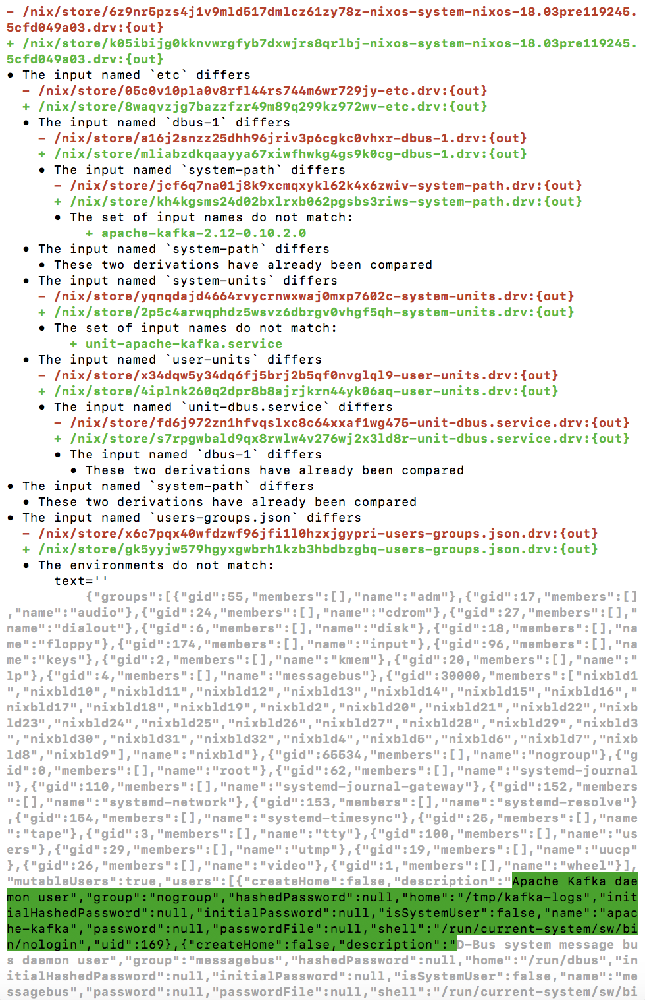

% Nix: under the hood
% Gabriel Gonzalez
% December 7, 2017

# Motivation

This talk covers how to **use** and **debug** Nix effectively in a commercial
setting

We'll do so by learning how Nix works under the hood

This talk will focus more on breadth rather than depth

This talk will emphasize the Nix toolchain and de-emphasize the Nix language 

# Introduction

Nix workflows go through this pipeline:

```
Nix expression  →  Derivation  →  Build product
```

Everything in Nix (packages, operating systems, clusters) works this way

We'll organize this talk around those three stages in the pipeline

# Organization

I like to document my Haskell libraries using the following standard format:

* For each type in the API:
    * Document what each type represents
    * Document how to **produce** a value of that type
    * Document how to **transform** a value of that type
    * Document how to **consume** a value of that type

We'll use a similar approach to systematically explore the Nix pipeline

# Overview

* Nix expressions
    * What are Nix expressions?
    * How do we **produce** Nix expressions?
    * How do we **transform** Nix expressions?
    * How do we **consume** Nix expressions?
* Derivations
    * What is a derivation?
    * How do we **produce** a derivation?
    * How do we **transform** a derivation?
    * How do we **consume** a derivation?
* Build products
    * What is a build product?
    * How do we **produce** a build product?
    * How do we **transform** a build product?
    * How do we **consume** a build product?
* Putting it all together

# Overview

* **Source code**
* Derivations
* Build products
* Putting it all together

# What is a Nix expression?

A Nix expressions is a purely functional code written in the Nix language

A Nix expression may `import` other Nix expressions stored within files

Reading a Nix expression from a file is a special case of `import`

For example, these two commands are identical:

```
$ nix-instantiate example.nix
$ nix-instantiate --expr 'import ./example.nix'
```

Strings, not files, are the universal interface to the Nix programming language

What are some contexts where we can evaluate a Nix expression without a file?

# Producing a Nix expression

Anything that can produce a string can produce a Nix expression, including:

* Text editors
* Command lines (such as `nix-repl` or `--expr` arguments to Nix commands)
* Nix expressions!
    * This is known as "import from derivation" (or "IFD" for short)
* Check out text files from a `git` repository
    * You can combine this with import from derivation

Not covered in this talk:

* `nix-channel`s
    * I discourage the use of channels for commercial development
* HTML form input
    * Example: Hydra web user interface


# Example: text editor

Use your editor to save this expression to a file named `add.nix`:

```nix
2 + 2
```

Then evaluate the expression:

```bash
$ nix-instantiate --eval add.nix
4
```

# Example: string literal

```bash
$ nix-instantiate --eval --expr '2 + 2'
4
$ nix-instantiate --eval --expr 'import ./add.nix'
4
```

```bash
$ nix-repl
Welcome to Nix version 1.11.4. Type :? for help.

nix-repl> 2 + 2
4

```

# Example: import from derivation

```bash
$ cat derivation.nix
let
  pkgs = import <nixpkgs> { };

in
  pkgs.writeText "result.nix" "2 + 2"

$ nix-instantiate --read-write-mode --eval --expr 'let derivation = import ./derivation.nix; in import derivation'
building path(s) ‘/nix/store/0nskx7yj8glb2kbqa1lz5alvw4ngz25a-result.nix’
4

$ cat /nix/store/0nskx7yj8glb2kbqa1lz5alvw4ngz25a-result.nix
2 + 2
```

# Example: obtaining `nixpkgs` using import from derivation

[Awake Security][awake] open sourced a derivation for retrieving `nixpkgs`:

* https://nixos.wiki/wiki/How_to_fetch_Nixpkgs_with_an_empty_NIX_PATH

```nix
{ rev                             # The Git revision of nixpkgs to fetch
, sha256                          # The SHA256 of the downloaded data
, system ? builtins.currentSystem # This is overridable if necessary
}:

with {
  ifThenElse = { bool, thenValue, elseValue }: (
    if bool then thenValue else elseValue);
};

ifThenElse {
  bool = (0 <= builtins.compareVersions builtins.nixVersion "1.12");

  # In Nix 1.12, we can just give a `sha256` to `builtins.fetchTarball`.
  thenValue = (
    builtins.fetchTarball {
      url = "https://github.com/NixOS/nixpkgs/archive/${rev}.tar.gz";
      inherit sha256;
    });

  # This hack should at least work for Nix 1.11
  elseValue = (
    (rec {
      tarball = import <nix/fetchurl.nix> {
        url = "https://github.com/NixOS/nixpkgs/archive/${rev}.tar.gz";
        inherit sha256;
      };

      builtin-paths = import <nix/config.nix>;
      
      script = builtins.toFile "nixpkgs-unpacker" ''
        "$coreutils/mkdir" "$out"
        cd "$out"
        "$gzip" --decompress < "$tarball" | "$tar" -x --strip-components=1
      '';

      nixpkgs = builtins.derivation {
        name = "nixpkgs-${builtins.substring 0 6 rev}";

        builder = builtins.storePath builtin-paths.shell;

        args = [ script ];

        inherit tarball system;

        tar       = builtins.storePath builtin-paths.tar;
        gzip      = builtins.storePath builtin-paths.gzip;
        coreutils = builtins.storePath builtin-paths.coreutils;
      };
    }).nixpkgs);
}
```

# Example: obtaining `nixpkgs` using import from derivation

You can import from a `nixpkgs` derivation instead of a `<nixpkgs>` channel:

```nix
# hello.nix

let
  fetchNixpkgs = import ./fetchNixpkgs.nix;

  nixpkgs = fetchNixpkgs {
     rev = "76d649b59484607901f0c1b8f737d8376a904019";
     sha256 = "01c2f4mj4ahir0sxk9kxbymg2pki1pc9a3y6r9x6ridry75fzb8h";
  };

  pkgs = import nixpkgs { config = {}; };

in
  pkgs.hello
```

```bash
$ nix-build hello.nix
building path(s) ‘/nix/store/likfhl38gcaxl5s6zywlspaln32lqa2x-nixpkgs-76d649’
/nix/store/4bc0vx8j66wrm6g44qsswmy060k61qnh-hello-2.10
```

This is better for commercial development where perfect reproducibility matters

# Transforming a Nix expression

The main way to transform a Nix expression is to evaluate the expression

Main ways to evaluate an expression:

* `nix-instantiate --eval`
* `nix-repl`
* implicitly as part of another command (such as `nix-build`)

# Example: `nix-instantiate`

```bash
$ nix-instantiate --eval --expr '2 + 2'
4
```

Evaluating a derivation:

```bash
$ nix-instantiate --eval --expr 'let pkgs = import <nixpkgs> { }; in pkgs.hello'
{ __ignoreNulls = true; __impureHostDeps = <CODE>; __propagatedImpureHostDeps = 
<CODE>; __propagatedSandboxProfile = <CODE>; __sandboxProfile = <CODE>; all = <C
ODE>; args = <CODE>; buildInputs = <CODE>; builder = <CODE>; doCheck = true; drv
Attrs = { __ignoreNulls = true; __impureHostDeps = <CODE>; __propagatedImpureHos
tDeps = <CODE>; __propagatedSandboxProfile = <CODE>; __sandboxProfile = <CODE>; 
args = <CODE>; buildInputs = <CODE>; builder = <CODE>; doCheck = true; name = "h
ello-2.10"; nativeBuildInputs = <CODE>; propagatedBuildInputs = <CODE>; propagat
edNativeBuildInputs = <CODE>; src = <CODE>; stdenv = { __impureHostDeps = <CODE>
; __sandboxProfile = <CODE>; all = <CODE>; allowedRequisites = <CODE>; args = <C
...
924537755ce9164fd5b5f81ce16a1c3-src/pkgs/stdenv/generic/setup.sh; shell = <CODE>
; shellPackage = <CODE>; system = "x86_64-darwin"; type = "derivation"; }; syste
m = <CODE>; type = "derivation"; userHook = <CODE>; }
```

A derivation is just a record with field named `type` set to `"derivation"`

# Example: `nix-repl`

```bash
$ nix-repl
Welcome to Nix version 1.11.4. Type :? for help.

nix-repl> 2 + 2
4

nix-repl> let pkgs = import <nixpkgs> { }; in pkgs.hello
«derivation /nix/store/w3a5xqc8zjamz01qqnziwasalbkzyskc-hello-2.10.drv»

nix-repl> let pkgs = import <nixpkgs> { }; in pkgs.hello.type
"derivation"
```

The `nix-repl` automatically shortens derivation records to `«derivation …»`

# Example: implicit evaluation

```bash
$ nix-instantiate --expr 'let pkgs = import <nixpkgs> { }; in pkgs.hello'
…
/nix/store/w3a5xqc8zjamz01qqnziwasalbkzyskc-hello-2.10.drv
```

Here `nix-instantiate` is actually performing two separate steps:

* evaluate the Nix expression to a derivation
* creating the derivation file from the Nix expression

Many Nix commands bundle several orthogonal steps in one invocation

Keep these orthogonal steps mentally separate when reasoning about Nix

# Consuming a Nix expression

The only way to consume a Nix expression is to transform into a derivation

Transforming a Nix expression into a derivation is known as "instantiation"

Instantiation only works if the Nix expression evaluates to a derivation

i.e. a record with a field named `type` whose value is `"derivation"`

Main ways to instantiation a Nix expression are:

* `nix-instantiate`
* implicitly as part of Nix evaluation

# Example: `nix-instantiate`

You can instantiate a Nix expression from command line with `nix-instantiate`:

```bash
$ nix-instantiate --expr 'let pkgs = import <nixpkgs> { }; in pkgs.hello'
…
/nix/store/w3a5xqc8zjamz01qqnziwasalbkzyskc-hello-2.10.drv
```

# Example: implicit as part of Nix evaluation

Nix automatically generates derivations that the root derivation references:

For example, the `both` derivation references `hello` and `goodbye` derivations:

```nix
# both.nix

let
  pkgs = import <nixpkgs> { };

  hello = pkgs.writeText "hello.txt" ''
    Hello, world!
  '';

  goodbye = pkgs.writeText "goodbye.txt" ''
    Goodbye, world!
  '';

  both = pkgs.runCommand "both.txt" {} ''
    ${pkgs.coreutils}/bin/cp ${hello} ${goodbye}
  '';

in
  both
```

# Example: implicit as part of Nix evaluation

Generating the `both` derivation also generates the `hello`/`goodbye`
derivations:

```bash
$ nix-instantiate both.nix 
…
/nix/store/a67d2b60vx30isvpgfnyk4qap92sn7zq-both.txt.drv

$ pretty-derivation < /nix/store/a67d2b60vx30isvpgfnyk4qap92sn7zq-both.txt.drv
Derivation
  { …
  , inputDrvs =
      fromList
        [ …
        , ( FilePath
              "/nix/store/f37sv45m6b3nhxw7hk1jd2iqyhqaq7bp-hello.txt.drv"
          , fromList [ "out" ]
          )
        , ( FilePath
              "/nix/store/h1phr2qq4as23rd9dgy5ccqg4ysdf0lf-goodbye.txt.drv"
          , fromList [ "out" ]
          )
        , …
        ]
  , …
  }

$ test -e /nix/store/f37sv45m6b3nhxw7hk1jd2iqyhqaq7bp-hello.txt.drv && echo $?
0

$ test -e /nix/store/h1phr2qq4as23rd9dgy5ccqg4ysdf0lf-goodbye.txt.drv && echo $?
0
```

# Overview

* Source code
* **Derivations**
* Build products
* Putting it all together

# What is a derivation?

A derivation is a language-independent recipe for how to build a path

* "Language-independent" means derivations are also Nix-independent
* A "path" you build can be a single file or a directory tree

Derivations strive to be "reproducible" and "deterministic"

* "Reproducible" means that you can always build the derivation from scratch
* "Deterministic" means that the result is always bit-for-bit identical

They are not perfectly reproducible/deterministic in practice, but better than
most alternatives

# Derivation files

Derivations are stored as `*.drv` files underneath the `/nix/store` directory:

```bash
$ find /nix/store -name '*.drv' | head
/nix/store/0008hdcdvkrr5mcqahy416hv6rmb5fwg-void-0.7.1.tar.gz.drv
/nix/store/000p9frz8wf8sns2jhn0bj94hl7ksdyq-bash43-030.drv
/nix/store/001d062xhg7bvypci1pa7h5x4ml5kz72-http-client-tls-0.3.5.1.tar.gz.drv
/nix/store/003cbxwyv9k2ihpxygxn523kxjlkpjbd-data-default-instances-dlist-0.0.1.drv
/nix/store/00548b6iwgwrrhblbyv3xqg15ycq8rcp-expat-2.2.2.drv
/nix/store/005bxi36hyy4hq889qbgkks8rv28l769-asciidoc-8.6.9.drv
/nix/store/005lcsd2xlczr9pp30qdgnml636vjz9r-gawk-4.1.4.drv
/nix/store/005vswmy4cjyjprzjjw5gmjvbll60zn2-x509-1.6.5.drv
/nix/store/00742vvlcwi00cryiwm24i75y43jvjan-dbus-conf.drv
/nix/store/0077zd7wg4rc38nppn0als642yp5sdif-Jinja2-2.8.tar.gz.drv
```

# Derivation format

Derivations are serialized as one long line of text:

```bash
$ fold /nix/store/0008hdcdvkrr5mcqahy416hv6rmb5fwg-void-0.7.1.tar.gz.drv
Derive([("out","/nix/store/fbbqa4x05q9x0w6s1fqmx7k676d2zyz1-void-0.7.1.tar.gz","
sha256","c9f0fd93680c029abb9654b5464be260652829961b18b7046f96a0df95e825f4")],[("
/nix/store/cwnn2alfww3six2ywph5hnnlmxwhv9c7-curl-7.52.1.drv",["dev"]),("/nix/sto
re/kzs0g1ch3a59ar14xnms1wj22p2bnr9l-stdenv.drv",["out"]),("/nix/store/qq7pqyfn98
314fd30xspb1hi3rqda2lh-bash-4.3-p48.drv",["out"]),("/nix/store/r1b0rbna957biiy63
m75yxsw3aphps9b-mirrors-list.drv",["out"])],["/nix/store/5pqfb6ik1cxqq1d0irlx306
0jx1qjmsn-builder.sh"],"x86_64-linux","/nix/store/gabjbkwga2dhhp2wzyaxl83r8hjjfc
37-bash-4.3-p48/bin/bash",["-e","/nix/store/5pqfb6ik1cxqq1d0irlx3060jx1qjmsn-bui
lder.sh"],[("buildInputs",""),("builder","/nix/store/gabjbkwga2dhhp2wzyaxl83r8hj
jfc37-bash-4.3-p48/bin/bash"),("curlOpts",""),("downloadToTemp",""),("executable
",""),("impureEnvVars","http_proxy https_proxy ftp_proxy all_proxy no_proxy NIX_
CURL_FLAGS NIX_HASHED_MIRRORS NIX_CONNECT_TIMEOUT NIX_MIRRORS_apache NIX_MIRRORS
_bioc NIX_MIRRORS_bitlbee NIX_MIRRORS_cpan NIX_MIRRORS_debian NIX_MIRRORS_fedora
 NIX_MIRRORS_gcc NIX_MIRRORS_gentoo NIX_MIRRORS_gnome NIX_MIRRORS_gnu NIX_MIRROR
S_gnupg NIX_MIRRORS_hackage NIX_MIRRORS_hashedMirrors NIX_MIRRORS_imagemagick NI
X_MIRRORS_kde NIX_MIRRORS_kernel NIX_MIRRORS_metalab NIX_MIRRORS_mozilla NIX_MIR
RORS_mysql NIX_MIRRORS_oldsuse NIX_MIRRORS_openbsd NIX_MIRRORS_opensuse NIX_MIRR
ORS_postgresql NIX_MIRRORS_pypi NIX_MIRRORS_roy NIX_MIRRORS_sagemath NIX_MIRRORS
_samba NIX_MIRRORS_savannah NIX_MIRRORS_sourceforge NIX_MIRRORS_sourceforgejp NI
X_MIRRORS_steamrt NIX_MIRRORS_ubuntu NIX_MIRRORS_xfce NIX_MIRRORS_xorg"),("mirro
rsFile","/nix/store/ab4zh0ga99y5xj441arp89zl8s4jfc7y-mirrors-list"),("name","voi
d-0.7.1.tar.gz"),("nativeBuildInputs","/nix/store/3ngwsbzhibvc434nqwq6jph6w7c2wa
s6-curl-7.52.1-dev"),("out","/nix/store/fbbqa4x05q9x0w6s1fqmx7k676d2zyz1-void-0.
7.1.tar.gz"),("outputHash","c9f0fd93680c029abb9654b5464be260652829961b18b7046f96
a0df95e825f4"),("outputHashAlgo","sha256"),("outputHashMode","flat"),("postFetch
",""),("preferHashedMirrors","1"),("preferLocalBuild","1"),("propagatedBuildInpu
ts",""),("propagatedNativeBuildInputs",""),("showURLs",""),("stdenv","/nix/store
/985d95clq0216a6pcp3qzw4igp84ajvr-stdenv"),("system","x86_64-linux"),("urls","mi
rror://hackage/void-0.7.1.tar.gz")])
```

# Pretty-printing derivations

You pretty-print derivations using `pretty-derivation`

You can install `pretty-derivation` from Haskell's `nix-derivation` package:

```bash
$ nix-shell --packages haskellPackages.pretty-derivation
$ pretty-derivation < /nix/store/0008hdcdvkrr5mcqahy416hv6rmb5fwg-void-0.7.1.tar.gz.drv
Derivation
  { outputs =
      fromList
        [ ( "out"
          , DerivationOutput
              { path =
                  FilePath
                    "/nix/store/fbbqa4x05q9x0w6s1fqmx7k676d2zyz1-void-0.7.1.tar.gz"
              , hashAlgo = "sha256"
              , hash =
                  "c9f0fd93680c029abb9654b5464be260652829961b18b7046f96a0df95e825f4"
              }
          )
        ]
  , inputDrvs =
      fromList
        [ ( FilePath
              "/nix/store/cwnn2alfww3six2ywph5hnnlmxwhv9c7-curl-7.52.1.drv"
          , fromList [ "dev" ]
          )
        , ( FilePath
              "/nix/store/kzs0g1ch3a59ar14xnms1wj22p2bnr9l-stdenv.drv"
          , fromList [ "out" ]
          )
        , ( FilePath
              "/nix/store/qq7pqyfn98314fd30xspb1hi3rqda2lh-bash-4.3-p48.drv"
          , fromList [ "out" ]
          )
        , ( FilePath
              "/nix/store/r1b0rbna957biiy63m75yxsw3aphps9b-mirrors-list.drv"
          , fromList [ "out" ]
          )
        ]
  , inputSrcs =
      fromList
        [ FilePath "/nix/store/5pqfb6ik1cxqq1d0irlx3060jx1qjmsn-builder.sh"
        ]
  , platform = "x86_64-linux"
  , builder =
      "/nix/store/gabjbkwga2dhhp2wzyaxl83r8hjjfc37-bash-4.3-p48/bin/bash"
  , args =
      [ "-e" , "/nix/store/5pqfb6ik1cxqq1d0irlx3060jx1qjmsn-builder.sh" ]
  , env =
      fromList
        [ ( "buildInputs" , "" )
        , ( "builder"
          , "/nix/store/gabjbkwga2dhhp2wzyaxl83r8hjjfc37-bash-4.3-p48/bin/bash"
          )
        , ( "curlOpts" , "" )
        , ( "downloadToTemp" , "" )
        , ( "executable" , "" )
        , ( "impureEnvVars"
          , "http_proxy https_proxy ftp_proxy all_proxy no_proxy NIX_CURL_FLAGS NIX_HASHED_MIRRORS NIX_CONNECT_TIMEOUT NIX_MIRRORS_apache NIX_MIRRORS_bioc NIX_MIRRORS_bitlbee NIX_MIRRORS_cpan NIX_MIRRORS_debian NIX_MIRRORS_fedora NIX_MIRRORS_gcc NIX_MIRRORS_gentoo NIX_MIRRORS_gnome NIX_MIRRORS_gnu NIX_MIRRORS_gnupg NIX_MIRRORS_hackage NIX_MIRRORS_hashedMirrors NIX_MIRRORS_imagemagick NIX_MIRRORS_kde NIX_MIRRORS_kernel NIX_MIRRORS_metalab NIX_MIRRORS_mozilla NIX_MIRRORS_mysql NIX_MIRRORS_oldsuse NIX_MIRRORS_openbsd NIX_MIRRORS_opensuse NIX_MIRRORS_postgresql NIX_MIRRORS_pypi NIX_MIRRORS_roy NIX_MIRRORS_sagemath NIX_MIRRORS_samba NIX_MIRRORS_savannah NIX_MIRRORS_sourceforge NIX_MIRRORS_sourceforgejp NIX_MIRRORS_steamrt NIX_MIRRORS_ubuntu NIX_MIRRORS_xfce NIX_MIRRORS_xorg"
          )
        , ( "mirrorsFile"
          , "/nix/store/ab4zh0ga99y5xj441arp89zl8s4jfc7y-mirrors-list"
          )
        , ( "name" , "void-0.7.1.tar.gz" )
        , ( "nativeBuildInputs"
          , "/nix/store/3ngwsbzhibvc434nqwq6jph6w7c2was6-curl-7.52.1-dev"
          )
        , ( "out"
          , "/nix/store/fbbqa4x05q9x0w6s1fqmx7k676d2zyz1-void-0.7.1.tar.gz"
          )
        , ( "outputHash"
          , "c9f0fd93680c029abb9654b5464be260652829961b18b7046f96a0df95e825f4"
          )
        , ( "outputHashAlgo" , "sha256" )
        , ( "outputHashMode" , "flat" )
        , ( "postFetch" , "" )
        , ( "preferHashedMirrors" , "1" )
        , ( "preferLocalBuild" , "1" )
        , ( "propagatedBuildInputs" , "" )
        , ( "propagatedNativeBuildInputs" , "" )
        , ( "showURLs" , "" )
        , ( "stdenv"
          , "/nix/store/985d95clq0216a6pcp3qzw4igp84ajvr-stdenv"
          )
        , ( "system" , "x86_64-linux" )
        , ( "urls" , "mirror://hackage/void-0.7.1.tar.gz" )
        ]
  }
```

# Anatomy of a derivation

The key components of a derivation are:

* Input derivations
    * This is used to compute what needs to be built before this derivation
* The build instructions, consisting of:
    * A command (i.e. `/nix/store/...-bash-4.3-p48/bin/bash`)
    * The command's arguments (i.e. `-e /nix/store/...-builder.sh`)
    * The command's environment
* The output paths
    * The build succeeds if and only if the command creates all of these paths

```bash
Derivation
  { outputs =
      fromList
        [ ( "out"
          , DerivationOutput
              { path =
                  FilePath
                    "/nix/store/fbbqa4x05q9x0w6s1fqmx7k676d2zyz1-void-0.7.1.tar.gz"
              , hashAlgo = "sha256"
              , hash =
                  "c9f0fd93680c029abb9654b5464be260652829961b18b7046f96a0df95e825f4"
              }
          )
        ]
  , inputDrvs =
      fromList
        [ ( FilePath
              "/nix/store/cwnn2alfww3six2ywph5hnnlmxwhv9c7-curl-7.52.1.drv"
          , fromList [ "dev" ]
          )
        , ( FilePath
              "/nix/store/kzs0g1ch3a59ar14xnms1wj22p2bnr9l-stdenv.drv"
          , fromList [ "out" ]
          )
        , ( FilePath
              "/nix/store/qq7pqyfn98314fd30xspb1hi3rqda2lh-bash-4.3-p48.drv"
          , fromList [ "out" ]
          )
        , ( FilePath
              "/nix/store/r1b0rbna957biiy63m75yxsw3aphps9b-mirrors-list.drv"
          , fromList [ "out" ]
          )
        ]
  , inputSrcs =
      fromList
        [ FilePath "/nix/store/5pqfb6ik1cxqq1d0irlx3060jx1qjmsn-builder.sh"
        ]
  , platform = "x86_64-linux"
  , builder =
      "/nix/store/gabjbkwga2dhhp2wzyaxl83r8hjjfc37-bash-4.3-p48/bin/bash"
  , args =
      [ "-e" , "/nix/store/5pqfb6ik1cxqq1d0irlx3060jx1qjmsn-builder.sh" ]
  , env =
      fromList
        [ ( "buildInputs" , "" )
        , ( "builder"
          , "/nix/store/gabjbkwga2dhhp2wzyaxl83r8hjjfc37-bash-4.3-p48/bin/bash"
          )
        , ( "curlOpts" , "" )
        , ( "downloadToTemp" , "" )
        , ( "executable" , "" )
        , ( "impureEnvVars"
          , "http_proxy https_proxy ftp_proxy all_proxy no_proxy NIX_CURL_FLAGS NIX_HASHED_MIRRORS NIX_CONNECT_TIMEOUT NIX_MIRRORS_apache NIX_MIRRORS_bioc NIX_MIRRORS_bitlbee NIX_MIRRORS_cpan NIX_MIRRORS_debian NIX_MIRRORS_fedora NIX_MIRRORS_gcc NIX_MIRRORS_gentoo NIX_MIRRORS_gnome NIX_MIRRORS_gnu NIX_MIRRORS_gnupg NIX_MIRRORS_hackage NIX_MIRRORS_hashedMirrors NIX_MIRRORS_imagemagick NIX_MIRRORS_kde NIX_MIRRORS_kernel NIX_MIRRORS_metalab NIX_MIRRORS_mozilla NIX_MIRRORS_mysql NIX_MIRRORS_oldsuse NIX_MIRRORS_openbsd NIX_MIRRORS_opensuse NIX_MIRRORS_postgresql NIX_MIRRORS_pypi NIX_MIRRORS_roy NIX_MIRRORS_sagemath NIX_MIRRORS_samba NIX_MIRRORS_savannah NIX_MIRRORS_sourceforge NIX_MIRRORS_sourceforgejp NIX_MIRRORS_steamrt NIX_MIRRORS_ubuntu NIX_MIRRORS_xfce NIX_MIRRORS_xorg"
          )
        , ( "mirrorsFile"
          , "/nix/store/ab4zh0ga99y5xj441arp89zl8s4jfc7y-mirrors-list"
          )
        , ( "name" , "void-0.7.1.tar.gz" )
        , ( "nativeBuildInputs"
          , "/nix/store/3ngwsbzhibvc434nqwq6jph6w7c2was6-curl-7.52.1-dev"
          )
        , ( "out"
          , "/nix/store/fbbqa4x05q9x0w6s1fqmx7k676d2zyz1-void-0.7.1.tar.gz"
          )
        , ( "outputHash"
          , "c9f0fd93680c029abb9654b5464be260652829961b18b7046f96a0df95e825f4"
          )
        , ( "outputHashAlgo" , "sha256" )
        , ( "outputHashMode" , "flat" )
        , ( "postFetch" , "" )
        , ( "preferHashedMirrors" , "1" )
        , ( "preferLocalBuild" , "1" )
        , ( "propagatedBuildInputs" , "" )
        , ( "propagatedNativeBuildInputs" , "" )
        , ( "showURLs" , "" )
        , ( "stdenv"
          , "/nix/store/985d95clq0216a6pcp3qzw4igp84ajvr-stdenv"
          )
        , ( "system" , "x86_64-linux" )
        , ( "urls" , "mirror://hackage/void-0.7.1.tar.gz" )
        ]
  }
```

# Producing derivations

Main ways to produce derivations:

* Instantiate the derivation using `nix-instantiate`
* Manually

```bash
$ nix-instantiate --expr 'let pkgs = import <nixpkgs> { }; in pkgs.hello'
…
/nix/store/w3a5xqc8zjamz01qqnziwasalbkzyskc-hello-2.10.drv
```

# Producing derivations: minimal derivation

```c
// touch.c

#include <stdlib.h>
#include <stdio.h>

int main(int argc, char **argv) {
  char *out;
  FILE *fp;

  out = getenv("out");

  fp = fopen(out, "w");

  fclose(fp);
}
```

```bash
$ gcc ./touch.c -o ./touch
```

# Producing derivations: minimal derivation

Required reading: https://nixos.org/nix/manual/#ssec-derivation

```nix
# empty.nix

derivation {
  name = "empty";

  system = "x86_64-darwin";

  builder = ./touch;
}
```

```bash
$ nix-instantiate empty.nix
…
/nix/store/g34m25sy69dxd7ly7fk2nw4zhjs55jp7-empty.drv

$ pretty-derivation < /nix/store/g34m25sy69dxd7ly7fk2nw4zhjs55jp7-empty.drv
Derivation
  { outputs =
      fromList
        [ ( "out"
          , DerivationOutput
              { path =
                  FilePath "/nix/store/cacmfnwdls57zd13hj5v2ydzh2gbwyl5-empty"
              , hashAlgo = ""
              , hash = ""
              }
          )
        ]
  , inputDrvs = fromList []
  , inputSrcs =
      fromList
        [ FilePath "/nix/store/jvf7isim1fhrppywazgxzx9h1hhzvkkb-touch" ]
  , platform = "x86_64-darwin"
  , builder = "/nix/store/jvf7isim1fhrppywazgxzx9h1hhzvkkb-touch"
  , args = []
  , env =
      fromList
        [ ( "builder"
          , "/nix/store/jvf7isim1fhrppywazgxzx9h1hhzvkkb-touch"
          )
        , ( "name" , "empty" )
        , ( "out" , "/nix/store/cacmfnwdls57zd13hj5v2ydzh2gbwyl5-empty" )
        , ( "system" , "x86_64-darwin" )
        ]
  }
```

# Producing derivations: `nix-store --add`

Note that this approach is **NOT** safe:

```bash
$ cat > empty.drv <<EOF
Derive([("out","/nix/store/wm2xkgrf072h2rkgdbaym700rvrgvrp0-empty","","")],[],["/nix/store/j65p7rrvmk6zhhbn19il02gsfrwcsgf9-touch"],"x86_64-darwin","/nix/store/j65p7rrvmk6zhhbn19il02gsfrwcsgf9-touch",[],[("builder","/nix/store/j65p7rrvmk6zhhbn19il02gsfrwcsgf9-touch"),("name","empty"),("out","/nix/store/wm2xkgrf072h2rkgdbaym700rvrgvrp0-empty"),("system","x86_64-darwin")])
EOF
```

```bash
$ nix-store --add empty.drv 
/nix/store/c8k1v7k7w349pz5lin1234fh2vhd394l-empty.drv
```

# Transforming a derivation

The main transformation is to copy the derivation between machines using
`nix-copy-closure`:

```bash
$ nix-copy-closure --to gabriel@example.com /nix/store/21wp6p5cd55kwf6f5p91w2ac031ngyv5-empty.drv
```

`nix-copy-closure` also copies derivations that are *build-time* dependencies of
the copied derivation

This is how Nix delegates build instructions to other machines

# Consuming derivations

Main ways to consume a derivation:

* Build the derivation using `nix-store --realise` 
* Debug the derivation using `nix-store --query`
* Garbage collection using `nix-store --gc`

# Consuming derivations: build the derivation

You can use `nix-store --realise` to build a derivation:

For each derivation output, `nix-store --realise` will:

* Check if the path to build already exists locally
* If not, then check if the build product can be downloaded from a remote cache
* If not, then build the derivation

```bash
$ nix-store --realise /nix/store/c8k1v7k7w349pz5lin1234fh2vhd394l-empty.drv
…
/nix/store/wm2xkgrf072h2rkgdbaym700rvrgvrp0-empty
```

```bash
$ nix-store --realise /nix/store/0008hdcdvkrr5mcqahy416hv6rmb5fwg-void-0.7.1.tar.gz.drv 
…
/nix/store/fbbqa4x05q9x0w6s1fqmx7k676d2zyz1-void-0.7.1.tar.gz
```

```bash
$ nix-store --realise /nix/store/w3a5xqc8zjamz01qqnziwasalbkzyskc-hello-2.10.drv
…
/nix/store/h5paliil3r6m70na37ymba1f007mm28k-hello-2.10
```

# Consuming derivations: Debugging

You can query a derivation's dependencies:

```bash
$ nix-store --query --tree /nix/store/jkhmav7kp8yrch4qx67276gsbzad0wbd-hello-2.10.drv
/nix/store/jkhmav7kp8yrch4qx67276gsbzad0wbd-hello-2.10.drv
+---/nix/store/9krlzvny65gdc8s7kpb6lkx8cd02c25b-default-builder.sh
+---/nix/store/z347hsajryw593h802ggb63lbr3gpv2b-standard-sandbox.sb
+---/nix/store/1ksvs625n8lwjhjxld446gn9ql23v5k8-bash-4.4-p5.drv
|   +---/nix/store/z347hsajryw593h802ggb63lbr3gpv2b-standard-sandbox.sb [...]
|   +---/nix/store/hh429nvzmkzvgq4w55bi3ihw5l5zzhwl-bootstrap-tools.drv
|   |   +---/nix/store/46qc2v6h7cicpcbchpk7ijprfwhzxxkk-cpio.drv
|   |   +---/nix/store/4cyixalr14bc2zmnvn665b3x13vq3vhd-bootstrap-tools.cpio.bz2.drv
|   |   +---/nix/store/4gn863k65zyramwjydiv32l79nw3mazi-bzip2.drv
|   |   +---/nix/store/8c8jgksrsr0xiq1ijyx7qkxcvlswhf4m-mkdir.drv
…
```

These are your *build-time* dependencies

# Consuming derivations: Debugging

You can query the derivation's reverse dependencies:

```bash
$ nix-store --query --referrers-closure /nix/store/8c8jgksrsr0xiq1ijyx7qkxcvlswhf4m-mkdir.drv
/nix/store/8c8jgksrsr0xiq1ijyx7qkxcvlswhf4m-mkdir.drv
/nix/store/hh429nvzmkzvgq4w55bi3ihw5l5zzhwl-bootstrap-tools.drv
/nix/store/fswx214d183zqv3x3l4bxhz7ams9rb3r-stdenv-darwin-boot-0.drv
/nix/store/3rp0p5xs8x9hljzvdvd6aa7915xf3b0q-mirrors-list.drv
/nix/store/751d1f1459f48ypfzq4wg2r9m9vdf6da-libffi-3.2.1.tar.gz.drv
/nix/store/2kl1f4g2ix0ypf99vz6fj7rwkfbhpv3p-bash44-004.drv
/nix/store/3cwnh05fc4l0xwh7h6bh3qikf8qbj07s-bash44-002.drv
/nix/store/alim4jg8300blbjzlj9q1m4r4k7fngz7-bash-4.4-popd-offset-overflow.patch?id=1bf1ceeb04a2f57e1e5e1636a8c288c4d0db6682.drv
/nix/store/kiy5cl6a166samb58001gc4x3hxm2bj3-bash44-001.drv
/nix/store/13f9kca130ybpfjsjymrxn9bnad461za-bootstrap-libcxx.drv
…
```

# Consuming derivations: Debugging

You can do a rich diff of two derivations using `nix-diff`:



This comes in handy when figuring out why Nix won't garbage collect something

# Consuming derivations: Garbage collection

`nix-store --gc` will delete any derivations not reachable from a garbage
collection root

You can list any garbage collection roots using:

```bash
$ nix-store --gc --print-roots
/Users/gabriel/proj/docs/result -> /nix/store/ih5wgz02rhhr327bvdbzmdv3g5rads47-node-awake-customer-docs-0.1.0
…
/nix/var/nix/profiles/default-845-link -> /nix/store/mw9jj3f0gy05gyck3s3yyhx97damxf80-user-environment
…
/nix/var/nix/profiles/per-user/gabriel/channels-14-link -> /nix/store/064hh5d6s5qrvnhrqdjgcvxv9s4j9gg8-user-environment
…
```

# Consuming derivations: Garbage collection

Things that create garbage collection roots by default:

* `nix-build` - Garbage collection root for latest build
* `nix-env` / `nix-channel` - Garbage collection root for each profile change
* NixOS / NixOps - Garbage collection root for each configuration change
* Hydra - Garbage collection roots for most recent N builds

You can delete garbage collection roots using `rm`

# Overview

* Source code
* Derivations
* **Build products**
* Putting it all together

# What is a build product

A build product is anything in the `/nix/store` that is not a derivation

A build product can be a single file:

```bash
$ cat /nix/store/sp0jf57pkwaihyalr2xribvrimq7vy6v-openssl-config.txt
[req]
prompt = no
distinguished_name = dn
req_extension = ext
[dn]
CN = localhost.localdomain
emailAddress = noreply@localhost.localdomain
O = Private Company
L = California
C = US
[ext]
```

... or a directory tree:

```bash
$ tree /nix/store/vy38yvpnb89zwrf0ndd7y0qg52a088ik-criterion
/nix/store/vy38yvpnb89zwrf0ndd7y0qg52a088ik-criterion
├── Criterion
│   ├── Analysis.hs
│   ├── EmbeddedData.hs
│   ├── IO
│   │   └── Printf.hs
│   ├── IO.hs
│   ├── Internal.hs
│   ├── Main
│   │   └── Options.hs
│   ├── Main.hs
│   ├── Measurement.hs
│   ├── Monad
│   │   └── Internal.hs
│   ├── Monad.hs
│   ├── Report.hs
│   ├── Types
│   │   └── Internal.hs
│   └── Types.hs
├── Criterion.hs
├── LICENSE
├── README.markdown
├── Setup.lhs
├── app
│   ├── Options.hs
│   └── Report.hs
├── cbits
│   ├── cycles.c
│   ├── time-osx.c
│   ├── time-posix.c
│   └── time-windows.c
├── changelog.md
├── criterion.cabal
├── examples
│   ├── BadReadFile.hs
│   ├── Comparison.hs
│   ├── ConduitVsPipes.hs
│   ├── Fibber.hs
│   ├── GoodReadFile.hs
│   ├── Judy.hs
│   ├── Maps.hs
│   ├── Overhead.hs
│   ├── criterion-examples.cabal
│   └── tiny.html
├── stack.yaml
├── templates
│   ├── criterion.css
│   ├── default.tpl
│   ├── js
│   │   └── jquery.criterion.js
│   └── json.tpl
├── tests
│   ├── Cleanup.hs
│   ├── Properties.hs
│   ├── Sanity.hs
│   └── Tests.hs
└── www
    ├── Makefile
    ├── background.jpg
    ├── bootstrap-custom.css
    ├── fibber-screenshot.png
    ├── fibber.html
    ├── index.md
    ├── report.html
    ├── template.html
    └── tutorial.md

12 directories, 53 files
```

# Producing build products

Main ways to product a build product

* Build a derivation using `nix-store --realise`
* Add a path directly to the store using `nix-store --add`

# Producing build products: build a derivation

`nix-store --realise` runs a derivation to build the output path:

```bash
$ nix-store --realise /nix/store/g34m25sy69dxd7ly7fk2nw4zhjs55jp7-empty.drv 
…
/nix/store/cacmfnwdls57zd13hj5v2ydzh2gbwyl5-empty

$ cat /nix/store/cacmfnwdls57zd13hj5v2ydzh2gbwyl5-empty  # It's empty
```

# Producing build products: add a path directly to the store

You can use `nix-store --add` to add files directly to the `/nix/store`:

```bash
$ echo foo > example.txt
$ nix-store --add example.txt
/nix/store/qrxgbry3bk4jxlywa2c9qybm4kq4lyzl-example.txt
$ cat /nix/store/qrxgbry3bk4jxlywa2c9qybm4kq4lyzl-example.txt 
foo
```

You usually only do this for self-contained files, such as:

* Text that doesn't reference any other files
* Object code with no dependencies

For anything with dependencies, you can create a derivation

# Transforming build products

The main transformation is to copy the build product between machines using
`nix-copy-closure`

```bash
$ nix-copy-closure --from gabriel@example.com /nix/store/wm2xkgrf072h2rkgdbaym700rvrgvrp0-empty
```

This is just like copying a derivation to another system

The difference is that the closure includes *run-time* dependencies

# Consuming build products

Main ways to consume a build product:

* A build product can be anything, such as:
    * An executable you can run
    * An HTML page you can open
    * A text file you can view
* Debug the derivation using `nix-store --query`
* Garbage collection using `nix-store --gc`

# Consuming build products: using them directly

```bash
$ nix-build hello.nix
/nix/store/4bc0vx8j66wrm6g44qsswmy060k61qnh-hello-2.10
$ /nix/store/4bc0vx8j66wrm6g44qsswmy060k61qnh-hello-2.10/bin/hello 
Hello, world!
```

Also, `nix-build` creates a convenient `result` symlink to the build product:

```bash
$ result/bin/hello 
Hello, world!
```

# Consuming build products: using them directly

Caveat: don't reference `/nix/store` paths in directions:

```nix
# BAD!

let
  fetchNixpkgs = import ./fetchNixpkgs.nix;

  nixpkgs = fetchNixpkgs {
     rev = "76d649b59484607901f0c1b8f737d8376a904019";
     sha256 = "01c2f4mj4ahir0sxk9kxbymg2pki1pc9a3y6r9x6ridry75fzb8h";
  };

  pkgs = import nixpkgs { config = {}; };
in
  pkgs.runCommand "hello" {} ''
    /nix/store/4bc0vx8j66wrm6g44qsswmy060k61qnh-hello-2.10/bin/hello > $out
  ''
```

... instead interpolate Nix expressions that evaluate to derivations:

```nix
# GOOD!

let
  fetchNixpkgs = import ./fetchNixpkgs.nix;

  nixpkgs = fetchNixpkgs {
     rev = "76d649b59484607901f0c1b8f737d8376a904019";
     sha256 = "01c2f4mj4ahir0sxk9kxbymg2pki1pc9a3y6r9x6ridry75fzb8h";
  };

  pkgs = import nixpkgs { config = {}; };
in
  pkgs.runCommand "hello" {} ''
    ${pkgs.hello}/bin/hello > $out
  ''
```

# Consuming build products: Debugging

You can debug build products using `nix-store --query` (just like derivations):

The difference is you query run-time relationships instead of built-time
relationships

* `nix-store --query --tree` gives you runtime dependency graph
* `nix-store --query --referrers-closure` gives you runtime reverse dependencies
* NEW: `nix-store --query --deriver` gives you the corresponding derivation

# Overview

* Source code
* Derivations
* Build products
* **Putting it all together**

# Putting it all together: `nix-build`

The following `nix-build` command:

```bash
$ nix-build --expr 'let pkgs = import <nixpkgs> { }; in pkgs.hello'
/nix/store/h5paliil3r6m70na37ymba1f007mm28k-hello-2.10
```

... just combines `nix-instantiate` and `nix-store --realise`:

```bash
$ nix-instantiate --expr 'let pkgs = import <nixpkgs> { }; in pkgs.hello'
…
/nix/store/w3a5xqc8zjamz01qqnziwasalbkzyskc-hello-2.10.drv

$ nix-store --realise /nix/store/w3a5xqc8zjamz01qqnziwasalbkzyskc-hello-2.10.drv
…
/nix/store/h5paliil3r6m70na37ymba1f007mm28k-hello-2.10
```

# Putting it all together: Distributed builds

Conceptually a distributed build consists of the following three steps:

* Instantiate the Nix expression to create a derivation

```bash
$ nix-instantiate empty.nix
…
/nix/store/g34m25sy69dxd7ly7fk2nw4zhjs55jp7-empty.drv
```

* Copy the derivation to another machine

```bash
$ nix-copy-closure --to gabriel@example.com /nix/store/21wp6p5cd55kwf6f5p91w2ac031ngyv5-empty.drv
```

* Realise the derivation on that machine to create a build product

```bash
$ ssh gabriel@example.com nix-store --realise /nix/store/21wp6p5cd55kwf6f5p91w2ac031ngyv5-empty.drv
…
/nix/store/wm2xkgrf072h2rkgdbaym700rvrgvrp0-empty
```

* Copy the build product back to your machine

```bash
$ nix-copy-closure --from gabriel@example.com /nix/store/wm2xkgrf072h2rkgdbaym700rvrgvrp0-empty
```

[Awake Security][awake] open sourced an executable that simplifies distributed
builds for you:

* `nix-delegate`: [https://github.com/awakesecurity/nix-delegate](https://github.com/awakesecurity/nix-delegate)

# Putting it all together: NixOS

Conceptually a NixOps deploy consists of the following steps:

* A NixOS system configuration is just a Nix expression:

```nix
# system.nix

let
  nixos = import <nixpkgs/nixos> {
    system = "x86_64-linux";

    configuration = {
      boot.loader.grub.device = "/dev/sda";

      fileSystems."/" = {
        device = "/dev/disk/by-label/nixos";
        fsType = "ext4";
      };
    };
  };

in
  nixos.system
```

* You instantiate the expression to create a derivation:

```bash
$ nix-instantiate system.nix
…
/nix/store/d8xi7adaljkj39sfz7s7bg72qybywq2l-nixos-system-nixos-16.09pre-git.drv
```

* You realise the derivation to create a build product:

```bash
$ nix-store --realise /nix/store/d8xi7adaljkj39sfz7s7bg72qybywq2l-nixos-system-nixos-16.09pre-git.drv 
```

* You copy the derivation to the target system:

```bash
$ nix-copy-closure --to target /nix/store/vc2sb3i0mmsgj91w6a97f96g7p3lna5f-nixos-system-nixos-16.09pre-git
```

* Then you a script within the copied closure to deploy the system:

```bash
$ ssh target /nix/store/vc2sb3i0mmsgj91w6a97f96g7p3lna5f-nixos-system-nixos-16.09pre-git/bin/switch-to-configuration switch
```

[Awake security][awake] open sourced a `nix-deploy` tool that simplifies the
last two steps for you:

* `nix-deploy`: [https://github.com/awakesecurity/nix-deploy](https://github.com/awakesecurity/nix-delegate)

# Conclusion

Nix conceptually operates at three layers:

* Nix expressions
* Derivations
* Build products

Being fluent at all three levels will improve your effectiveness at:

* Debugging build failures and cache misses
* Integrating with other tools
* Using Nix more idiomatically

# TODO

* Explain the implications of Nix derivations being Nix-independent
* Explain how various command lines desugar to Nix expressions trings
    * i.e. the equivalent `--expr`
* Explain why channels are not covered
* Explain why `NIX_PATH` is not covered
* Diagram showing all possible transitions and commands
* Explain how caching is based off of derivations when explaining
  `nix-store --realise`
* Test audience understanding of caching by understanding that it is insensitive
  to cosmetic source changes
* Add more questions for the audience

[awake]: https://github.com/awakesecurity/nix-deploy
