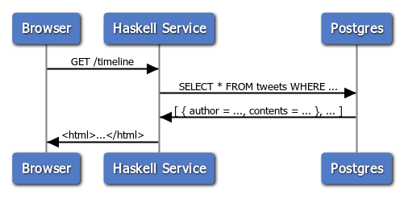
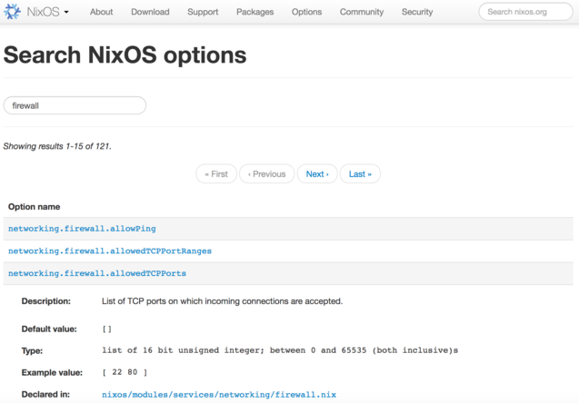

% A bare-bones Twitter clone implemented with Haskell + Nix
% Gabriel Gonzalez
% April 18, 2017

# Overview

This talk illustrates how to implement and deploy a:

... bare-bones Twitter clone

... as a multi-page application

... using Haskell and Nix

The final implementation fits in a single file! (~450 lines of code)

* ~340 lines of Haskell code
* ~80 lines of Nix
* ~30 lines of SQL

# Overview

* **How web servers work**
* Deploy a blank server (NixOps)
* Add the database (Postgres)
* Add the web service (Haskell)
* Render the results (HTML + CSS)
* Conclusion

# Single page vs multi page application

There are two extremes on the web application spectrum:

* Multi-page applications (e.g. `dmv.ca.gov`)

  HTML is generated server-side.  The page only changes when the user clicks a
  link or submits a form:

  ```haskell
  { path : List Text, input : < GET : QueryParams | POST : FormParams > } → HTML
  ```

* Single-page applications (e.g. `gmail.com`)

  HTML is served only once for the initial page load, but after that JavaScript
  code communicates with the server on the user's behalf using (usually) JSON

  ```haskell
  { path : List Text, input : < GET : QueryParams | POST : JSON | … > } → JSON
  ```

Many web applications are somewhere in between (e.g. `github.com`)

# `yesod` vs. `servant`

**`yesod`** is primarily designed to support **multi page web applications**

**`servant`** is primarily designed to support **single page web applications**

They both can be used for other use cases, though!

For example, this talk uses **`servant`** for a **multi page web application**

This is simple to demo, but not necessarily the approach I'd use in production

# Anatomy of our multi-page application

* Front-end: HTML + CSS
* Web service: ⚡️ Haskell
* Database: Postgres



# Overview

* How web servers work
* **Deploy a blank server (NixOps)**
* Add the database (Postgres)
* Add the web service (Haskell)
* Render the results (HTML + CSS)
* Conclusion

# A blank EC2 server

```nix
# ./simple-twitter.nix

let
  region = "us-west-1";

  accessKeyId = "personal";

in
  { machine = { resources, ... }: {
      deployment = {
        targetEnv = "ec2";

        ec2 = {
          inherit accessKeyId region;

          instanceType = "t2.nano";

          keyPair = resources.ec2KeyPairs.my-key-pair;
        };
      };
    };

    resources = {
      ec2KeyPairs.my-key-pair = { inherit region accessKeyId; };
    };
  }
```

# Deploying the server

```bash
$ nixops create --deployment simple-twitter simple-twitter.nix
$ nixops deploy --deployment simple-twitter
building all machine configurations...
these derivations will be built:
  /nix/store/033cv585isiqldf2px7d7av9dhccmbbg-unit-script-network-local-commands-start.drv
  /nix/store/3nip2mwbqw3ahcjmlfbba1dhgwj9yv3n-pam-environment.drv
  /nix/store/074h7r6m88crmw9j3hgj5plmgv3gr003-chsh.pam.drv
…
copying path '/nix/store/na5brqw59i3n6wnbzfgrv8vh9jpfdzx7-adv_cmds-osx-10.5.8-locale' from 'https://cache.nixos.org'...
copying path '/nix/store/kl1k39r4aw5almxscbgnq7jigl98w92h-acl-2.2.53-doc' from 'https://cache.nixos.org'...
copying path '/nix/store/zl1gyi297xvflrlsg3zp46990g2xg30l-acl-2.2.53-man' from 'https://cache.nixos.org'...
…
building '/nix/store/vywxksf52k89znflwqv3118n8qrs3nzk-unit-dbus.socket.drv' on 'ssh://root@107.23.226.1'...
building '/nix/store/y8jbyga8wxx5ds06psq5gj9b12r2ji5k-unit-encrypted-links.target.drv' on 'ssh://root@107.23.226.1'...
building '/nix/store/w8w6z0g250vf70m35l8klsaln3gcgcsa-unit-fs.target.drv' on 'ssh://root@107.23.226.1'...
…
machine....> copying closure...
machine....> copying path '/nix/store/kl1k39r4aw5almxscbgnq7jigl98w92h-acl-2.2.53-doc' from 'https://cache.nixos.org'...
machine....> copying path '/nix/store/zl1gyi297xvflrlsg3zp46990g2xg30l-acl-2.2.53-man' from 'https://cache.nixos.org'...
machine....> copying path '/nix/store/f1f6xz2nkfhs1w64gfhgbck2ialhcq6q-attr-2.4.48-doc' from 'https://cache.nixos.org'...
…
simple-twitter> closures copied successfully
machine....> updating GRUB 2 menu...
machine....> installing the GRUB 2 boot loader on /dev/xvda...
machine....> Installing for i386-pc platform.
machine....> Installation finished. No error reported.
machine....> stopping the following units: apply-ec2-data.service, audit.service, kmod-static-nodes.service, network-local-commands.service, network-setup.service, nix-daemon.service, nix-daemon.socket, nscd.service, print-host-key.service, rngd.service, systemd-journal-catalog-update.service, systemd-modules-load.service, systemd-sysctl.service, systemd-timesyncd.service, systemd-tmpfiles-clean.timer, systemd-tmpfiles-setup-dev.service, systemd-udev-trigger.service, systemd-udevd-control.socket, systemd-udevd-kernel.socket, systemd-udevd.service, systemd-update-done.service
machine....> NOT restarting the following changed units: amazon-init.service, systemd-journal-flush.service, systemd-logind.service, systemd-random-seed.service, systemd-remount-fs.service, systemd-tmpfiles-setup.service, systemd-udev-settle.service, systemd-update-utmp.service, systemd-user-sessions.service, user-runtime-dir@0.service, user@0.service
machine....> activating the configuration...
machine....> setting up /etc...
machine....> removing user ‘nscd’
machine....> removing obsolete symlink ‘/etc/sysctl.d/nixos.conf’...
machine....> restarting systemd...
machine....> reloading user units for root...
machine....> setting up tmpfiles
machine....> reloading the following units: dbus.service, dev-hugepages.mount, dev-mqueue.mount, firewall.service, sys-fs-fuse-connections.mount, sys-kernel-debug.mount
machine....> restarting the following units: dhcpcd.service, sshd.service, systemd-journald.service
machine....> starting the following units: apply-ec2-data.service, audit.service, kmod-static-nodes.service, network-local-commands.service, network-setup.service, nix-daemon.socket, nscd.service, print-host-key.service, rngd.service, systemd-journal-catalog-update.service, systemd-modules-load.service, systemd-sysctl.service, systemd-timesyncd.service, systemd-tmpfiles-clean.timer, systemd-tmpfiles-setup-dev.service, systemd-udev-trigger.service, systemd-udevd-control.socket, systemd-udevd-kernel.socket, systemd-update-done.service
machine....> the following new units were started: resolvconf.service, systemd-binfmt.service, systemd-coredump.socket
machine....> activation finished successfully
simple-twitter> deployment finished successfully
```

# Browsing the server

```bash
$ nixops ssh --deployment simple-twitter machine

[root@machine:~]# systemctl  # Check the status of all services
…
[root@machine:~]# systemctl status sshd  # Check on a specific service
● sshd.service - SSH Daemon
   Loaded: loaded (/nix/store/d8a8ak0xsbzqq54b4wfgp98flhvkyfjx-unit-sshd.service/sshd.service; enabled; vendor preset: enabled)
   Active: active (running) since Sat 2019-11-09 16:16:28 UTC; 17min ago
 Main PID: 1710 (sshd)
       IP: 46.0K in, 111.9K out
    Tasks: 1
   Memory: 4.0M
      CPU: 43ms
   CGroup: /system.slice/sshd.service
           └─1710 /nix/store/hj338597zkps02cai2jcywxwq2iihjdi-openssh-7.9p1/bin/sshd -f /etc/ssh/sshd_config

Nov 09 16:27:19 machine sshd[1919]: Starting session: command for root from 69.181.64.30 port 57957 id 0
Nov 09 16:27:19 machine sshd[1919]: Close session: user root from 69.181.64.30 port 57957 id 0
Nov 09 16:31:44 machine sshd[2087]: Connection from 69.181.64.30 port 57997 on 172.31.2.114 port 22
Nov 09 16:31:44 machine sshd[2087]: Failed publickey for root from 69.181.64.30 port 57997 ssh2: RSA SHA256:ZQqcv3dtDCKTtoKPIbk5mFBoXjFzCjhhNIsnkdmBXLE
Nov 09 16:31:44 machine sshd[2087]: Accepted key RSA SHA256:ShyPdJfY4vOyJ8AdEhoXtkNICVUn88BqLvce9TfMZas found at /root/.ssh/authorized_keys:1
Nov 09 16:31:44 machine sshd[2087]: Postponed publickey for root from 69.181.64.30 port 57997 ssh2 [preauth]
Nov 09 16:31:44 machine sshd[2087]: Accepted key RSA SHA256:ShyPdJfY4vOyJ8AdEhoXtkNICVUn88BqLvce9TfMZas found at /root/.ssh/authorized_keys:1
Nov 09 16:31:44 machine sshd[2087]: Accepted publickey for root from 69.181.64.30 port 57997 ssh2: RSA SHA256:ShyPdJfY4vOyJ8AdEhoXtkNICVUn88BqLvce9TfMZas
Nov 09 16:31:44 machine sshd[2087]: pam_unix(sshd:session): session opened for user root by (uid=0)
Nov 09 16:31:44 machine sshd[2087]: Starting session: shell on pts/0 for root from 69.181.64.30 port 57997 id 0
```

# Configuring options

```nix
let
  …

in
  { machine = { resources, ... }: {
      deployment = {
        …
      };

      networking.firewall.allowedTCPPorts = [ 80 ];  # ← New NixOS option
    };

    resources = {
      …
    };
  }
```

# Applying the option change

```bash
$ nixops deploy --deployment simple-twitter
…
machine....> reloading the following units: firewall.service
machine....> activation finished successfully
simple-twitter> deployment finished successfully

$ nixops ssh --deployment simple-twitter machine

[root@machine:~]# iptables --list nixos-fw --numeric
Chain nixos-fw (1 references)
target     prot opt source               destination         
nixos-fw-accept  all  --  0.0.0.0/0            0.0.0.0/0           
nixos-fw-accept  all  --  0.0.0.0/0            0.0.0.0/0            ctstate RELATED,ESTABLISHED
nixos-fw-accept  tcp  --  0.0.0.0/0            0.0.0.0/0            tcp dpt:22
nixos-fw-accept  tcp  --  0.0.0.0/0            0.0.0.0/0            tcp dpt:80
nixos-fw-accept  icmp --  0.0.0.0/0            0.0.0.0/0            icmptype 8
nixos-fw-log-refuse  all  --  0.0.0.0/0            0.0.0.0/0           
```

# Browse NixOS options

You can browse available NixOS options by visiting:

* [https://nixos.org/nixos/options.html](https://nixos.org/nixos/options.html)



# Overview

* How web servers work
* Deploy a blank server (NixOps)
* **Add the database (Postgres)**
* Add the web service (Haskell)
* Render the results (HTML + CSS)
* Conclusion

# Schema

```sql
CREATE TABLE "user" (
  name text NOT NULL,
  PRIMARY KEY (name)
);

CREATE TABLE tweet (
  id integer GENERATED ALWAYS AS IDENTITY,
  contents text NOT NULL,
  time TIMESTAMP NOT NULL DEFAULT CURRENT_TIMESTAMP,
  PRIMARY KEY (id)
);

CREATE TABLE user_tweet (
  "user" text NOT NULL,
  tweet integer NOT NULL,
  PRIMARY KEY ("user", tweet),
  FOREIGN KEY ("user") REFERENCES "user" (name) ON DELETE CASCADE,
  FOREIGN KEY (tweet) REFERENCES tweet (id) ON DELETE CASCADE
);

CREATE TABLE follows (
  follower text NOT NULL,
  followed text NOT NULL,
  PRIMARY KEY (follower, followed),
  FOREIGN KEY (follower) REFERENCES "user" (name) ON DELETE CASCADE,
  FOREIGN KEY (followed) REFERENCES "user" (name) ON DELETE CASCADE
);
```

# Creating the database

```nix
…
  { machine = { pkgs, resources, ... }: {
      …

      services.postgresql = {
        enable = true;

        authentication = ''
          local all all ident map=mapping
        '';

        identMap = ''
          mapping root     postgres
          mapping postgres postgres
        '';

        package = pkgs.postgresql_11;

        initialScript = pkgs.writeText "initialScript.sql" ''
          CREATE TABLE "user" (
            name text NOT NULL,
            PRIMARY KEY (name)
          );

          …
        '';
      };
    };

    …
  }
```

# Deploying the database

```bash
$ nixops deploy --deployment simple-twitter
…
machine....> the following new units were started: postgresql.service
machine....> activation finished successfully
simple-twitter> deployment finished successfully

$ nixops ssh --deployment simple-twitter machine

[root@machine:~]# sudo -u postgres psql
psql (11.5)
Type "help" for help.

postgres=# \d "user"
              Table "public.user"
 Column | Type | Collation | Nullable | Default 
--------+------+-----------+----------+---------
 name   | text |           | not null | 
Indexes:
    "user_pkey" PRIMARY KEY, btree (name)
Referenced by:
    TABLE "follows" CONSTRAINT "follows_followed_fkey" FOREIGN KEY (followed) REFERENCES "user"(name) ON DELETE CASCADE
    TABLE "follows" CONSTRAINT "follows_follower_fkey" FOREIGN KEY (follower) REFERENCES "user"(name) ON DELETE CASCADE
    TABLE "user_tweet" CONSTRAINT "user_tweet_user_fkey" FOREIGN KEY ("user") REFERENCES "user"(name) ON DELETE CASCADE
```

# Overview

* How web servers work
* Deploy a blank server (NixOps)
* Add the database (Postgres)
* **Add the web service (Haskell)**
* Render the results (HTML + CSS)
* Conclusion

# A minimal Haskell service

```haskell
{-# LANGUAGE BlockArguments     #-}
{-# LANGUAGE OverloadedStrings  #-}
{-# LANGUAGE DataKinds          #-}
{-# LANGUAGE DeriveAnyClass     #-}
{-# LANGUAGE DeriveGeneric      #-}
{-# LANGUAGE DerivingStrategies #-}
{-# LANGUAGE RecordWildCards    #-}
{-# LANGUAGE TypeApplications   #-}

module Main where

import Data.Proxy (Proxy(..))
import Data.Text (Text)
import Data.Word (Word16)
import GHC.Generics (Generic)
import Options.Generic (ParseRecord)
import Servant.API (Get, JSON)

import qualified Control.Exception          as Exception
import qualified Database.PostgreSQL.Simple as PostgreSQL
import qualified Network.Wai.Handler.Warp   as Warp
import qualified Options.Generic            as Options
import qualified Servant.Server             as Server

newtype Options = Options { connectPort :: Word16 }
    deriving stock (Generic)
    deriving anyclass (ParseRecord)

type API = Get '[JSON] Text

main :: IO ()
main = do
    Options {..} <- Options.getRecord "Simple Twitter"

    let connectInfo =
            PostgreSQL.defaultConnectInfo
              { PostgreSQL.connectPort = connectPort
              , PostgreSQL.connectHost = ""
              }

    let open = PostgreSQL.connect connectInfo
    let close = PostgreSQL.close

    Exception.bracket open close \_connection -> do
        let server = return "Hello, world!"

        let application = Server.serve @API Proxy server

        Warp.run 80 application
```

# Creating a skeleton for our service

```nix
…
  { machine = { config, pkgs, resources, ... }: {
      …

      systemd.services.simple-twitter = {
        wantedBy = [ "multi-user.target" ];

        after = [ "postgresql.service" ];

        script =
          let
            ghc =
              pkgs.haskellPackages.ghcWithPackages (pkgs: [
                  pkgs.optparse-generic
                  pkgs.postgresql-simple
                  pkgs.servant
                  pkgs.servant-server
                  pkgs.warp
                ]
              );

            code = pkgs.writeText "Main.hs" ''
{-# LANGUAGE BlockArguments     #-}
{-# LANGUAGE OverloadedStrings  #-}
{-# LANGUAGE DataKinds          #-}
…
        Warp.run 80 application
            '';

            simple-twitter = pkgs.runCommand "simple-twitter" {} ''
              ${pkgs.coreutils}/bin/mkdir --parents $out/bin

              ${ghc}/bin/ghc -O -Wall -Werror ${code} -o $out/bin/simple-twitter
            '';

          in
            ''
            ${simple-twitter}/bin/simple-twitter --connectPort ${toString config.services.postgresql.port}
            '';
      };
    };

    resources = {
      …

      ec2SecurityGroups."http" = {
        inherit accessKeyId region;

        rules = [
          { fromPort = 80; toPort = 80; sourceIp = "0.0.0.0/0"; }
        ];
      };
    };
  }
```

# Deploy our service

```
$ nixops deploy --deployment simple-twitter
…
machine....> starting the following units: simple-twitter.service
machine....> activation finished successfully
simple-twitter> deployment finished successfully

$ nixops info --deployment simple-twitter
Network name: simple-twitter
…

+-------------+-----------------+--------------------------------+-------------+--------------+
| Name        |      Status     | Type                           | Resource Id | IP address   |
+-------------+-----------------+--------------------------------+-------------+--------------+
| machine     | Up / Up-to-date | ec2 [us-west-1c; t2.nano]      | …           | 54.67.99.168 |
| my-key-pair |        Up       | ec2-keypair [us-west-1]        | …           |              |
| http        |        Up       | ec2-security-group [us-west-1] | …           |              |
+-------------+-----------------+--------------------------------+-------------+--------------+

$ curl http://54.67.99.168
"Hello, world!"
```

Not covered in this talk: how to register a domain name and enable HTTPS

# Define our API

The endpoints we will use to power our Twitter-like site are:

* `GET /` - Get the global timeline

* `POST /user` (†) - Create a user

* `GET /user` - Get a specific user's profile (tweets, timeline, follows)

* `POST /user/delete` (‡) - Delete a user

* `GET /users` - Get a list of all users

* `POST /tweet` (†) - Create a tweet

* `POST /follow` (†) - Follow a user

†: These methods should really be `PUT`

‡: This method should really be `DELETE /user`

Browser links and web forms only support `GET`/`POST`

# Our `Servant` API

```haskell
newtype User = User { name :: Text }
    deriving stock (Generic)
    deriving anyclass (FromForm, FromRow, ToRow)
    deriving newtype (FromHttpApiData)

data Follow = Follow { follower :: Text, followed :: Text }
    deriving stock (Generic)
    deriving anyclass (FromForm, ToRow)

data Tweet = Tweet { name :: Text, contents :: Text }
    deriving stock (Generic)
    deriving anyclass (FromForm, FromRow)

type API =
        -- GET /
        Get '[HTML] Markup
        -- POST /user
   :<|> "user" :> ReqBody '[FormUrlEncoded] User :> Post '[HTML] Markup
        -- GET /user?name=:name
   :<|> "user" :> QueryParam' '[Required, Strict] "name" User :> Get '[HTML] Markup
        -- POST /user/delete
   :<|> "user" :> "delete" :> ReqBody '[FormUrlEncoded] User :> Post '[HTML] Markup
        -- GET /users
   :<|> "users" :> Get '[HTML] Markup
        -- POST /tweet
   :<|> "tweet" :> ReqBody '[FormUrlEncoded] Tweet :> Post '[HTML] Markup
        -- POST /follow
   :<|> "follow" :> ReqBody '[FormUrlEncoded] Follow :> Post '[HTML] Markup
```

# Handler types

```haskell
>>> import Data.Text as Text
>>> import GHC.Generics as Generics
>>> import Servant
>>> import Servant.HTML.Blaze as Servant.Blaze
>>> import Text.Blaze.Internal as Blaze
>>> import Web.FormUrlEncoded as Web
>>> :set -XDeriveGeneric -XDeriveAnyClass -XGeneralizedNewtypeDeriving -XDerivingStrategies
>>> :set -XDataKinds -XTypeOperators
>>> newtype User = User { name :: Text } deriving stock (Generic) deriving anyclass (FromForm) deriving newtype (FromHttpApiData)
>>> :kind! Server (Get '[HTML] Markup)
= Handler (MarkupM ())
>>> :kind! Server ("user" :> ReqBody '[FormUrlEncoded] User :> Post '[HTML] Markup)
= User -> Handler (MarkupM ())
>>> :kind! Server ("user" :> QueryParam' '[Required, Strict] "name" User :> Get '[HTML] Markup)
= User -> Handler (MarkupM ())
>>> :kind! Server ("user" :> "delete" :> ReqBody '[FormUrlEncoded] User :> Post '[HTML] Markup)
= User -> Handler (MarkupM ())
```

# Handlers

```haskell
let index :: Handler Markup
    index = do
        tweets <- query_ [sql|
            SELECT "user".name, tweet.contents
            FROM           "user"
                INNER JOIN user_tweet ON "user".name = user_tweet."user"
                INNER JOIN tweet      ON user_tweet.tweet = tweet.id
            ORDER BY tweet.time DESC
        |]

        …  -- Render the global timeline

let getUsers :: Handler Markup
    getUsers = do
        users <- query_ [sql|SELECT name FROM "user"|]

        …  -- Render the list of users

let createUser :: User -> Handler Markup
    createUser user = do
        execute user [sql|INSERT INTO "user" (name) VALUES (?)|]

        getUsers

let getUser :: User -> Handler Markup
    getUser user = do
        followeds <- query user [sql|
            SELECT follows.followed
            FROM           "user"
                INNER JOIN follows ON "user".name = follows.follower
            WHERE "user".name = ?
        |]

        history <- query user [sql|
            SELECT "user".name, tweet.contents
            FROM           "user"
                INNER JOIN user_tweet ON "user".name = user_tweet."user"
                INNER JOIN tweet      ON user_tweet.tweet = tweet.id
            WHERE "user".name = ?
            ORDER BY tweet.time DESC
        |]

        timeline <- query user [sql|
            SELECT follows.followed, tweet.contents
            FROM           "user"
                INNER JOIN follows    ON "user".name = follows.follower
                INNER JOIN user_tweet ON follows.followed = user_tweet."user"
                INNER JOIN tweet      ON user_tweet.tweet = tweet.id
            WHERE "user".name = ?
            ORDER BY tweet.time DESC
        |]

        …  -- Render the user's profile and timeline

let deleteUser :: User -> Handler Markup
    deleteUser user = do
        execute user [sql|DELETE FROM "user" WHERE name = ?|]

        getUsers

let createTweet :: Tweet -> Handler Markup
    createTweet (Tweet {..}) = do
        rows <- query (Only contents) [sql|
            INSERT INTO tweet (contents) VALUES (?) RETURNING (id)
        |]

        id <- case rows of
            [ (id :: Only Integer) ] -> return id
            _                        -> Catch.throwM Server.err500

        execute (Only name :. id) [sql|
            INSERT INTO user_tweet ("user", tweet) VALUES (?, ?)
        |]

        getUser (User {..})

let follow :: Follow -> Handler Markup
    follow f = do
        execute f [sql|
            INSERT INTO follows (follower, followed) VALUES (?, ?)
        |]

        getUser (User { name = follower })

let server = index
        :<|> createUser
        :<|> getUser
        :<|> deleteUser
        :<|> getUsers
        :<|> createTweet
        :<|> follow
```

# Overview

* How web servers work
* Deploy a blank server (NixOps)
* Add the database (Postgres)
* Add the web service (Haskell)
* **Render the results (HTML + CSS)**
* Conclusion

# Rendering HTML

We'll be using the following two packages to render HTML using Haskell code:

* [`blaze-markup`](http://hackage.haskell.org/package/blaze-markup) -
  Efficiently rendering HTML using Haskell code

* [`servant-blaze`](https://hackage.haskell.org/package/servant-blaze) -
  Glue layer between `servant` and `blaze-markup`

The benefit of doing things this way is that:

* `blaze-markup` eliminates certain classes of malformed HTML
* We can take advantage of Haskell programming features to reduce repetition

# Rendering code

```haskell
let submit label =
            Html.button
        !   Attr.type_ "submit"
        !   Attr.class_ "btn btn-primary btn-sm"
        $   label

let field name = do
        Html.div ! Attr.class_ "form-group" $ do
            Html.input
                !   Attr.type_ "text"
                !   Attr.class_ "form-control form-control-sm"
                !   Attr.name name
                !   Attr.placeholder name

let form action method html =
        Html.div ! Attr.class_ "col-md-4" $ do
            Html.form
                !   Attr.action action
                !   Attr.method method
                !   Attr.class_ "border m-3 p-2 bg-light"
                $   html

let forms = do
        Html.div ! Attr.class_ "row" $ do
            form "/" "get" do
                submit "Global timeline"

        Html.div ! Attr.class_ "row" $ do
            form "/user" "post" do
                field "name"
                submit "Create user"

            form "/user/delete" "post" do
                field "name"
                submit "Delete user"

            form "/users" "get" do
                submit "Get users"

        Html.div ! Attr.class_ "row" $ do
            form "/tweet" "post" do
                field "name"
                field "contents"
                submit "Create tweet"

            form "/follow" "post" do
                field "follower"
                field "followed"
                submit "Follow"

            form "/user" "get" do
                field "name"
                submit "Get user"

let ul html = Html.ul ! Attr.class_ "list-group" $ html

let li html = Html.li ! Attr.class_ "list-group-item" $ html

let wrap body =
        Html.html do
            Html.head do
                Html.title "Simple Twitter"
                Html.link
                    ! Attr.rel "stylesheet"
                    ! Attr.href "https://stackpath.bootstrapcdn.com/bootstrap/4.3.1/css/bootstrap.min.css"

            Html.body do
                Html.h1
                    ! Attr.class_ "display-4 text-center"
                    $ "Simple Twitter"

                Html.div ! Attr.class_ "container" $ do
                  Html.div ! Attr.class_ "row" $ do
                      Html.div ! Attr.class_ "col-md-6" $ forms
                      Html.div ! Attr.class_ "col-md-6" $ body

let failWith message handler = do
        let fallback :: SomeException -> Handler Markup
            fallback _ = return (wrap (Html.toHtml message))

        Catch.handle fallback handler

let index :: Handler Markup
    index = do
        tweets <- query_ [sql|
            SELECT "user".name, tweet.contents
            FROM           "user"
                INNER JOIN user_tweet ON "user".name = user_tweet."user"
                INNER JOIN tweet      ON user_tweet.tweet = tweet.id
            ORDER BY tweet.time DESC
        |]

        let renderTweet (Tweet {..}) =
                li (Html.toHtml (name <> ": " <> contents))

        return do
            wrap (ul (traverse_ renderTweet tweets))

let getUsers :: Handler Markup
    getUsers = do
        users <- query_ [sql|SELECT name FROM "user"|]

        let renderUser (User {..}) = li (Html.toHtml name)

        return (wrap (ul (traverse_ renderUser users)))

let createUser :: User -> Handler Markup
    createUser user@User{..} = do
        let message =
                "A user named '" <> name <> "' already exists"

        failWith message do
            execute user [sql|INSERT INTO "user" (name) VALUES (?)|]

            getUsers

let getUser :: User -> Handler Markup
    getUser user@User{..} = do
        let message =
                "No user named '" <> name <> "' exists"

        failWith message do
            followeds <- query user [sql|
                SELECT follows.followed
                FROM           "user"
                    INNER JOIN follows ON "user".name = follows.follower
                WHERE "user".name = ?
            |]

            history <- query user [sql|
                SELECT "user".name, tweet.contents
                FROM           "user"
                    INNER JOIN user_tweet ON "user".name = user_tweet."user"
                    INNER JOIN tweet      ON user_tweet.tweet = tweet.id
                WHERE "user".name = ?
                ORDER BY tweet.time DESC
            |]

            timeline <- query user [sql|
                SELECT follows.followed, tweet.contents
                FROM           "user"
                    INNER JOIN follows    ON "user".name = follows.follower
                    INNER JOIN user_tweet ON follows.followed = user_tweet."user"
                    INNER JOIN tweet      ON user_tweet.tweet = tweet.id
                WHERE "user".name = ?
                ORDER BY tweet.time DESC
            |]

            let renderHistory (Tweet { contents }) =
                    li (Html.toHtml contents)

            let renderTimeline (Tweet { name = followed, ..}) =
                    li (Html.toHtml (followed <> ": " <> contents))

            let renderUser (User { name = followed }) =
                    li (Html.toHtml followed)

            return do
                wrap do
                    Html.h2 (Html.toHtml name)
                    Html.hr
                    Monad.when (not (null history)) do
                        Html.h3 "History"
                        ul (traverse_ renderHistory history)

                    Monad.when (not (null timeline)) do
                        Html.h3 "Timeline"
                        ul (traverse_ renderTimeline timeline)

                    Monad.when (not (null followeds)) do
                        Html.h3 "Follows"
                        ul (traverse_ renderUser followeds)

let deleteUser :: User -> Handler Markup
    deleteUser user@User{..}= do
        let message =
                "No user named '" <> name <> "' exists"

        failWith message do
            execute user [sql|DELETE FROM "user" WHERE name = ?|]

            getUsers

let createTweet :: Tweet -> Handler Markup
    createTweet (Tweet {..}) = do
        rows <- query (Only contents) [sql|
            INSERT INTO tweet (contents) VALUES (?) RETURNING (id)
        |]

        id <- case rows of
            [ (id :: Only Integer) ] -> return id
            _                        -> Catch.throwM Server.err500

        execute (Only name :. id) [sql|
            INSERT INTO user_tweet ("user", tweet) VALUES (?, ?)
        |]

        getUser (User {..})

let follow :: Follow -> Handler Markup
    follow f@Follow{..} = do
        let message =
                "'" <> follower <> "' already follows '" <> followed <> "'"
        failWith message do
            execute f [sql|
                INSERT INTO follows (follower, followed) VALUES (?, ?)
            |]

            getUser (User { name = follower })
```

# Overview

* How web servers work
* Deploy a blank server (NixOps)
* Add the database (Postgres)
* Add the web service (Haskell)
* Render the results (HTML + CSS)
* **Conclusion**

# Conclusion

* Multi-page apps = old-fashioned / Single-page apps = modern
* Don't repeat yourself!  Especially don't copy-and-paste HTML
* Haskell + Nix + Postgres have the skillz to pay the billz

You can find the complete code here:

* [https://github.com/Gabriel439/simple-twitter](https://github.com/Gabriel439/simple-twitter)
