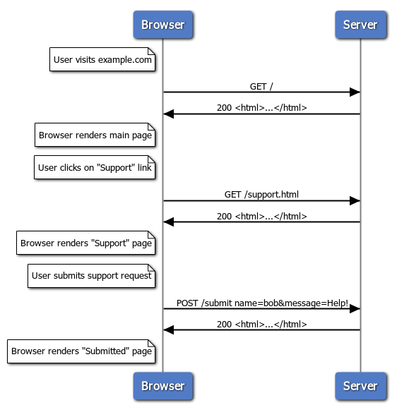
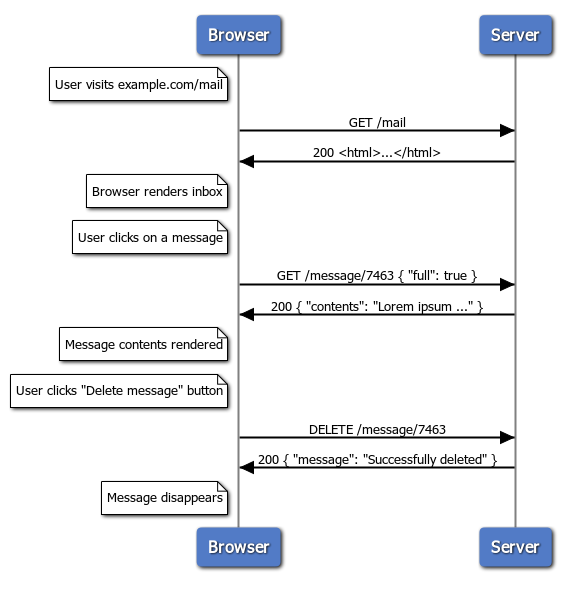

% A bare-bones Twitter clone implemented with Haskell + Nix
% Gabriel Gonzalez
% April 18, 2017

# Overview

This talk illustrates how to implement and deploy a:

... bare-bones Twitter clone

... as a multi-page application

... using Haskell and Nix

The final implementation fits in a single file! (~450 lines of code)

# Overview

* **How web servers work**
* Deploy a blank server (NixOps)
* Add the database (Postgres)
* Add the web service (Haskell)
* Render the results (HTML + CSS)

# Single page vs multi page application

There are two extremes on the web application spectrum:

* Multi-page applications (e.g. `dmv.ca.gov`)

  HTML is generated server-side.  The page only changes when the user clicks a
  link or submits a form:

  ```haskell
  { path : List Text, input : < GET : QueryParams | POST : FormParams > } → HTML
  ```

* Single-page applications (e.g. `gmail.com`)

  HTML is served only once for the initial page load, but after that JavaScript
  code communicates with the server on the user's behalf using (usually) JSON

  ```haskell
  { path : List Text, input : < GET : JSON | POST : JSON | … > } → JSON
  ```

Many web applications are somewhere in between (e.g. `github.com`)

# Multi page application



# Single page application



# `yesod` vs. `servant`

**`yesod`** is primarily designed to support **multi page web applications**

**`servant`** is primarily designed to support **single page web applications**

They both can be used for other use cases, though!

For example, this talk uses **`servant`** for a **multi page web application**

This is simple to demo, but not necessarily the approach I'd use in production

# Anatomy of our multi-page application

* Front-end: HTML + CSS
* Web service: ⚡️ Haskell
* Database: Postgres


# Overview

* How web servers work
* **Deploy a blank server (NixOps)**
* Add the database (Postgres)
* Add the web service (Haskell)
* Render the results (HTML + CSS)

# A blank EC2 server

```nix
# ./simple-twitter.nix

let
  region = "us-west-1";

  accessKeyId = "personal";

in
  { machine = { resources, ... }: {
      deployment = {
        targetEnv = "ec2";

        ec2 = {
          inherit accessKeyId region;

          instanceType = "t2.nano";

          keyPair = resources.ec2KeyPairs.my-key-pair;
        };
      };
    };

    resources = {
      ec2KeyPairs.my-key-pair = { inherit region accessKeyId; };
    };
  }
```

# Deploying the server

```bash
$ nixops create --deployment simple-twitter simple-twitter.nix
$ nixops deploy --deployment simple-twitter
building all machine configurations...
these derivations will be built:
  /nix/store/033cv585isiqldf2px7d7av9dhccmbbg-unit-script-network-local-commands-start.drv
  /nix/store/3nip2mwbqw3ahcjmlfbba1dhgwj9yv3n-pam-environment.drv
  /nix/store/074h7r6m88crmw9j3hgj5plmgv3gr003-chsh.pam.drv
…
copying path '/nix/store/na5brqw59i3n6wnbzfgrv8vh9jpfdzx7-adv_cmds-osx-10.5.8-locale' from 'https://cache.nixos.org'...
copying path '/nix/store/kl1k39r4aw5almxscbgnq7jigl98w92h-acl-2.2.53-doc' from 'https://cache.nixos.org'...
copying path '/nix/store/zl1gyi297xvflrlsg3zp46990g2xg30l-acl-2.2.53-man' from 'https://cache.nixos.org'...
…
building '/nix/store/vywxksf52k89znflwqv3118n8qrs3nzk-unit-dbus.socket.drv' on 'ssh://root@107.23.226.1'...
building '/nix/store/y8jbyga8wxx5ds06psq5gj9b12r2ji5k-unit-encrypted-links.target.drv' on 'ssh://root@107.23.226.1'...
building '/nix/store/w8w6z0g250vf70m35l8klsaln3gcgcsa-unit-fs.target.drv' on 'ssh://root@107.23.226.1'...
…
machine....> copying closure...
machine....> copying path '/nix/store/kl1k39r4aw5almxscbgnq7jigl98w92h-acl-2.2.53-doc' from 'https://cache.nixos.org'...
machine....> copying path '/nix/store/zl1gyi297xvflrlsg3zp46990g2xg30l-acl-2.2.53-man' from 'https://cache.nixos.org'...
machine....> copying path '/nix/store/f1f6xz2nkfhs1w64gfhgbck2ialhcq6q-attr-2.4.48-doc' from 'https://cache.nixos.org'...
…
simple-twitter-iterate> closures copied successfully
machine....> updating GRUB 2 menu...
machine....> installing the GRUB 2 boot loader on /dev/xvda...
machine....> Installing for i386-pc platform.
machine....> Installation finished. No error reported.
machine....> stopping the following units: apply-ec2-data.service, audit.service, kmod-static-nodes.service, network-local-commands.service, network-setup.service, nix-daemon.service, nix-daemon.socket, nscd.service, print-host-key.service, rngd.service, systemd-journal-catalog-update.service, systemd-modules-load.service, systemd-sysctl.service, systemd-timesyncd.service, systemd-tmpfiles-clean.timer, systemd-tmpfiles-setup-dev.service, systemd-udev-trigger.service, systemd-udevd-control.socket, systemd-udevd-kernel.socket, systemd-udevd.service, systemd-update-done.service
machine....> NOT restarting the following changed units: amazon-init.service, systemd-journal-flush.service, systemd-logind.service, systemd-random-seed.service, systemd-remount-fs.service, systemd-tmpfiles-setup.service, systemd-udev-settle.service, systemd-update-utmp.service, systemd-user-sessions.service, user-runtime-dir@0.service, user@0.service
machine....> activating the configuration...
machine....> setting up /etc...
machine....> removing user ‘nscd’
machine....> removing obsolete symlink ‘/etc/sysctl.d/nixos.conf’...
machine....> restarting systemd...
machine....> reloading user units for root...
machine....> setting up tmpfiles
machine....> reloading the following units: dbus.service, dev-hugepages.mount, dev-mqueue.mount, firewall.service, sys-fs-fuse-connections.mount, sys-kernel-debug.mount
machine....> restarting the following units: dhcpcd.service, sshd.service, systemd-journald.service
machine....> starting the following units: apply-ec2-data.service, audit.service, kmod-static-nodes.service, network-local-commands.service, network-setup.service, nix-daemon.socket, nscd.service, print-host-key.service, rngd.service, systemd-journal-catalog-update.service, systemd-modules-load.service, systemd-sysctl.service, systemd-timesyncd.service, systemd-tmpfiles-clean.timer, systemd-tmpfiles-setup-dev.service, systemd-udev-trigger.service, systemd-udevd-control.socket, systemd-udevd-kernel.socket, systemd-update-done.service
machine....> the following new units were started: resolvconf.service, systemd-binfmt.service, systemd-coredump.socket
machine....> activation finished successfully
simple-twitter-iterate> deployment finished successfully
```

# Browsing the server

```bash
$ nixops ssh --deployment simple-twitter machine

[root@machine:~]# systemctl  # Check the status of all services
…
[root@machine:~]# systemctl status sshd  # Check on a specific service
● sshd.service - SSH Daemon
   Loaded: loaded (/nix/store/d8a8ak0xsbzqq54b4wfgp98flhvkyfjx-unit-sshd.service/sshd.service; enabled; vendor preset: enabled)
   Active: active (running) since Sat 2019-11-09 16:16:28 UTC; 17min ago
 Main PID: 1710 (sshd)
       IP: 46.0K in, 111.9K out
    Tasks: 1
   Memory: 4.0M
      CPU: 43ms
   CGroup: /system.slice/sshd.service
           └─1710 /nix/store/hj338597zkps02cai2jcywxwq2iihjdi-openssh-7.9p1/bin/sshd -f /etc/ssh/sshd_config

Nov 09 16:27:19 machine sshd[1919]: Starting session: command for root from 69.181.64.30 port 57957 id 0
Nov 09 16:27:19 machine sshd[1919]: Close session: user root from 69.181.64.30 port 57957 id 0
Nov 09 16:31:44 machine sshd[2087]: Connection from 69.181.64.30 port 57997 on 172.31.2.114 port 22
Nov 09 16:31:44 machine sshd[2087]: Failed publickey for root from 69.181.64.30 port 57997 ssh2: RSA SHA256:ZQqcv3dtDCKTtoKPIbk5mFBoXjFzCjhhNIsnkdmBXLE
Nov 09 16:31:44 machine sshd[2087]: Accepted key RSA SHA256:ShyPdJfY4vOyJ8AdEhoXtkNICVUn88BqLvce9TfMZas found at /root/.ssh/authorized_keys:1
Nov 09 16:31:44 machine sshd[2087]: Postponed publickey for root from 69.181.64.30 port 57997 ssh2 [preauth]
Nov 09 16:31:44 machine sshd[2087]: Accepted key RSA SHA256:ShyPdJfY4vOyJ8AdEhoXtkNICVUn88BqLvce9TfMZas found at /root/.ssh/authorized_keys:1
Nov 09 16:31:44 machine sshd[2087]: Accepted publickey for root from 69.181.64.30 port 57997 ssh2: RSA SHA256:ShyPdJfY4vOyJ8AdEhoXtkNICVUn88BqLvce9TfMZas
Nov 09 16:31:44 machine sshd[2087]: pam_unix(sshd:session): session opened for user root by (uid=0)
Nov 09 16:31:44 machine sshd[2087]: Starting session: shell on pts/0 for root from 69.181.64.30 port 57997 id 0
```

# Configuring options

```nix
let
  …

in
  { machine = { resources, ... }: {
      deployment = {
        …
      };

      networking.firewall.allowedTCPPorts = [ 80 ];  # ← New NixOS option
    };

    resources = {
      …
    };
  }
```

# Applying the option change

```bash
$ nixops deploy --deployment simple-twitter-iterate 
building all machine configurations...
these derivations will be built:
  /nix/store/62jn9qic8i36cdsmmr4gwjg022nkgrk8-firewall-start.drv
  /nix/store/xjjl73mpwj45qz3scpkwsrffapdkb2db-firewall-reload.drv
  /nix/store/nk8vv2rln68d6rsypvkifvil037pf6wp-unit-firewall.service.drv
  /nix/store/5j4hdhfhryhvxfa9gp9ar5j37vyh3xf3-system-units.drv
  /nix/store/ilrzg8fi27zv2w2irhz7nqa8z3mj3nz9-etc.drv
  /nix/store/wcchpbi5pg2y309f89k87axn6b3n7hph-nixos-system-machine-20.03pre197736.91d5b3f07d2.drv
  /nix/store/rh6pf6f1bdkhvhkwdpmnv3arxnnbanbs-nixops-machines.drv
building '/nix/store/62jn9qic8i36cdsmmr4gwjg022nkgrk8-firewall-start.drv' on 'ssh://root@107.23.226.1'...
copying 1 paths...
copying path '/nix/store/cqnr2k485zn95is865wl131r28fmxccw-firewall-start' from 'ssh://root@107.23.226.1'...
building '/nix/store/xjjl73mpwj45qz3scpkwsrffapdkb2db-firewall-reload.drv' on 'ssh://root@107.23.226.1'...
copying 1 paths...
copying path '/nix/store/yz82p7nlycl58szsy39q1gygx43qnf38-firewall-reload' from 'ssh://root@107.23.226.1'...
building '/nix/store/nk8vv2rln68d6rsypvkifvil037pf6wp-unit-firewall.service.drv' on 'ssh://root@107.23.226.1'...
copying 1 paths...
copying path '/nix/store/da6v3js93qm55iv1md40fdf7yc2lsjdx-unit-firewall.service' from 'ssh://root@107.23.226.1'...
building '/nix/store/5j4hdhfhryhvxfa9gp9ar5j37vyh3xf3-system-units.drv' on 'ssh://root@107.23.226.1'...
copying 1 paths...
copying path '/nix/store/7hm6yjp66vlsb6z9b6kvzbw1r8i1w3vs-system-units' from 'ssh://root@107.23.226.1'...
building '/nix/store/ilrzg8fi27zv2w2irhz7nqa8z3mj3nz9-etc.drv' on 'ssh://root@107.23.226.1'...
copying 1 paths...
copying path '/nix/store/way2szw1j5gb7basi2pp8g0241wcjdhw-etc' from 'ssh://root@107.23.226.1'...
building '/nix/store/wcchpbi5pg2y309f89k87axn6b3n7hph-nixos-system-machine-20.03pre197736.91d5b3f07d2.drv' on 'ssh://root@107.23.226.1'...
copying 1 paths...
copying path '/nix/store/3i67bb8bigz10c0y4ipwzx1sqa387rw3-nixos-system-machine-20.03pre197736.91d5b3f07d2' from 'ssh://root@107.23.226.1'...
building '/nix/store/rh6pf6f1bdkhvhkwdpmnv3arxnnbanbs-nixops-machines.drv'...
machine....> copying closure...
machine....> copying path '/nix/store/cqnr2k485zn95is865wl131r28fmxccw-firewall-start' from 'https://cache.nixos.org'...
machine....> copying path '/nix/store/yz82p7nlycl58szsy39q1gygx43qnf38-firewall-reload' from 'https://cache.nixos.org'...
machine....> copying 4 paths...
machine....> copying path '/nix/store/da6v3js93qm55iv1md40fdf7yc2lsjdx-unit-firewall.service' to 'ssh://root@13.52.184.65'...
machine....> copying path '/nix/store/7hm6yjp66vlsb6z9b6kvzbw1r8i1w3vs-system-units' to 'ssh://root@13.52.184.65'...
machine....> copying path '/nix/store/way2szw1j5gb7basi2pp8g0241wcjdhw-etc' to 'ssh://root@13.52.184.65'...
machine....> copying path '/nix/store/3i67bb8bigz10c0y4ipwzx1sqa387rw3-nixos-system-machine-20.03pre197736.91d5b3f07d2' to 'ssh://root@13.52.184.65'...
simple-twitter-iterate> closures copied successfully
machine....> updating GRUB 2 menu...
machine....> setting up /etc...
machine....> activating the configuration...
machine....> reloading user units for root...
machine....> setting up tmpfiles
machine....> reloading the following units: firewall.service
machine....> activation finished successfully
simple-twitter-iterate> deployment finished successfully
```

# Verify the change

```bash
$ nixops ssh --deployment simple-twitter-iterate machine

[root@machine:~]# iptables --list nixos-fw --numeric
Chain nixos-fw (1 references)
target     prot opt source               destination         
nixos-fw-accept  all  --  0.0.0.0/0            0.0.0.0/0           
nixos-fw-accept  all  --  0.0.0.0/0            0.0.0.0/0            ctstate RELATED,ESTABLISHED
nixos-fw-accept  tcp  --  0.0.0.0/0            0.0.0.0/0            tcp dpt:22
nixos-fw-accept  tcp  --  0.0.0.0/0            0.0.0.0/0            tcp dpt:80
nixos-fw-accept  icmp --  0.0.0.0/0            0.0.0.0/0            icmptype 8
nixos-fw-log-refuse  all  --  0.0.0.0/0            0.0.0.0/0           
```

# Browse NixOS options

You can browse available NixOS options by visiting:

* [https://nixos.org/nixos/options.html](https://nixos.org/nixos/options.html)


# Overview

* How web servers work
* Deploy a blank server (NixOps)
* **Add the database (Postgres)**
* Add the web service (Haskell)
* Render the results (HTML + CSS)

# Schema

```sql
CREATE TABLE "user" (
  name text NOT NULL,
  PRIMARY KEY (name)
);

CREATE TABLE tweet (
  id integer GENERATED ALWAYS AS IDENTITY,
  contents text NOT NULL,
  time TIMESTAMP NOT NULL DEFAULT CURRENT_TIMESTAMP,
  PRIMARY KEY (id)
);

CREATE TABLE user_tweet (
  "user" text NOT NULL,
  tweet integer NOT NULL,
  PRIMARY KEY ("user", tweet),
  FOREIGN KEY ("user") REFERENCES "user" (name) ON DELETE CASCADE,
  FOREIGN KEY (tweet) REFERENCES tweet (id) ON DELETE CASCADE
);

CREATE TABLE follows (
  follower text NOT NULL,
  followed text NOT NULL,
  PRIMARY KEY (follower, followed),
  FOREIGN KEY (follower) REFERENCES "user" (name) ON DELETE CASCADE,
  FOREIGN KEY (followed) REFERENCES "user" (name) ON DELETE CASCADE
);
```

# Creating the database

```nix
…
  { machine = { pkgs, resources, ... }: {
      …

      services.postgresql = {
        enable = true;

        authentication = ''
          local all all ident map=mapping
        '';

        identMap = ''
          mapping root     postgres
          mapping postgres postgres
        '';

        package = pkgs.postgresql_11;

        initialScript = pkgs.writeText "initialScript.sql" ''
          CREATE TABLE "user" (
            name text NOT NULL,
            PRIMARY KEY (name)
          );

          CREATE TABLE tweet (
            id integer GENERATED ALWAYS AS IDENTITY,
            contents text NOT NULL,
            time TIMESTAMP NOT NULL DEFAULT CURRENT_TIMESTAMP,
            PRIMARY KEY (id)
          );

          CREATE TABLE user_tweet (
            "user" text NOT NULL,
            tweet integer NOT NULL,
            PRIMARY KEY ("user", tweet),
            FOREIGN KEY ("user") REFERENCES "user" (name) ON DELETE CASCADE,
            FOREIGN KEY (tweet) REFERENCES tweet (id) ON DELETE CASCADE
          );

          CREATE TABLE follows (
            follower text NOT NULL,
            followed text NOT NULL,
            PRIMARY KEY (follower, followed),
            FOREIGN KEY (follower) REFERENCES "user" (name) ON DELETE CASCADE,
            FOREIGN KEY (followed) REFERENCES "user" (name) ON DELETE CASCADE
          );
        '';
      };
    };

    …
  }
```

# Deploying the database

```bash
$ nixops deploy --deployment simple-twitter-iterate 
building all machine configurations...
these derivations will be built:
…
  /nix/store/bin42k3ggcymx67gpn6hhxxp6zdmwn2z-pg_ident.conf.drv
  /nix/store/flf45y66hyz3znj82s4w2pj96iynignw-pg_hba.conf.drv
  /nix/store/60pvsi0l8l34lf2j454qxjcrdmwj8maw-postgresql.conf.drv
  /nix/store/cirascnqjv7b157cibgylb0bhyfbh203-unit-script-postgresql-start.drv
  /nix/store/8b8brkmsjf8bpv2rabpjkwr35v9mdl9j-initialScript.sql.drv
  /nix/store/lkk0xw9d1348zb61k9kgzbrzsj2rx7k4-unit-script-postgresql-post-start.drv
  /nix/store/zda4whxymihfp9k8cnjy3z68ww3r8wpi-unit-script-postgresql-pre-start.drv
  /nix/store/2w0wxrplb65j37zd9vw9fi0hfh7jvrb4-unit-postgresql.service.drv
…
these paths will be fetched (16.78 MiB download, 90.94 MiB unpacked):
  /nix/store/1lxj940cgn672lpaizbw4x9q7zxdv84c-postgresql-11.5
  /nix/store/cf81428clxaahaly17i4mvxlmx6kdn7d-postgresql-11.5-man
  /nix/store/p2c1hpyn0a7hf4ji0alsapn990ig8zqi-postgresql-11.5-lib
  /nix/store/sg98yg6572kzbppn3ykgy8li5wakbs2k-postgresql-11.5-doc
…
copying path '/nix/store/sg98yg6572kzbppn3ykgy8li5wakbs2k-postgresql-11.5-doc' from 'https://cache.nixos.org'...
building '/nix/store/5xxq80nkwpi7gd6si8wgnb1jlxnyiglr-users-groups.json.drv' on 'ssh://root@107.23.226.1'...
…
machine....> copying closure...
machine....> copying path '/nix/store/2pla5hnaqknpf65ilnf9f03jhqw51hs8-hook' from 'https://cache.nixos.org'...
…
simple-twitter-iterate> closures copied successfully
machine....> updating GRUB 2 menu...
machine....> activating the configuration...
machine....> setting up /etc...
machine....> reloading user units for root...
machine....> setting up tmpfiles
machine....> reloading the following units: dbus.service
machine....> the following new units were started: postgresql.service
machine....> activation finished successfully
simple-twitter-iterate> deployment finished successfully
```

# Test-driving the database

```bash
$ nixops ssh --deployment simple-twitter machine

[root@machine:~]# sudo -u postgres psql
psql (11.5)
Type "help" for help.

postgres=# \d "user"
              Table "public.user"
 Column | Type | Collation | Nullable | Default 
--------+------+-----------+----------+---------
 name   | text |           | not null | 
Indexes:
    "user_pkey" PRIMARY KEY, btree (name)
Referenced by:
    TABLE "follows" CONSTRAINT "follows_followed_fkey" FOREIGN KEY (followed) REFERENCES "user"(name) ON DELETE CASCADE
    TABLE "follows" CONSTRAINT "follows_follower_fkey" FOREIGN KEY (follower) REFERENCES "user"(name) ON DELETE CASCADE
    TABLE "user_tweet" CONSTRAINT "user_tweet_user_fkey" FOREIGN KEY ("user") REFERENCES "user"(name) ON DELETE CASCADE

postgres=# INSERT INTO "user" (name) VALUES ('Gabriel');
INSERT 0 1
postgres=# INSERT INTO "tweet" (contents) VALUES ('Hello, world!');
INSERT 0 1
postgres=# SELECT * FROM tweet;
 id |   contents    |            time            
----+---------------+----------------------------
  1 | Hello, world! | 2019-11-09 18:22:14.491523
(1 row)

postgres=# INSERT INTO user_tweet ("user", tweet) VALUES ('Gabriel', 1);
INSERT 0 1

postgres=# SELECT tweet.contents
postgres-# FROM user_tweet INNER JOIN tweet ON user_tweet.tweet = tweet.id
postgres-# WHERE user_tweet.user = 'Gabriel'
postgres-# ORDER BY tweet.time;
   contents    
---------------
 Hello, world!
(1 row)
```
