% Typed and Composable Spreadsheets
% Gabriel Gonzalez
% September 03, 2016

# Introduction

Goal: Haskell-native spreadsheets

* Make invalid spreadsheets unrepresentable
* Take advantage of the Haskell ecosystem
* Keep it fun and elegant!

# Overview

* **Basics**
* Advanced usage
* Diagrams and charts
* In the browser
* Conclusion

# Example #0 - Code

Here's what the user interface looks like

```haskell
{-# LANGUAGE ApplicativeDo     #-}
{-# LANGUAGE OverloadedStrings #-}

import Typed.Spreadsheet

main :: IO ()
main = cellUI "Example program" $ do
    -- Inputs
    a <- checkBox   "a"
    b <- spinButton "b" 1
    c <- spinButton "c" 0.1
    d <- entry      "d"

    -- Outputs
    return
        [ ("a"    , display  a     )
        , ("b + c", display (b + c))
        , ("d"    ,          d     )
        ]
```

# Example #0 - Screenshot

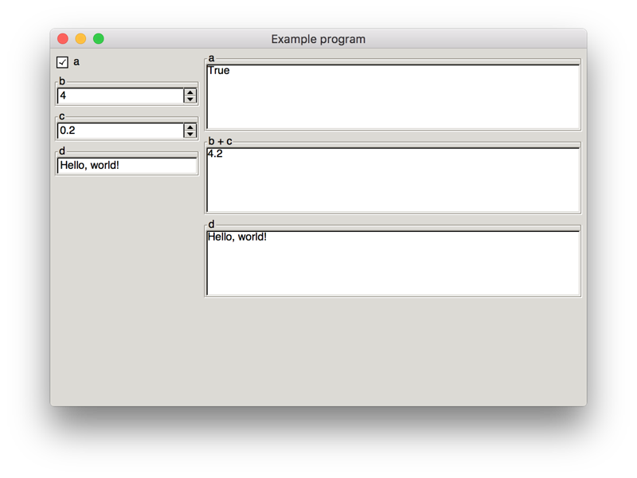

# Spreadsheets

Haskell-native spreadsheets will obey the following rules:

* Any number of inputs
    * **Inputs can have different types**
* Any number of outputs
* Output can depend on inputs
    * **Outputs cannot depend on other outputs**

I've highlighted where we deviate from traditional spreadsheets

# `Updatable`

The central type in the API is an `Updatable` value

```haskell
data Updatable a = ...  -- We'll study the internals later
```

This type represents a stream of values of type `a`

We get a new value of type `a` whenever the user updates any input element

This type also includes the logic for setting up input elements

# Creating `Updatable` values

The library provides a few primitive `Updatable` values:

```haskell
checkBox
    :: Text    -- Label
    -> Updatable Text

spinButton
    :: Text    -- Label
    -> Double  -- Step size
    -> Updatable Double

entry
    :: Text    -- Label
    -> Updatable Text

radioButton
    :: Show a  -- Used to label choices
    => Text    -- Label
    -> a       -- 1st choice (Default selection)
    -> [a]     -- Remaining choices
    -> Updatable a
```

# Creating `Updatable` values - Example

```haskell
checkBox   "a"   :: Updatable Bool

spinButton "b" 1 :: Updatable Double

entry      "c"   :: Updatable Text

data Greeting = Hello | Bonjour | Hola deriving (Show)

radioButton "d" Hello [ Bonjour, Hola ] :: Updatable Greeting
```

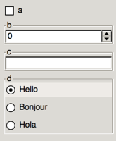

# Consuming `Updatable` elements

You can "run" an `Updatable` value using one of the following utilities:

```haskell
-- | A single text output
textUI :: Updatable Text -> IO ()

-- | Multiple labeled text outputs resembling spreadsheet cells
cellUI :: Updatable [(Text, Text)] -> IO ()

-- | A single diagram output
graphicalUI :: Updatable (Diagram Cairo) -> IO ()
```

# Simplest possible spreadsheet - Code

```haskell
{-# LANGUAGE OverloadedStrings #-}

import Typed.Spreadsheet

main :: IO ()
main = textUI "Example program" (entry "Input")
```

```haskell
entry         :: Text -> Updatable Text
entry "Input" ::         Updatable Text

textUI                                   :: Text -> Updatable Text -> IO ()
textUI "Example program"                 ::         Updatable Text -> IO ()
textUI "Example program" (entry "Input") ::                           IO ()
```

# Simplest possible spreadsheet - Screenshot

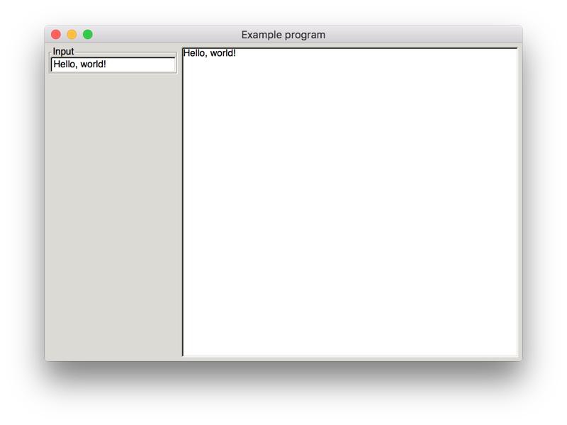

# Combining `Updatable` elements

You can use the following `Applicative` instance to combine `Updatable` values:

```haskell
instance Applicative Updatable where ...
```

This means you can combine `Updatable` values using `Applicative` operators:

```haskell
(==) <$> checkbox "a" <*> checkbox "b" :: Updatable Bool
```

... or you can use `do` notation if you enable `ApplicativeDo`:

```haskell
{-# LANGUAGE ApplicativeDo #-}

example :: Updatable (Bool, Bool)
exampe = do
    a <- checkbox "a"
    b <- checkbox "b"
    return (a == b)
```

# Combining `Updatable` elements - Semantics

When you combine smaller `Updatable` values into a larger `Updatable` value:

* The larger `Updatable` value updates when any smaller value updates
* You combine their input form elements and setup logic

# Combination example - Code

```haskell
{-# LANGUAGE ApplicativeDo     #-}
{-# LANGUAGE OverloadedStrings #-}

import Typed.Spreadsheet

main :: IO ()
main = textUI "Example program" $ do
    a <- checkBox "a"
    b <- checkBox "b"
    return (display (a == b))
```

# Combination example - Screenshot

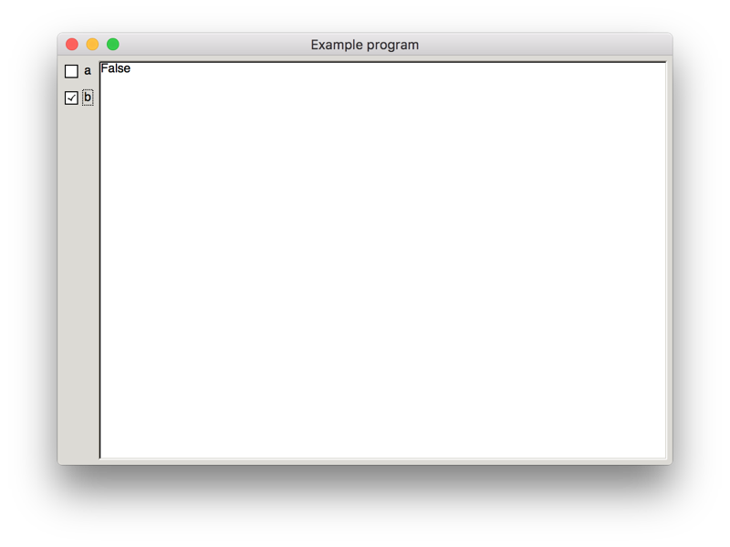

# Questions?

* Basics
* **Advanced usage**
* Diagrams and charts
* In the browser
* Conclusion

# `traverse`

`traverse` works for any type that implements `Applicative`:

```haskell
traverse
    :: (Applicative f, Traversable t)
    => (a -> f b) -> t a -> f (t b)
```

... if we replace `f` with `Updatable` and `t` with `[]`, we get:

```haskell
traverse :: (a -> Updatable b) -> [a] -> Updatable [b]
```

```haskell
makeInput :: Int -> Updatable Double
makeInput i = spinButton ("Input #" <> display i) 0.1

traverse                  :: (a -> Updatable b) -> [a]   -> Updatable [b]
traverse makeInput        ::                    -> [Int] -> Updatable [Double]
traverse makeInput [0..9] ::                                Updatable [Double]
```

# `traverse` - Code

```haskell
{-# LANGUAGE ApplicativeDo     #-}
{-# LANGUAGE OverloadedStrings #-}

import Data.Monoid
import Typed.Spreadsheet

data Example = Text | Numbers | Debug deriving (Show)

main :: IO ()
main = cellUI "Example program" $ do
    let makeInput i = spinButton ("Input #" <> display i) 0.1
    numbers <- traverse makeInput [0..9]

    return
        [ ("Sum"    , display (sum     numbers))
        , ("Product", display (product numbers))
        , ("Maximum", display (maximum numbers))
        , ("Minimum", display (minimum numbers))
        ]
```

# `traverse` - Screenshot

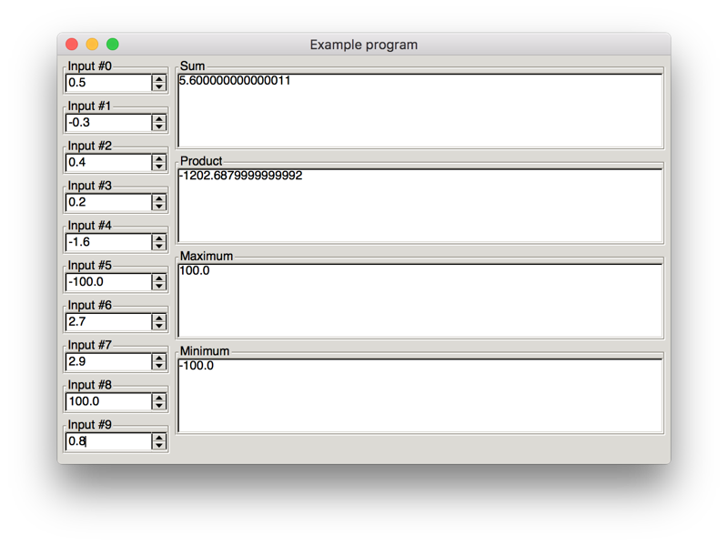

# Does it scale?

**TL;DR:** Not really ☹

Consider the following "optimized" example:

```haskell
{-# LANGUAGE ApplicativeDo     #-}
{-# LANGUAGE OverloadedStrings #-}

import Typed.Spreadsheet

import qualified Data.Sequence

data Example = Text | Numbers | Debug deriving (Show)

main :: IO ()
main = cellUI "Example program" $ do
    numbers <- Data.Sequence.replicateA 99 (spinButton "Input" 0.1)

    return
        [ ("Sum"    , display (sum     numbers))
        , ("Product", display (product numbers))
        , ("Maximum", display (maximum numbers))
        , ("Minimum", display (minimum numbers))
        ]
```

# Does it scale? - Results

99 cells = startup delay, slightly perceptible lag, no smooth number scrolling

999 cells = totally unusable

# More useful operations on `Applicative`s

```haskell
replicateM :: Int -> Updatable a -> Updatable [a]

sequenceA :: [Updatable a] -> Updatable [a]

when :: Bool -> Updatable () -> Updatable ()

filterM :: (a -> Updatable Bool) -> [a] -> Updatable [a]
```

# `Num` / `Fractional` / `Floating`

`Updatable` implements `Num` / `Fractional` / `Floating`

```haskell
instance Num a => Num (Updatable a) where
    fromInteger n = pure (fromInteger n)

    negate = fmap negate
    abs    = fmap abs
    signum = fmap signum

    (+) = liftA2 (+)
    (*) = liftA2 (*)
    (-) = liftA2 (-)

instance Fractional a => Fractional (Updatable a) where
    fromRational = pure . fromRational

    recip = fmap recip

    (/) = liftA2 (/)

instance Floating a => Floating (Updatable a) where
    pi = pure pi

    exp   = fmap exp
    sqrt  = fmap sqrt
    log   = fmap log
    sin   = fmap sin
    tan   = fmap tan
    cos   = fmap cos
    asin  = fmap sin
    atan  = fmap atan
    acos  = fmap acos
    sinh  = fmap sinh
    tanh  = fmap tanh
    cosh  = fmap cosh
    asinh = fmap asinh
    atanh = fmap atanh
    acosh = fmap acosh
```

# `Num` / `Fractional` / `Floating` - Code

```haskell
{-# LANGUAGE ApplicativeDo     #-}
{-# LANGUAGE OverloadedStrings #-}

import Data.Text (Text)
import Typed.Spreadsheet

num :: Text -> Updatable Double
num label = spinButton label 1

main :: IO ()
main = textUI "Example program" $ do
    result <- sqrt (num "x" ** 2 + num "y" ** 2)
    return (display result)
```

# `Num` / `Fractional` / `Floating` - Screenshot

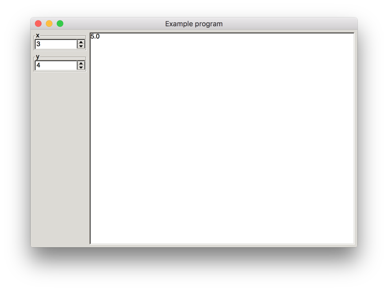

# `Monoid` / `IsString` - Code

`Updatable` also implements `Monoid` and `IsString`:

```haskell
instance Monoid a => Monoid (Updatable a) where
    mempty = pure mempty

    mappend ux uy = do
        x <- ux
        y <- uy
        return (mappend x y)

instance IsString a => IsString (Updatable a) where
    fromString str = pure (fromString str)
```

# `Monoid` / `IsString` - Code

This means that you can do this:

```haskell
{-# LANGUAGE OverloadedStrings #-}

import Data.Monoid
import Typed.Spreadsheet

noun      = entry "Noun"
verb      = entry "Verb"
adjective = entry "Adjective"

example =
    "I want to " <> verb <> " every " <> noun <> " because they are so " <> adjective

main :: IO ()
main = textUI "Mad libs" example
```

```haskell
"I want to " :: IsString str => str
"I want to " :: IsString str => Updatable str
"I want to " ::                 Updatable Text

                verb :: Updatable Text
"I want to " <> verb :: Updatable Text
```

# `Monoid` / `IsString` - Screenshot

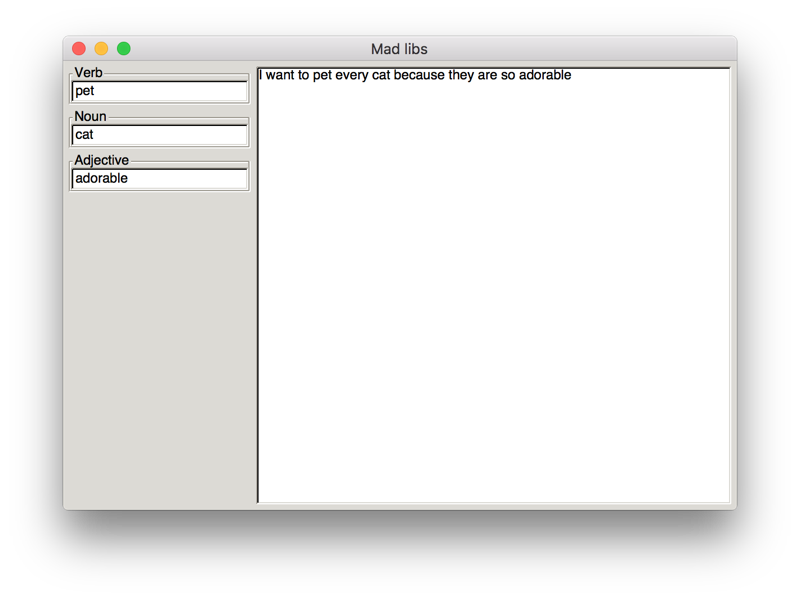

# Questions?

* Basics
* Advanced usage
* **Diagrams and charts**
* In the browser
* Conclusion

# Diagrams - Code

```haskell
{-# LANGUAGE OverloadedStrings #-}

import Diagrams.Prelude
import Typed.Spreadsheet

data AColor = Red | Orange | Yellow | Green | Blue | Purple
    deriving (Enum, Bounded, Show)

toColor :: AColor -> Colour Double
toColor Red    = red
toColor Orange = orange
toColor Yellow = yellow
toColor Green  = green
toColor Blue   = blue
toColor Purple = purple

main :: IO ()
main = graphicalUI "Example program" $ do
    color <- radioButton      "Color"        Red [Orange .. Purple]
    r     <- spinButtonAt 100 "Radius"       1
    x     <- spinButton       "X Coordinate" 1
    y     <- spinButton       "Y Coordinate" 1
    return (circle r # fc (toColor color) # translate (r2 (x, y)))
```

# Diagrams - Screenshot

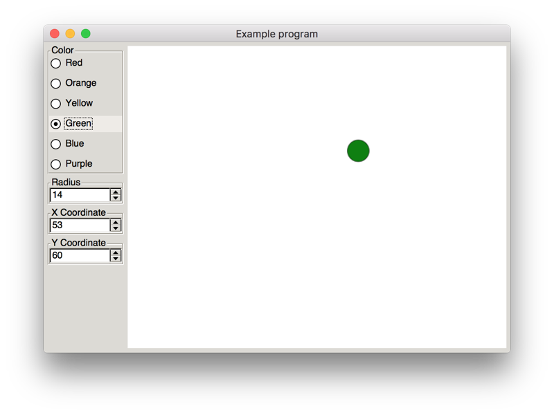

# Sine wave - Code

```haskell
{-# LANGUAGE OverloadedStrings #-}
{-# LANGUAGE ApplicativeDo     #-}

import Diagrams.Backend.Cairo
import Diagrams.Prelude
import Typed.Spreadsheet

buildGraph :: Double -> Double -> Double -> Diagram Cairo
buildGraph amplitude frequency phase = strokeP (fromVertices points) <> axes
  where
    axes = arrowBetween (p2 (0, 0)) (p2 ( 100,    0))
        <> arrowBetween (p2 (0, 0)) (p2 (-100,    0))
        <> arrowBetween (p2 (0, 0)) (p2 (   0,  100))
        <> arrowBetween (p2 (0, 0)) (p2 (   0, -100))

    f x = amplitude * cos (frequency * x + phase * pi / 180)

    points = map (\x -> p2 (x, f x)) [-100, -99 .. 100]
main :: IO ()
main = graphicalUI "Example program" $ do
    amplitude <- spinButtonAt 50  "Amplitude (Pixels)"   0.1
    frequency <- spinButtonAt 0.1 "Frequency (Pixels⁻¹)" 0.001
    phase     <- spinButtonAt 90  "Phase (Degrees)"      1

    return (buildGraph amplitude frequency phase)
```

# Sine wave - Screenshot

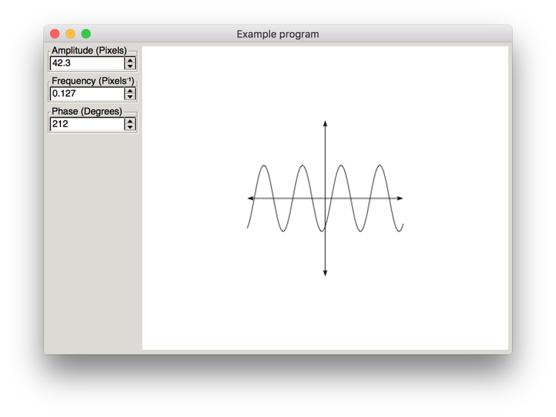

# Charts - Code

```haskell
{-# LANGUAGE FlexibleContexts  #-}
{-# LANGUAGE TypeFamilies      #-}
{-# LANGUAGE OverloadedStrings #-}

import Diagrams.Backend.Cairo (Cairo)
import Diagrams.Prelude
import Typed.Spreadsheet

import qualified Data.Text as Text

bar :: Int -> Updatable (Diagram Cairo)
bar i = fmap buildBar (spinButtonAt 100 label 0.2)
  where
    color = case i `mod` 3 of
        0 -> red
        1 -> green
        2 -> yellow

    buildBar height =
        (  alignB (   vine
                  <>  bubbles
                  )
        <> alignB (   roundedRect 25 (height - 5) 5 # fc white
                  <>  roundedRect 30  height      5 # fc color
                  )
        )
      where
        stepSize = 15

        vine = strokeP (fromVertices (map toPoint [0..height]))
          where
            toPoint n = p2 (5 * cos (pi * n / stepSize), n)

        bubble n =
            circle radius
                # translate (r2 (0, n * stepSize))
                # fc lightblue
          where
            radius = max 1 (min stepSize (height - n * stepSize)) / 5

        bubbles = foldMap bubble [1 .. (height / stepSize) - 1]

    label = "Bar #" <> Text.pack (show i)

bars :: Int -> Updatable (Diagram Cairo)
bars n = fmap combine (traverse bar [1..n])
  where
    combine bars = alignX 0 (hsep 5 [alignL yAxis, alignL (hsep 5 bars)])

    yAxis = arrowV (r2 (0, 150))

main :: IO ()
main = graphicalUI "Example program" (bars 5)
```

# Charts - Screenshot

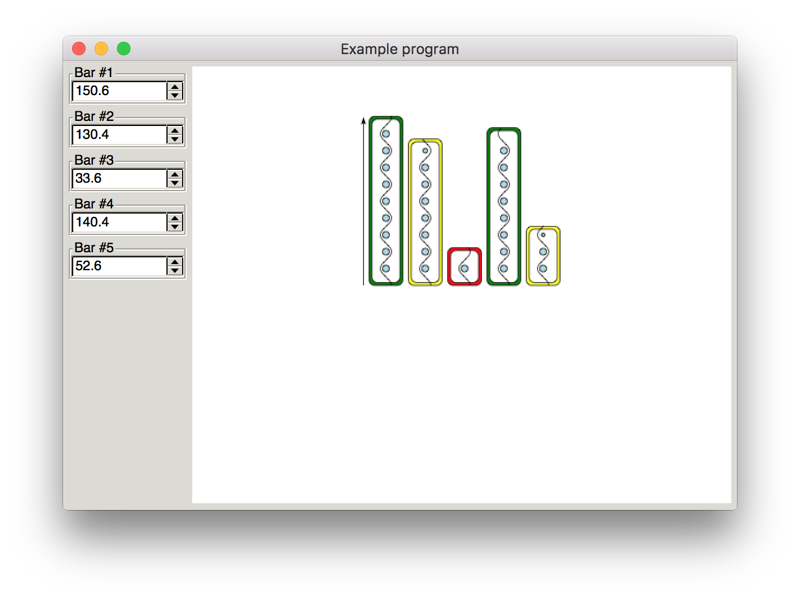

# Questions?

* Basics
* Advanced usage
* Diagrams and charts
* **In the browser**
* Conclusion

# Purescript `flare`

[Try Flare](http://try.purescript.org/?backend=flare)

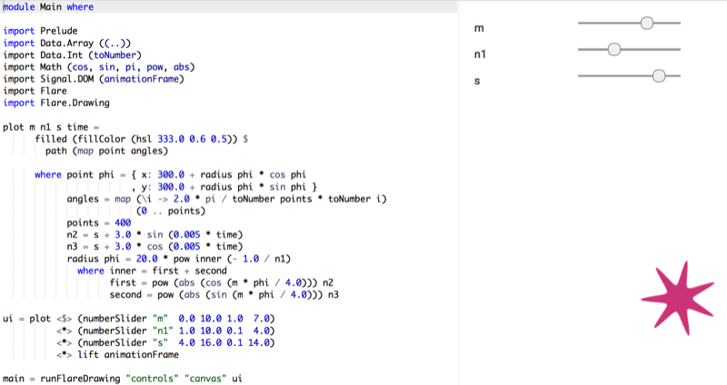

# Questions?

* Basics
* Advanced usage
* Diagrams and charts
* In the browser
* **Conclusion**

# Conclusion

Haskell-native spreadsheets can be simple, useful, and elegant

The API can be ported to any language with support for `Applicative`s

You can use this in the browser using Purescript's `flare` library

You can quickly build simple interactive apps for non-technical users
