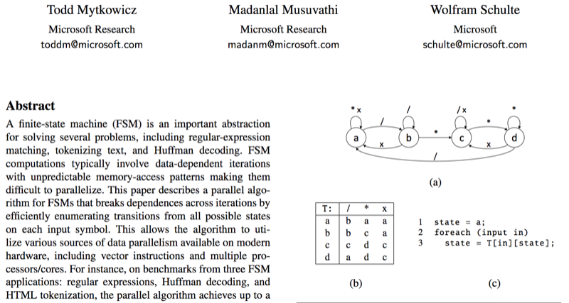
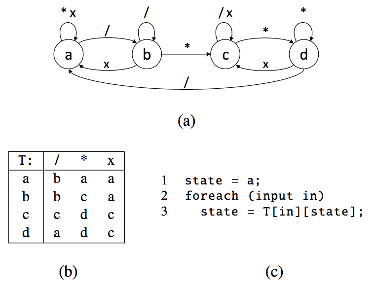

% Fast and parallel state machines
% Gabriel Gonzalez
% April 18, 2017

# Overview

This talk is based on a subset of the following paper:

> [Mytkowicz, Todd, Madanlal Musuvathi, and Wolfram Schulte. "Data-parallel finite-state machines." ACM SIGARCH Computer Architecture News. Vol. 42. No. 1. ACM, 2014](https://www.microsoft.com/en-us/research/wp-content/uploads/2016/02/asplos302-mytkowicz.pdf)

... which explains how to implement **fast** and **parallel** state machines



# Overview

* **Haskell state machines**
* C state machines
* Parallel state machines
* Conclusion

# State machine

According to [Wikipedia](https://en.wikipedia.org/wiki/Finite-state_machine):

> A deterministic finite state machine or acceptor deterministic finite state
> machine is a quintuple (Σ, S, s₀, δ, F), where: 
> 
> * Σ is the input alphabet (a finite, non-empty set of symbols).
> * S is a finite, non-empty set of states
> * s₀ is an initial state, an element of S
> * δ is the state-transition function: δ : S × Σ → S
> * F is the set of final states, a (possibly empty) subset of S

# Haskell encoding

We could pedantically follow the naming conventions from Wikipedia:

```haskell
import Data.Set (Set)

data StateMachine _Σ _S = StateMachine
    { s₀ :: _S
    , δ  :: (_S, _Σ) -> _S
    , _F :: Set _S
    }
```

... but I prefer to use verbose names:

```haskell
import Data.Set (Set)

data StateMachine input state = StateMachine
    { startingState   :: state
    , step            :: state -> input -> state
    , acceptingStates :: Set state
    }
```

# Hide the state

We can translate this:

```haskell
import Data.Set (Set)

data StateMachine input state = StateMachine
    { startingState   :: state
    , step            :: state -> input -> state
    , acceptingStates :: Set state
    }
```

... to this version that hides the type of the internal state:

```haskell
{-# LANGUAGE ExistentialQuantification #-}

import Data.Set (Set)

data StateMachine input = forall state . Ord state => StateMachine
    { startingState   :: state
    , step            :: state -> input -> state
    , acceptingStates :: Set state
    }
```

# Example state machine - Diagram



# Example state machine - Code

```haskell
{-# LANGUAGE RecordWildCards #-}

import qualified Data.Set

data State = A | B | C | D deriving (Eq, Ord)

cStyleComments :: StateMachine Char
cStyleComments = StateMachine {..}
  where
    startingState = A

    step A '/' = B
    step B '/' = B
    step C '/' = C
    step D '/' = A

    step A '*' = A
    step B '*' = C
    step C '*' = D
    step D '*' = D

    step A  _  = A
    step B  _  = A
    step C  _  = C
    step D  _  = C

    acceptingStates = Data.Set.fromList [ A, B ]
```

# Run a state machine

```haskell
{-# LANGUAGE BangPatterns              #-}
{-# LANGUAGE ExistentialQuantification #-}

import Data.Set (Set)

import qualified Data.Set

data StateMachine input = forall state . Ord state => StateMachine
    { startingState   :: state
    , step            :: state -> input -> state
    , acceptingStates :: Set state
    }

accept :: StateMachine input -> [input] -> Bool
accept (StateMachine {..}) input = Data.Set.member finalState acceptingStates
  where
    finalState = Data.List.foldl' step startingState input
```

# Example runs

```haskell
>>> accept cStyleComments "/**/"
True
>>> accept cStyleComments "/*ABC"
False
>>> accept cStyleComments "/**"
False
>>> accept cStyleComments "ABC"
True
>>> accept cStyleComments "**/"
True
>>> accept cStyleComments "/* /* */"
True
```

# Full example

```haskell
-- chars.hs

{-# LANGUAGE ExistentialQuantification #-}
{-# LANGUAGE RecordWildCards           #-}

module Main where

import Data.Set (Set)

import qualified Data.Set

main :: IO ()
main = do
    string <- readFile "test.c" -- "/*" ++ replicate 1000000000 ' ' ++ "*/"
    print (accept cStyleComments string)

data StateMachine input = forall state . Ord state => StateMachine
    { startingState   :: state
    , step            :: state -> input -> state
    , acceptingStates :: Set state
    }

accept :: StateMachine input -> [input] -> Bool
accept (StateMachine {..}) input = Data.Set.member finalState acceptingStates
  where
    finalState = Data.List.foldl' step startingState input

data State = A | B | C | D deriving (Eq, Ord)

cStyleComments :: StateMachine Char
cStyleComments = StateMachine {..}
  where
    startingState = A

    step A '/' = B
    step B '/' = B
    step C '/' = C
    step D '/' = A

    step A '*' = A
    step B '*' = C
    step C '*' = D
    step D '*' = D

    step A  _  = A
    step B  _  = A
    step C  _  = C
    step D  _  = C

    acceptingStates = Data.Set.fromList [ A, B ]
```

# Performance

```
$ time ./chars
True

real    0m17.202s
user    0m17.000s
sys     0m0.196s
```

1 B / 17.2 ns = 58 MB/s

# Using `ByteString`s

Haskell's `String` type is very inefficient (a linked-list of `Char`s)

We can speed things up by using `ByteString`s instead of `String`s

```haskell
{-# LANGUAGE ExistentialQuantification #-}
{-# LANGUAGE RecordWildCards           #-}

module Main where

import Data.ByteString (ByteString)
import Data.Set (Set)
import Data.Word (Word8)

import qualified Data.ByteString
import qualified Data.Set

main :: IO ()
main = do
    bytes <- Data.ByteString.readFile "test.c"
    print (accept cStyleComments bytes)

data StateMachine input = forall state . Ord state => StateMachine
    { startingState   :: state
    , step            :: state -> input -> state
    , acceptingStates :: Set state
    }

accept :: StateMachine Word8 -> ByteString -> Bool
accept (StateMachine {..}) bytes = Data.Set.member finalState acceptingStates
  where
    finalState = Data.ByteString.foldl' step startingState bytes

data State = A | B | C | D deriving (Eq, Ord)

cStyleComments :: StateMachine Word8
cStyleComments = StateMachine {..}
  where
    startingState = A

    step A 47 = B
    step B 47 = B
    step C 47 = C
    step D 47 = A

    step A 42 = A
    step B 42 = C
    step C 42 = D
    step D 42 = D

    step A _  = A
    step B _  = A
    step C _  = C
    step D _  = C

    acceptingStates = Data.Set.fromList [ A, B ]
```

# Performance

```
$ time ./bytes
True

real    0m1.468s
user    0m0.952s
sys     0m0.512s
```

1 B / 1.47 ns = 681 MB/s

~11.7x faster using `ByteString` instead of `String`

# Question

Is (1 B / 1.47 ns) good?

What is the single-threaded performance we should expect for an optimal state
machine implementation?

# Questions?

* Haskell state machines
* **C state machines**
* Parallel state machines
* Conclusion

# C state machine

We can run a state machine in C using a lookup table for a fixed number of
states

We'll support up to 16 states for now:

```c
// run.c

#include <stdlib.h>

#define NUM_STATES 16
#define NUM_BYTES  256

// Final state: [0..15]
unsigned char run(
    // Input bytes to process
    char *input,

    // Length of the input
    size_t length,

    // Starting state: [0..15]
    unsigned char startingState,

    // Step function encoded as lookup table
    char step[NUM_STATES][NUM_BYTES]
) {
    size_t i;
    char currentByte;
    unsigned char currentState = startingState;

    for (i = 0; i < length; i++) {
        currentByte = input[i];
        currentState = step[currentState][currentByte];
    }

    return currentState;
}
```

# Pure C example

We can test a pure C example matching C-style comments as an example:

```c
// file.c

#include <stdlib.h>
#include <stdio.h>

#define NUM_STATES 16
#define NUM_BYTES 256
#define INPUT_SIZE 1000000004

// Final state: [0..15]
unsigned char run(
    // Input bytes to process
    FILE *file,

    // Length of the input
    size_t length,

    // Starting state: [0..15]
    unsigned char startingState,

    // Step function encoded as lookup table
    unsigned char step[NUM_STATES][NUM_BYTES]
) {
    size_t i, j;
    char currentByte;
    unsigned char buffer[1000];
    unsigned char currentState = startingState;

    for (i = 0; i < INPUT_SIZE; i++) {
        currentByte = fgetc(file);
        currentState = step[currentState][currentByte];
    }

    return currentState;
}

int main() {
    size_t byte;
    unsigned char finalState;
    unsigned char startingState;
    unsigned char state;
    unsigned char cStyleComments[NUM_STATES][NUM_BYTES] = { 0 };
    FILE *file;

    for (byte = 0; byte < NUM_BYTES; byte++) {
        cStyleComments[0][byte] = 0;
        cStyleComments[1][byte] = 0;
        cStyleComments[2][byte] = 2;
        cStyleComments[3][byte] = 2;
    }
    cStyleComments[0][47] = 1;
    cStyleComments[1][47] = 1;
    cStyleComments[2][47] = 2;
    cStyleComments[3][47] = 0;

    cStyleComments[0][42] = 0;
    cStyleComments[1][42] = 2;
    cStyleComments[2][42] = 3;
    cStyleComments[3][42] = 3;

    startingState = 0;

    file = fopen("test.c", "rb");
    finalState = run(file, INPUT_SIZE, startingState, cStyleComments);
    fclose(file);
    if (finalState == 0 || finalState == 1) {
        printf("True");
    } else {
        printf("False");
    }
    return 0;
}
```

# Performance

Surprisingly, the pure C example is slower:

```
$ gcc -march=native -O3 file.c -o file
$ time ./file
True
real    0m7.568s
user    0m7.400s
sys     0m0.164s
```

1 B / 7.568 ns = 132 MB/s

I'm not sure why 🤷

(Yes, I also tried reading blocks instead of individual bytes, unsuccessfully)

**Update**: @nh2 discovered that this is because the C implementation is
decoding the input instead of reading raw bytes

You'll just have to trust me that using C will pay off in the end.  I promise

# Serialization

We can't use our C state machine until we serialize the Haskell state machine

However, we'll make a few changes to the Haskell types to simplify things:

```haskell
-- Hard-code the number of states to 16
data State = S00 | S01 | S02 | S03 | S04 | S05 | S06 | S07
           | S08 | S09 | S10 | S11 | S12 | S13 | S14 | S15

-- Split out a state transition into its own type
newtype Transition = Transition { runTransition :: State -> State }

-- Remove the `startingState` and `acceptingStates` fields from `StateMachine`
newtype StateMachine = StateMachine { runStateMachine :: Word8 -> Transition }
```

These types more closely match how the paper works

This choice of types also simplifies the serialization/deserialization logic

# Serializing `State`

We can derive `Generic` and `Binary` (and some other instances) for `State`:

```haskell
{-# LANGUAGE DeriveAnyClass #-}
{-# LANGUAGE DeriveGeneric  #-}

import Data.Binary (Binary(..))
import GHC.Generics (Generic)

data State = S00 | S01 | S02 | S03 | S04 | S05 | S06 | S07
           | S08 | S09 | S10 | S11 | S12 | S13 | S14 | S15
           deriving (Binary, Bounded, Enum, Eq, Generic, Ord, Show)
```

The derived `Binary` instance encodes each state as one byte:

```haskell
>>> let bytes x = Data.ByteString.Lazy.unpack (Data.Binary.encode x)
>>> bytes S00
[0]
>>> bytes S01
[1]
>>> bytes S15
[15]
```

# Serializing `Transition`

We encode a state transition as a "transition array":

```haskell
{-# LANGUAGE BangPatterns #-}

import Data.Vector ((!))

import qualified Data.Vector

numberOfStates :: Int
numberOfStates = fromEnum (maxBound :: State) + 1

newtype Transition = Transition { runTransition :: State -> State }

instance Binary Transition where
    put (Transition f) = mapM_ (put . f) [minBound..maxBound]

    get = do
        !ss <- Data.Vector.replicateM numberOfStates get
        return (Transition (\s -> ss ! fromEnum s))
```

For every possible input state, we encode the respective output state, in order

# Example `Transition` encoding

For example, these transition functions:

```haskell
contrivedTransition :: Transition
contrivedTransition = Transition f
  where
    f S00 = S00
    f S01 = S04
    f S02 = S01
    f S03 = S10
    f S04 = S02
    f S05 = S00
    f S06 = S03
    f S07 = S06
    f S08 = S04
    f S09 = S12
    f S10 = S05
    f S11 = S02
    f S12 = S06
    f S13 = S08
    f S14 = S07
    f S15 = S14

-- Every state transitions to itself
identityTransition :: Transition
identityTransition = Transition id
```

... encode to these byte sequences:

```
>>> bytes transition
[0,4,1,10,2,0,3,6,4,12,5,2,6,8,7,14]
>>> bytes identityTransition
[0,1,2,3,4,5,6,7,8,9,10,11,12,13,14,15]
```

# Serializing `StateMachine`

We serialize `StateMachine`s the same way that we serialize `Transition`s

For every possible input byte, we encode the respective output transition, in
order

```haskell
import Data.Word (Word8)

newtype StateMachine = StateMachine { runStateMachine :: Word8 -> Transition }

instance Binary StateMachine where
    put (StateMachine k) = mapM_ (put . k) [minBound..maxBound]

    get = do
        let numBytes = fromEnum (maxBound :: Word8) + 1
        ts <- Data.Vector.replicateM numBytes get
        return (StateMachine (\word8 -> ts ! fromEnum word8))
```

# Example `StateMachine` encoding

```haskell
contrivedStateMachine :: StateMachine
contrivedStateMachine = StateMachine f
  where
    f byte = if even byte then contrivedTransition else identityTransition
```

```haskell
>>> bytes contrivedStateMachine 
[0,4,1,10,2,0,3,6,4,12,5,2,6,8,7,14,0,1,2,3,4,5,6,7,8,9,10,11,12,13,14,15,0,4,…
```

This encoding uses 256 × 16 B = 4096 B = 4 KiB (compact! 😊)

# C-style comments

```haskell
buildStateMachine :: (Word8 -> State -> State) -> StateMachine
buildStateMachine = coerce  -- 😎

cStyleComments :: StateMachine
cStyleComments = buildStateMachine step
  where
    step 47 S00 = S01  -- Possible  comment start: Go to state #1
    step 42 S01 = S02  -- Confirmed comment start: Go to state #2
    step 42 S02 = S03  -- Possible  comment end  : Go to state #3
    step 47 S03 = S00  -- Confirmed comment end  : Go to state #0

    step 47 S01 = S01  -- Still might be a comment start: Stay on   state #1
    step  _ S01 = S00  -- Not a comment after all       : Return to state #0

    step 42 S03 = S03  -- Still might be a comment end  : Stay on   state #3
    step  _ S03 = S02  -- Not a comment after all       : Return to state #2

    step  _ S00 = S00  -- Outside of a comment: Stay on state #0

    step  _ S02 = S02  -- Inside a comment    : Stay on state #2

    step  _ _   = S00
```

# Wrapping C in a Haskell API

😱

```haskell
-- c.hs

import Data.ByteString (ByteString)
import Foreign (Ptr)
import Foreign.C.Types (CChar(..), CSize(..), CUChar(..))

import qualified Data.Binary
import qualified Data.ByteString.Lazy
import qualified Data.ByteString.Unsafe
import qualified Foreign.Marshal.Unsafe

foreign import ccall "run" c_run
    :: Ptr CChar -> CSize -> CUChar -> Ptr CChar -> IO CUChar

run :: StateMachine -> ByteString -> Transition
run stateMachine input = Transition f
  where
    step = Data.ByteString.Lazy.toStrict (Data.Binary.encode stateMachine)

    f startingState = Foreign.Marshal.Unsafe.unsafeLocalState io
      where
        io =
            Data.ByteString.Unsafe.unsafeUseAsCStringLen step  $ \(ptrStep , _  ) -> do
            Data.ByteString.Unsafe.unsafeUseAsCStringLen input $ \(ptrBytes, len) -> do
            let c_startingState = fromIntegral (fromEnum startingState)
            let c_len           = fromIntegral len
            c_finalState <- c_run ptrBytes c_len c_startingState ptrStep
            return (toEnum (fromEnum c_finalState))
```

# Full example

```haskell
-- c.hs

{-# LANGUAGE BangPatterns   #-}
{-# LANGUAGE DeriveAnyClass #-}
{-# LANGUAGE DeriveGeneric  #-}

module Main where

import Data.Binary (Binary(..))
import Data.ByteString (ByteString)
import Data.Vector ((!))
import Data.Word (Word8)
import Foreign (Ptr)
import Foreign.C.Types (CChar(..), CUChar(..), CSize(..))
import GHC.Generics (Generic)

import qualified Data.Binary
import qualified Data.ByteString
import qualified Data.ByteString.Lazy
import qualified Data.ByteString.Unsafe
import qualified Data.Vector
import qualified Foreign.Marshal.Unsafe

data State = S00 | S01 | S02 | S03 | S04 | S05 | S06 | S07
           | S08 | S09 | S10 | S11 | S12 | S13 | S14 | S15
           deriving (Binary, Bounded, Enum, Eq, Generic, Ord, Show)

numberOfStates :: Int
numberOfStates = fromEnum (maxBound :: State) + 1

newtype Transition = Transition { runTransition :: State -> State }

instance Binary Transition where
    put (Transition f) = mapM_ (put . f) [minBound..maxBound]

    get = do
        !ss <- Data.Vector.replicateM numberOfStates get
        return (Transition (\s -> ss ! fromEnum s))

newtype StateMachine = StateMachine { runStateMachine :: Word8 -> Transition }

instance Binary StateMachine where
    put (StateMachine k) = mapM_ (put . k) [minBound..maxBound]

    get = do
        let numBytes = fromEnum (maxBound :: Word8) + 1
        ts <- Data.Vector.replicateM numBytes get
        return (StateMachine (\word8 -> ts ! fromEnum word8))

buildStateMachine :: (Word8 -> State -> State) -> StateMachine
buildStateMachine f = StateMachine (fmap Transition f)

cStyleComments :: StateMachine
cStyleComments = buildStateMachine step
  where
    step 47 S00 = S01  -- Possible  comment start: Go to state #1
    step 42 S01 = S02  -- Confirmed comment start: Go to state #2
    step 42 S02 = S03  -- Possible  comment end  : Go to state #3
    step 47 S03 = S00  -- Confirmed comment end  : Go to state #0

    step 47 S01 = S01  -- Still might be a comment start: Stay on   state #1
    step  _ S01 = S00  -- Not a comment after all       : Return to state #0

    step 42 S03 = S03  -- Still might be a comment end  : Stay on   state #3
    step  _ S03 = S02  -- Not a comment after all       : Return to state #2

    step  _ S00 = S00  -- Outside of a comment: Stay on state #0

    step  _ S02 = S02  -- Inside a comment    : Stay on state #2

    step  _ _   = S00

foreign import ccall "run" c_run
    :: Ptr CChar -> CSize -> CUChar -> Ptr CChar -> IO CUChar

run :: StateMachine -> ByteString -> Transition
run stateMachine input = Transition f
  where
    step = Data.ByteString.Lazy.toStrict (Data.Binary.encode stateMachine)

    f startingState = Foreign.Marshal.Unsafe.unsafeLocalState io
      where
        io =
            Data.ByteString.Unsafe.unsafeUseAsCStringLen step  $ \(ptrStep , _  ) -> do
            Data.ByteString.Unsafe.unsafeUseAsCStringLen input $ \(ptrBytes, len) -> do
            let c_startingState = fromIntegral (fromEnum startingState)
            let c_len           = fromIntegral len
            c_finalState <- c_run ptrBytes c_len c_startingState ptrStep
            return (toEnum (fromEnum c_finalState))

main :: IO ()
main = do
    bytes <- Data.ByteString.readFile "test.c"
    print (runTransition (run cStyleComments bytes) S00)
```

# Performance

```
$ gcc -O3 -march=native -c run.c
$ ghc -O2 c.hs run.o
$ time ./c
S00

real    0m2.735s
user    0m2.220s
sys     0m0.512s
```

This is in between the pure Haskell solutions for `String` vs `ByteString`

Surprisingly, Haskell's file I/O is faster than the obvious C code 🤷

# Questions?

* Haskell state machines
* C state machines
* **Parallel state machines**
* Conclusion

# Question

How do we make this algorithm parallel? 🤔

In other words, how can we take advantage of multiple cores to accelerate this?

# 💡 Insight #1 - Use a CPU intrinsic

The paper notes that we can simulate all 16 states in one CPU instruction!

GCC provides a
[`__builtin_shuffle` intrinsic](https://gcc.gnu.org/onlinedocs/gcc/Vector-Extensions.html)
for this purpose

We can understand `__builtin_shuffle` by analogy to our `Transition` type

# The `Transition` monoid

First, define a `Monoid` instance for our `Transition` type:

```haskell
newtype Transition = Transition { runTransition :: State -> State }

instance Monoid Transition where
    mempty = Transition id

    mappend (Transition f) (Transition g) = Transition (g . f)

-- Reminder that `(<>)` is an infix operator synonymous with `mappend`
(<>) :: Monoid m => m -> m -> m
(<>) = mappend
```

`mempty` is what we previously called `identityTransition`

`f <> g` means compose two state transitions end-to-end

`__builtin_shuffle` is essentially a really fast `mappend` for `Transition`

# `__builtin_shuffle`

`__builtin_shuffle` composes two transition arrays

Specifically, `__builtin_shuffle` composes the binary representation of our
`Transition` type

```c
typedef uint8_t v16si __attribute__ ((vector_size (16)));

// The encoding of `contrivedTransition`
v16si contrivedTransition = { 0, 4, 1, 10, 2, 0, 3, 6, 4, 12, 5, 2, 6, 8, 7, 14 }

// The encoding of `identityTransition`
v16si identityTransition  = { 0, 1, 2, 3, 4, 5, 6, 7, 8, 9, 10, 11, 12, 13, 14, 15 };

// result0 = { 0, 2, 4, 5, 1, 0, 10, 3, 2, 6, 0, 1, 3, 4, 6, 7 }
result0 = __builtin_shuffle(contrivedTransition, contrivedTransition)

// result1 = { 0, 4, 1, 10, 2, 0, 3, 6, 4, 12, 5, 2, 6, 8, 7, 14 }
result1 = __builtin_shuffle(contrivedTransition, identityTransition)
```

Compare to Haskell:

```haskell
>>> bytes (contrivedTransition <> contrivedTransition)
[0,2,4,5,1,0,10,3,2,6,0,1,3,4,6,7]
>>> bytes (contrivedTransition <> identityTransition)
[0,4,1,10,2,0,3,6,4,12,5,2,6,8,7,14]
```

# `Monoid` laws

```haskell
x <> mempty = x                -- f . id = f

mempty <> x = x                -- id . f = f

(x <> y) <> z = x <> (y <> z)  -- (f . g) . h = f . (g . h)
```

```c
__builtin_shuffle(x, identityTransition) = x

__builtin_shuffle(identityTransition, x) = x

__builtin_shuffle(__builtin_shuffle(x, y), z) = __builtin_shuffle(x, __builtin_shuffle(y, z))
```

# Using `__builtin_shuffle`

We don't need specify the starting state now that we have `__builtin_shuffle`

We can simulate all 16 of them at the same time!

```c
// run2.c

#include <stdlib.h>

#define NUM_STATES 16
#define NUM_BYTES  256

typedef uint8_t v16si __attribute__ ((vector_size (16)));

void run(
    // Input bytes to process
    char *input,

    // Length of the input
    size_t length,

    // Step function encoded as lookup table
    char *stepBytes,

    // Output to save the final state for all 16 initial states
    char *out
) {
    size_t byte, index, state;
    char currentByte;
    v16si step[NUM_BYTES];
    v16si currentStates = { 0, 1, 2, 3, 4, 5, 6, 7, 8, 9, 10, 11, 12, 13, 14, 15 };

    for (byte = 0; byte < NUM_BYTES; byte++) {
        for (state = 0; state < NUM_STATES; state++) {
            step[byte][state] = stepBytes[NUM_STATES * byte + state];
        }
    }

    for (index = 0; index < length; index++) {
        currentByte = input[index];
        currentStates = __builtin_shuffle(step[currentByte], currentStates);
    }

    for (state = 0; state < NUM_STATES; state++) {
        out[state] = currentStates[state];
    }
}
```

# Matching Haskell changes

Now the C code returns a `Transition` array, which we decode directly:

```haskell
run :: StateMachine -> ByteString -> Transition
run stateMachine input = Foreign.Marshal.Unsafe.unsafeLocalState io
  where
    step = Data.ByteString.Lazy.toStrict (Data.Binary.encode stateMachine)

    io =
        Data.ByteString.Unsafe.unsafeUseAsCStringLen step  $ \(ptrStep , _  ) -> do
        Data.ByteString.Unsafe.unsafeUseAsCStringLen input $ \(ptrBytes, len) -> do
        Foreign.allocaBytes numberOfStates                 $ \ptrOut          -> do
        let c_len = fromIntegral len
        c_run ptrBytes c_len ptrStep ptrOut
        bytes <- Data.ByteString.packCStringLen (ptrOut, numberOfStates)
        return (Data.Binary.decode (Data.ByteString.Lazy.fromStrict bytes))
```

# Full example

```haskell
-- c2.hs

{-# LANGUAGE BangPatterns   #-}
{-# LANGUAGE DeriveAnyClass #-}
{-# LANGUAGE DeriveGeneric  #-}

module Main where

import Data.Binary (Binary(..))
import Data.ByteString (ByteString)
import Data.Vector ((!))
import Data.Word (Word8)
import Foreign (Ptr)
import Foreign.C.Types (CChar(..), CSize(..), CUChar(..))
import GHC.Generics (Generic)

import qualified Data.Binary
import qualified Data.ByteString.Lazy
import qualified Data.ByteString.Unsafe
import qualified Data.Vector
import qualified Foreign.Marshal.Unsafe

import qualified Data.ByteString
import qualified Foreign

data State = S00 | S01 | S02 | S03 | S04 | S05 | S06 | S07
           | S08 | S09 | S10 | S11 | S12 | S13 | S14 | S15
           deriving (Binary, Bounded, Enum, Eq, Generic, Ord, Show)

numberOfStates :: Int
numberOfStates = fromEnum (maxBound :: State) + 1

newtype Transition = Transition { runTransition :: State -> State }

instance Binary Transition where
    put (Transition f) = mapM_ (put . f) [minBound..maxBound]

    get = do
        !ss <- Data.Vector.replicateM numberOfStates get
        return (Transition (\s -> ss ! fromEnum s))

newtype StateMachine = StateMachine { runStateMachine :: Word8 -> Transition }

instance Binary StateMachine where
    put (StateMachine k) = mapM_ (put . k) [minBound..maxBound]

    get = do
        let numBytes = fromEnum (maxBound :: Word8) + 1
        ts <- Data.Vector.replicateM numBytes get
        return (StateMachine (\word8 -> ts ! fromEnum word8))

buildStateMachine :: (Word8 -> State -> State) -> StateMachine
buildStateMachine f = StateMachine (fmap Transition f)

cStyleComments :: StateMachine
cStyleComments = buildStateMachine step
  where
    step 47 S00 = S01  -- Possible  comment start: Go to state #1
    step 42 S01 = S02  -- Confirmed comment start: Go to state #2
    step 42 S02 = S03  -- Possible  comment end  : Go to state #3
    step 47 S03 = S00  -- Confirmed comment end  : Go to state #0

    step 47 S01 = S01  -- Still might be a comment start: Stay on   state #1
    step  _ S01 = S00  -- Not a comment after all       : Return to state #0

    step 42 S03 = S03  -- Still might be a comment end  : Stay on   state #3
    step  _ S03 = S02  -- Not a comment after all       : Return to state #2

    step  _ S00 = S00  -- Outside of a comment: Stay on state #0

    step  _ S02 = S02  -- Inside a comment    : Stay on state #2

    step  _ _   = S00

foreign import ccall "run" c_run
    :: Ptr CChar -> CSize -> Ptr CChar -> Ptr CChar -> IO ()

run :: StateMachine -> ByteString -> Transition
run stateMachine input = Foreign.Marshal.Unsafe.unsafeLocalState io
  where
    step = Data.ByteString.Lazy.toStrict (Data.Binary.encode stateMachine)

    io =
        Data.ByteString.Unsafe.unsafeUseAsCStringLen step  $ \(ptrStep , _  ) -> do
        Data.ByteString.Unsafe.unsafeUseAsCStringLen input $ \(ptrBytes, len) -> do
        Foreign.allocaBytes numberOfStates                 $ \ptrOut          -> do
        let c_len = fromIntegral len
        c_run ptrBytes c_len ptrStep ptrOut
        bytes <- Data.ByteString.packCStringLen (ptrOut, numberOfStates)
        return (Data.Binary.decode (Data.ByteString.Lazy.fromStrict bytes))

main :: IO ()
main = do
    bytes <- Data.ByteString.readFile "test.c"
    print (runTransition (run cStyleComments bytes) S00)
```

# Performance

```
$ gcc -O3 -mssse3 -c run2.c
$ ghc -O2 c2.hs run2.o
$ time ./c2
S00

real    0m1.079s
user    0m1.040s
sys     0m0.036s
```

1 B / 1.08 ns = 926 MB/s

We can simulate 16 states faster than simulating 1 state! 😮

# `PSHUFB`

`__builtin_shuffle` is beats a lookup table thanks to the `PSHUFB` instruction:

[`PSHUFB`](https://www.felixcloutier.com/x86/PSHUFB.html) is short for
"packed shuffle bytes"

`gcc` provides a (slower) fallback implementation for processors that don't
provide this instruction

This feature requires passing the `-mssse3` flag to `gcc`

```
$ gcc -O3 -mssse3 -S run2.c
$ cat run2.s
	...
L6:
	movsbq	(%rax), %rdx
	addq	$1, %rax
	pand	%xmm2, %xmm0
	salq	$4, %rdx
	cmpq	%rax, %rsi
	movdqa	16(%rsp,%rdx), %xmm1
	pshufb	%xmm0, %xmm1          # The magic instruction
	movdqa	%xmm1, %xmm0
	jne	L6
	movaps	%xmm1, (%rsp)
L7:
	...
```

# 💡 Insight #2: Use the `Transition` `Monoid` to parallelize `run`

Given a single-threaded run:

```haskell
run :: StateMachine -> ByteString -> Transition
```

... we can create a parallel run using a divide and conquer algorithm:

* splitting our input into chunks (i.e. "divide")
* calling the single-threaded `run` on each chunk in parallel (i.e. "conquer")
* combining the `Transition`s returned by each `run` using `(<>)`

```haskell
-- Not legal Haskell
runParallel :: StateMachine -> ByteString -> Transition
runParallel stateMachine (bytes₀ <> bytes₂ <> … <> bytesᵢ)
       run stateMachine bytes₀  -- We can compute
    <> run stateMachine bytes₁  -- each one of these
    <> …                        -- `run` functions
    <> run stateMachine bytesᵢ  -- in parallel
```

# The actual implementation

```haskell
import qualified Control.Parallel.Strategies

runParallel :: Int -> StateMachine -> ByteString -> Transition
runParallel numThreads stateMachine bytes =
    mconcat
        (Control.Parallel.Strategies.parMap
            Control.Parallel.Strategies.rseq
            (run stateMachine)
            (chunkBytes subLen bytes) )
  where
    len = Data.ByteString.length bytes

    subLen = ((len - 1) `div` numThreads) + 1

chunkBytes :: Int -> ByteString -> [ByteString]
chunkBytes n bytes =
    if Data.ByteString.null bytes
    then []
    else prefix : chunkBytes n suffix
  where
    ~(prefix, suffix) = Data.ByteString.splitAt n bytes
```

# Full example

```haskell
-- c3.hs

{-# LANGUAGE BangPatterns   #-}
{-# LANGUAGE DeriveAnyClass #-}
{-# LANGUAGE DeriveGeneric  #-}

module Main where

import Data.Binary (Binary(..))
import Data.ByteString (ByteString)
import Data.Vector ((!))
import Data.Word (Word8)
import Foreign (Ptr)
import Foreign.C.Types (CChar(..), CSize(..), CUChar(..))
import GHC.Generics (Generic)

import qualified Control.Concurrent
import qualified Control.Parallel.Strategies
import qualified Data.Binary
import qualified Data.ByteString.Lazy
import qualified Data.ByteString.Unsafe
import qualified Data.ByteString
import qualified Data.Vector
import qualified Foreign
import qualified Foreign.Marshal.Unsafe
import qualified System.IO.MMap

data State = S00 | S01 | S02 | S03 | S04 | S05 | S06 | S07
           | S08 | S09 | S10 | S11 | S12 | S13 | S14 | S15
           deriving (Binary, Bounded, Enum, Eq, Generic, Ord, Show)

numberOfStates :: Int
numberOfStates = fromEnum (maxBound :: State) + 1

newtype Transition = Transition { runTransition :: State -> State }

instance Monoid Transition where
    mempty = Transition id

    mappend (Transition f) (Transition g) = Transition (g . f)

instance Binary Transition where
    put (Transition f) = mapM_ (put . f) [minBound..maxBound]

    get = do
        !ss <- Data.Vector.replicateM numberOfStates get
        return (Transition (\s -> ss ! fromEnum s))

newtype StateMachine = StateMachine { runStateMachine :: Word8 -> Transition }

instance Binary StateMachine where
    put (StateMachine k) = mapM_ (put . k) [minBound..maxBound]

    get = do
        let numBytes = fromEnum (maxBound :: Word8) + 1
        ts <- Data.Vector.replicateM numBytes get
        return (StateMachine (\word8 -> ts ! fromEnum word8))

buildStateMachine :: (Word8 -> State -> State) -> StateMachine
buildStateMachine f = StateMachine (fmap Transition f)

cStyleComments :: StateMachine
cStyleComments = buildStateMachine step
  where
    step 47 S00 = S01  -- Possible  comment start: Go to state #1
    step 42 S01 = S02  -- Confirmed comment start: Go to state #2
    step 42 S02 = S03  -- Possible  comment end  : Go to state #3
    step 47 S03 = S00  -- Confirmed comment end  : Go to state #0

    step 47 S01 = S01  -- Still might be a comment start: Stay on   state #1
    step  _ S01 = S00  -- Not a comment after all       : Return to state #0

    step 42 S03 = S03  -- Still might be a comment end  : Stay on   state #3
    step  _ S03 = S02  -- Not a comment after all       : Return to state #2

    step  _ S00 = S00  -- Outside of a comment: Stay on state #0

    step  _ S02 = S02  -- Inside a comment    : Stay on state #2

    step  _ _   = S00

foreign import ccall "run" c_run
    :: Ptr CChar -> CSize -> Ptr CChar -> Ptr CChar -> IO ()

run :: StateMachine -> ByteString -> Transition
run stateMachine input = Foreign.Marshal.Unsafe.unsafeLocalState io
  where
    step = Data.ByteString.Lazy.toStrict (Data.Binary.encode stateMachine)

    io =
        Data.ByteString.Unsafe.unsafeUseAsCStringLen step  $ \(ptrStep , _  ) -> do
        Data.ByteString.Unsafe.unsafeUseAsCStringLen input $ \(ptrBytes, len) -> do
        Foreign.allocaBytes numberOfStates                 $ \ptrOut          -> do
        let c_len = fromIntegral len
        c_run ptrBytes c_len ptrStep ptrOut
        bytes <- Data.ByteString.packCStringLen (ptrOut, numberOfStates)
        return (Data.Binary.decode (Data.ByteString.Lazy.fromStrict bytes))

runParallel :: Int -> StateMachine -> ByteString -> Transition
runParallel numThreads stateMachine bytes =
    mconcat
        (Control.Parallel.Strategies.parMap
            Control.Parallel.Strategies.rseq
            (run stateMachine)
            (chunkBytes subLen bytes) )
  where
    len = Data.ByteString.length bytes

    subLen = ((len - 1) `div` numThreads) + 1

chunkBytes :: Int -> ByteString -> [ByteString]
chunkBytes n bytes =
    if Data.ByteString.null bytes
    then []
    else prefix : chunkBytes n suffix
  where
    ~(prefix, suffix) = Data.ByteString.splitAt n bytes

main :: IO ()
main = do
    bytes <- System.IO.MMap.mmapFileByteString "test.c" Nothing
    n <- Control.Concurrent.getNumCapabilities
    print (runTransition (runParallel n cStyleComments bytes) S00)
```

# Performance

```
$ gcc -O3 -mssse3 -S run2.c
$ ghc -O2 -threaded -rtsopts c3.hs run2.0
$ time ./c3 +RTS -N1
S00

real    0m1.069s
user    0m1.024s
sys     0m0.044s

$ time ./c3 +RTS -N2
S00

real    0m0.603s
user    0m0.996s
sys     0m0.064s

$ time ./c3 +RTS -N4
S00

real    0m0.444s
user    0m1.568s
sys     0m0.052s
```

1 B / 0.44 ns = 2272 MB/s

# 💡 Insight #3 - Use CPU data pipelining

We can extract more parallelism per-thread by minimizing data dependencies in C
code

`__builtin_shuffle` is associative, so we can reorder how we combine transitions

Each non-leaf node in this tree represents a `__builtin_shuffle` of its
children:

```
                    states
                /             \
          states4             states5
          /     \             /     \
     states0   states1   states2   states3
      /   \     /   \     /   \     /   \
  states s[a] s[b] t[c] s[d] s[e] s[f] s[g]
```

The CPU is smart and notices that each tree layer has no data dependencies

The CPU exploits the lack of data dependencies using instruction-level
parallelism

# Minimizing data dependencies

```c
// run3.c

#include <stdint.h>
#include <stdlib.h>

#define NUM_STATES 16
#define NUM_BYTES  256

typedef uint8_t v16si __attribute__ ((vector_size (16)));

void run(
    // Input bytes to process
    char *input,

    // Length of the input
    size_t length,

    // Step function encoded as lookup table
    char *stepBytes,

    // Output to save the final state for all 16 initial states
    char *out
) {
    size_t byte, index, state;
    char a, b, c, d, e, f, g;
    v16si s[NUM_BYTES];
    v16si states = { 0, 1, 2, 3, 4, 5, 6, 7, 8, 9, 10, 11, 12, 13, 14, 15 };
    v16si states0, states1, states2, states3, states4, states5;

    for (byte = 0; byte < NUM_BYTES; byte++) {
        for (state = 0; state < NUM_STATES; state++) {
            s[byte][state] = stepBytes[NUM_STATES * byte + state];
        }
    }

    for (index = 0; index + 6 < length; index +=7) {
        // These can be run in parallel
        a = input[index     ];
        b = input[index + 1];
        c = input[index + 2];
        d = input[index + 3];
        e = input[index + 4];
        f = input[index + 5];
        g = input[index + 6];

        // These can be run in parallel
        states0 = __builtin_shuffle(s[a], states);
        states1 = __builtin_shuffle(s[c], s[b] );
        states2 = __builtin_shuffle(s[e], s[d] );
        states3 = __builtin_shuffle(s[g], s[f] );

        // These can be run in parallel
        states4 = __builtin_shuffle(states1, states0);
        states5 = __builtin_shuffle(states3, states2);

        states = __builtin_shuffle(states5, states4);
    }

    for (; index < length; index++) {
        a = input[index];
        states = __builtin_shuffle(s[a], states);
    }

    for (state = 0; state < NUM_STATES; state++) {
        out[state] = states[state];
    }
}
```

# Performance

```
$ time ./c3 +RTS -N1
S00

real    0m0.697s
user    0m0.676s
sys     0m0.020s
$ time ./c3 +RTS -N2
S00

real    0m0.398s
user    0m0.736s
sys     0m0.040s
$ time ./c3 +RTS -N4
S00

real    0m0.386s
user    0m1.352s
sys     0m0.060s
```

1 B / 0.39 ns = 2590 MB/s

3.8x faster than our best pure Haskell implementation

# Overview

* Haskell state machines
* C state machines
* Parallel state machines
* **Conclusion**

# Conclusion

The paper actually describes how to scale this algorithm efficiently to 256-512
states

I couldn't figure out how to use the intrinsic that unlocks additional states

Everything I described is in a Haskell package on GitHub called `sig`:

* [https://github.com/Gabriel439/sig](https://github.com/Gabriel439/sig)

Associative operations can be cheaply parallelized

Haskell is a great language for providing provides a high-level interface to C

You can find these slides here:

* [https://github.com/Gabriel439/slides/tree/master/zurihac](https://github.com/Gabriel439/slides/tree/master/zurihac)

# Questions?
